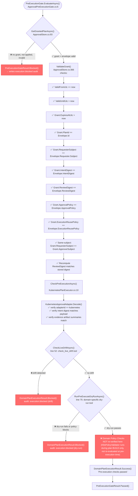

# Mutation Approval Flow: Code-Accurate Diagram

**Date**: 2026-05-18
**Based on**: actual code in `src/` (111 `.cs` files), cross-referenced against `CONTEXT.md`, `mutation-approval-profile.md`, `mutation-approval-flow.md`

Symbols: ✅ = implemented   ⚠️ = partially implemented   ❌ = missing   🔮 = documented future extension

---

## 1. Complete Lifecycle Flow (Ownership Boundaries)

```mermaid
flowchart TD
    %% ─── EXTERNAL ───
    subgraph External["External"]
        Client["MCP Client (AI)"]
        IdP["Identity Provider (Keycloak) \n authenticates Requester / Approver"]
        Browser["Browser (Review Surface)"]
    end

    %% ─── GENERIC APPROVAL CORE ───
    subgraph Core["Generic Approval Core"]
        direction TB
        Dispatcher["GatewayToolDispatcher"]
        ApprovalSvc["GatewayApprovalService"]
        ApprovalEndpts["GatewayApprovalEndpoints \n (HTML review surface)"]
        Store["ApprovalStore \n (plan persist + grants + audit)"]
        ChallengeStore["ApprovalChallengeStore"]
        PreExecGate["ApprovalPreExecutionGate"]
        PlanFactory["PlanEnvelopeFactory \n (review digest canonicalization)"]

        subgraph GenericEnvelope["Generic Data Types"]
            PlanEnvelope["PlanEnvelope \n planId, profile, adapterId, operation, \n requester, approvalPolicy, executionReusePolicy, \n freshnessPolicy, evidenceArtifacts, \n intentDigest, reviewDigest, payload"]
            Challenge["ApprovalChallenge \n status, TTL, intent/Review digest binding"]
            Outcome["ChallengeOutcome \n approved | denied | rejected | expired | canceled"]
            Grant["ApprovalGrant \n bound to: planId, requester, approver, \n intent/review digest, policy, expiry, reuse"]
            Policy["ApprovalPolicy \n ✅ same-subject only\n 🔮 delegated, multi-party"]
            Reuse["ExecutionReusePolicy \n ✅ single-execution only\n 🔮 reusable plan"]
            Freshness["FreshnessPolicy + FreshnessCheck[] \n ✅ kubernetes.live-drift\n ✅ kubernetes.pre-execute-dry-run"]
        end
    end

    %% ─── DOMAIN ADAPTER ───
    subgraph Adapter["Domain Adapter (Kubernetes)"]
        direction TB
        PlanBuilder["KubernetesPlanBuilder \n (IDomainPlanBuilder)"]
        PlanExecutor["KubernetesPlanExecutor \n (IDomainPlanExecutor)"]
        K8sApprovalAdapter["KubernetesApprovalAdapter \n (intent canonicalization)\n (evidence artifact digests)"]
        ReviewAdapter["KubernetesPlanReviewAdapter \n (IPlanReviewAdapter)"]
        ReviewRenderer["KubernetesPlanReviewRenderer \n (IPlanReviewRenderer)"]

        subgraph AdapterData["Adapter Data Types"]
            Payload["KubernetesPlanPayload \n namespace, description, parameters,\n objects, manifest, dryRun, diffs, policyFindings"]
            Evidence["EvidenceArtifactSummary[] \n dry-run digest, diff digest, policy findings digest\n ⚠️ RedactionMetadata always []"]
        end
    end

    %% ─── MCP SERVER (trusted execution substrate) ───
    subgraph McpServer["InfraGate.McpServer \n (trusted execution substrate)"]
        EvidenceTools["Evidence tools (dry-run, diff)\n called via IToolCaller"]
        MutationTools["Mutation tools (apply, delete, scale,\n restart, set-image)\n called via IToolCaller"]
    end

    %% ─── AUDIT ───
    subgraph Audit["Audit Trail (audit.jsonl)"]
        direction LR
        A1["✅ plan.created"]
        A2["✅ challenge.created"]
        A3["✅ challenge.approved"]
        A4["✅ challenge.denied"]
        A5["✅ challenge.rejected"]
        A6["✅ challenge.expired"]
        A7["✅ challenge.canceled"]
        A8["✅ grant.issued"]
        A9["❌ execution.started"]
        A10["✅ execution.blocked"]
        A11["✅ execution.failed"]
        A12["✅ execution.succeeded"]
    end

    %% ─── FLOW: Plan Creation ───
    Client -->|"1️⃣ call request_apply_manifest(...)"| Dispatcher
    IdP -.->|"JWT (Requester identity)"| Dispatcher
    Dispatcher -->|"2️⃣ GuardedToolRunner.AuditRequestAsync\n (prompt injection scan)"| Dispatcher
    Dispatcher -->|"3️⃣ planBuilder.BuildAsync()"| PlanBuilder
    PlanBuilder -->|"4️⃣ toolCaller.CallAsync()\n (dry-run + diff)"| EvidenceTools
    EvidenceTools -->|"dry-run result, diff result"| PlanBuilder
    PlanBuilder -->|"5️⃣ K8sApprovalAdapter.CreateEnvelope()\n compute intent digest (adapter canonicalization)"| Payload
    PlanBuilder -->|"6️⃣ PlanEnvelopeFactory.Create()\n sets SameSubject + SingleExecution\n computes review digest (profile canonicalization)\n ⚠️ evidence artifact redaction metadata = []"| PlanFactory
    PlanFactory -->|"PlanEnvelope<KubernetesPlanPayload>"| PlanBuilder
    PlanBuilder -->|"PlanBuildResult.Success"| Dispatcher
    Dispatcher -->|"7️⃣ approvalStore.CreatePlanAsync()"| Store
    Store -->|"writes"| A1

    %% ─── FLOW: Challenge Creation ───
    Client -->|"8️⃣ call execute_approved_plan(planId=...)"| Dispatcher
    Dispatcher -->|"9️⃣ approvals.EnsureApprovedOrCreateChallengeAsync()"| ApprovalSvc
    ApprovalSvc -->|"resolve requester identity"| IdP
    ApprovalSvc -->|"10️⃣ approvalStore.GetGrantedPlanAsync()\n check if already granted"| Store
    Store -->|"not granted yet"| ApprovalSvc
    ApprovalSvc -->|"11️⃣ approvalStore.GetPendingPlanAsync()\n decode via IPlanReviewAdapter"| Store
    ApprovalSvc -->|"12️⃣ Check same-subject policy\n check plan has review evidence\n ⚠️ no dedup: multiple pending challenges\n can coexist for same plan"| ApprovalSvc
    ApprovalSvc -->|"13️⃣ challengeStore.CreateAsync()\n with TTL, intent+review digest binding"| ChallengeStore
    ApprovalSvc -->|"writes"| A2
    ApprovalSvc -->|"returns approval URL"| Dispatcher
    Dispatcher -->|"returns approval URL to client"| Client

    %% ─── FLOW: Browser Approval ───
    Client -->|"14️⃣ User opens approval URL"| Browser
    Browser -->|"15️⃣ GET /approvals/{challengeId}"| ApprovalEndpts
    ApprovalEndpts -->|"GetApprovalPageAsync()"| ApprovalSvc
    ApprovalSvc -->|"ValidatePendingChallengeAsync():\n • challenge is pending\n • TTL not expired\n • approver same-subject\n • pending plan hash matches\n • digest binding matches\n • review evidence exists"| ApprovalSvc
    ApprovalSvc -->|"decode via IPlanReviewAdapter"| ReviewAdapter
    ApprovalSvc -->|"render via IPlanReviewRenderer\n (plan summary + diff + dry-run + policy findings)\n ⚠️ RedactionMetadata not displayed"| ReviewRenderer
    ApprovalEndpts -->|"HTML page"| Browser

    Browser -->|"16️⃣ POST approve"| ApprovalEndpts
    ApprovalEndpts -->|"ApproveChallengeAsync()"| ApprovalSvc
    ApprovalSvc -->|"validate + same-subject check"| ApprovalSvc
    ApprovalSvc -->|"17️⃣ approvalStore.CreateGrantAsync()\n (binds: planId, requester, approver,\n intent/review digest, policy, expiry, reuse)"| Store
    Store -->|"writes"| A8
    ApprovalSvc -->|"18️⃣ save challenge with \n ChallengeOutcome(approved, grantId)"| ChallengeStore
    ApprovalSvc -->|"writes"| A3

    Browser -->|"POST deny"| ApprovalEndpts
    ApprovalEndpts -->|"DenyChallengeAsync()"| ApprovalSvc
    ApprovalSvc -->|"ChallengeOutcome(denied), no grant"| ChallengeStore
    ApprovalSvc -->|"writes"| A4

    Browser -->|"POST cancel"| ApprovalEndpts
    ApprovalEndpts -->|"CancelChallengeAsync()"| ApprovalSvc
    ApprovalSvc -->|"ChallengeOutcome(canceled), no grant"| ChallengeStore
    ApprovalSvc -->|"writes"| A7

    Browser -->|"TTL expires"| ApprovalSvc
    ApprovalSvc -->|"ChallengeOutcome(expired), no grant"| ChallengeStore
    ApprovalSvc -->|"writes"| A6

    Browser -->|"rejected by system"| ApprovalSvc
    ApprovalSvc -->|"ChallengeOutcome(rejected), no grant"| ChallengeStore
    ApprovalSvc -->|"writes"| A5

    %% ─── FLOW: Pre-Execution Gates ───
    Client -->|"19️⃣ call execute_approved_plan(planId=...)\n (again, after approval)"| Dispatcher
    Dispatcher -->|"approvals.EnsureApprovedOrCreateChallengeAsync()\n → now returns Approved"| ApprovalSvc
    Dispatcher -->|"20️⃣ preExecutionGate.EvaluateAsync()"| PreExecGate
    PreExecGate -->|"21️⃣ approvalStore.GetGrantedPlanAsync()\n ValidateGrant():\n  ✅ plan validity window (ValidFromUtc..ValidUntilUtc)\n  ✅ grant not expired\n  ✅ intent digest matches\n  ✅ review digest matches\n  ✅ approval policy matches (same-subject check)\n  ✅ execution reuse policy matches\n  ✅ review digest recomputed and verified"| Store
    Store -->|"grant valid"| PreExecGate
    PreExecGate -->|"22️⃣ planExecutor.CheckPreExecutionAsync()"| PlanExecutor
    PlanExecutor -->|"KubernetesApprovalAdapter.Decode()\n (verify intent digest + evidence artifacts)"| K8sApprovalAdapter
    PlanExecutor -->|"23️⃣ ✅ CheckLiveDriftAsync()\n (call check_live_drift)"| EvidenceTools
    PlanExecutor -->|"24️⃣ ✅ RunPreExecuteDryRunAsync()\n (call domain dry-run)"| EvidenceTools
    PlanExecutor -->|"25️⃣ ❌ Domain Policy Checks NOT re-run\n (policy only checked during plan BUILD,\n not at pre-execution time)"| PlanExecutor
    PreExecGate -->|"gates passed"| Dispatcher

    %% ─── FLOW: Execution ───
    Dispatcher -->|"26️⃣ ❌ execution.started audit NOT written"| Dispatcher
    Dispatcher -->|"27️⃣ planExecutor.ExecuteAsync()"| PlanExecutor
    PlanExecutor -->|"28️⃣ DispatchAsync() → call mutation tool\n (apply_manifest | delete_manifest |\n  scale_deployment | restart_deployment |\n  set_deployment_image)"| MutationTools
    MutationTools -->|"result"| PlanExecutor
    PlanExecutor -->|"success"| Dispatcher
    Dispatcher -->|"29️⃣ approvalStore.MarkAppliedAsync()\n (mark plan as applied, prevent replay)"| Store
    Store -->|"writes"| A12

    PlanExecutor -->|"failure"| Dispatcher
    Dispatcher -->|"write ApplyFailed audit"| A11
    Dispatcher -->|"❌ no retry attempted"| Dispatcher

    %% Legend
    subgraph Legend[" "]
        L1["✅ = correctly implemented"]
        L2["⚠️ = partially implemented (doc declares feature, code is incomplete)"]
        L3["❌ = missing from code"]
        L4["🔮 = documented future extension (not implemented, by design)"]
    end
```

---

## 2. Pre-Execution Gate Detail (code-accurate)

---

## 3. Audit Spine: Profile Expectation vs. Code Reality

```mermaid
flowchart LR
    subgraph Spine["Audit Spine Events"]
        direction TB
        S1["1. plan.created\n ✅ Approvals/ApprovalConventions.cs:65"]
        S2["2. challenge.created\n ✅ Approvals/ApprovalConventions.cs:72"]
        S3["3. challenge.approved\n ✅ Approvals/ApprovalConventions.cs:73"]
        S4["4. challenge.denied\n ✅ Approvals/ApprovalConventions.cs:74"]
        S5["5. challenge.rejected\n ✅ Approvals/ApprovalConventions.cs:76"]
        S6["6. challenge.expired\n ✅ Approvals/ApprovalConventions.cs:75"]
        S7["7. challenge.canceled\n ✅ Approvals/ApprovalConventions.cs:77"]
        S8["8. grant.issued\n ✅ Approvals/ApprovalConventions.cs:78"]
        S9["9. execution.started\n ❌ NO CONSTANT EXISTS\n ❌ NEVER WRITTEN"]
        S10["10. execution.blocked\n ✅ Approvals/ApprovalConventions.cs:67,69,70,71\n (4 constants all map to execution.blocked)"]
        S11["11. execution.failed\n ✅ Approvals/ApprovalConventions.cs:68"]
        S12["12. execution.succeeded\n ✅ Approvals/ApprovalConventions.cs:66"]
    end

    style S9 fill:#ff6b6b,stroke:#cc0000,color:#fff
```

---

## 4. Ownership Map (code-project boundaries)

```mermaid
flowchart TD
    subgraph Approvals["InfraGate.Approvals (39 .cs files)\n Generic Approval Core"]

        subgraph Owns_Core["OWNS"]
            OC1["PlanEnvelope schema & lifecycle state"]
            OC2["ApprovalDigest (SHA-256 compute)"]
            OC3["CanonicalJson (deterministic bytes)"]
            OC4["ApprovalPolicy (type field)"]
            OC5["ExecutionReusePolicy (type field)"]
            OC6["FreshnessPolicy / FreshnessCheck (generic wrapper)"]
            OC7["ApprovalChallenge / ChallengeOutcome types"]
            OC8["ApprovalGrant type"]
            OC9["ApprovalStore (all file IO + grants + audit)"]
            OC10["ApprovalChallengeStore"]
            OC11["ApprovalPreExecutionGate (orchestration)"]
            OC12["PlanEnvelopeFactory (review digest)"]
            OC13["ReviewSurfaceContext"]
            OC14["EvidenceArtifactSummary (generic shape)"]
            OC15["Audit payload types (IPlanAuditPayload)"]
            OC16["PlanAudit (audit event container)"]
        end

        subgraph Seams_Core["SEAMS (interfaces)"]
            Seam1["IDomainPlanBuilder ← impl by adapter"]
            Seam2["IDomainPlanExecutor ← impl by adapter"]
            Seam3["IPlanReview ← impl by adapter"]
            Seam4["IPlanReviewAdapter ← impl by adapter"]
            Seam5["IPlanReviewRenderer ← impl by adapter"]
            Seam6["IToolCaller ← impl by gateway"]
        end

        subgraph DoesNotOwn_Core["DOES NOT OWN"]
            DNO1["Mutation Intent meaning"]
            DNO2["Domain evidence (dry-run, diff)"]
            DNO3["Domain canonicalization"]
            DNO4["Domain policy checks"]
            DNO5["Freshness check implementation"]
            DNO6["Domain execution behavior"]
            DNO7["Domain audit payload (adapter-managed)"]
        end
    end

    subgraph K8sAdapter["InfraGate.KubernetesAdapter (20 .cs files)\n Domain Adapter"]

        subgraph Owns_Adapter["OWNS"]
            KA1["KubernetesPlanBuilder (IDomainPlanBuilder)"]
            KA2["KubernetesPlanExecutor (IDomainPlanExecutor)"]
            KA3["KubernetesApprovalAdapter (envelope creation + decode)"]
            KA4["KubernetesPlanReviewAdapter (IPlanReviewAdapter)"]
            KA5["KubernetesPlanReviewRenderer (IPlanReviewRenderer)"]
            KA6["KubernetesPlanPayload / KubernetesPlan"]
            KA7["Intent canonicalization (intent.v1)"]
            KA8["Evidence canonicalization (dry-run.v1, diff.v1, policy.v1)"]
            KA9["Freshness: live-drift check"]
            KA10["Freshness: pre-execute dry-run"]
            KA11["K8sPolicyValidator (domain policy)"]
            KA12["K8s evidence types (dryRun, diff, policyFindings)"]
            KA13["5 mutation operations (apply, delete, scale, restart, set-image)"]
        end

        subgraph DoesNotOwn_Adapter["DOES NOT OWN"]
            DNO_KA1["Approval challenge creation"]
            DNO_KA2["Approval policy enforcement"]
            DNO_KA3["Audit spine shape"]
            DNO_KA4["Generic digest semantics"]
            DNO_KA5["Pre-execution gate orchestration"]
        end
    end

    subgraph Gateway["InfraGate.McpGateway (26 .cs files)\n Approval Authority + Generic Core host"]

        subgraph Owns_Gateway["OWNS"]
            GW1["GatewayToolDispatcher (tool routing)"]
            GW2["GatewayApprovalService (challenge lifecycle)"]
            GW3["GatewayApprovalEndpoints (HTML review surface)"]
            GW4["GatewayApprovalIdentityResolver (auth)"]
            GW5["GuardedToolRunner (prompt injection guard)"]
            GW6["DownstreamMcpClient (IToolCaller impl)"]
            GW7["ApprovalGateResult / ApprovalPageModel"]
        end
    end

    subgraph McpServer["InfraGate.McpServer (20 .cs files)\n Trusted execution substrate"]
        MS1["Evidence tools: dry-run, diff, drift check"]
        MS2["Mutation tools: apply, delete, scale, restart, set-image"]
        MS3["K8sPolicyValidator (domain policy, called during evidence collection)"]
    end
```

---

## 5. Consolidated Gap Summary

| # | Gap | Where in flow | Severity |
|---|---|---|---|
| 1 | `execution.started` audit never written | Step 26 in main diagram (after gates pass, before ExecuteAsync) | 🔴 Missing |
| 2 | RedactionMetadata always `[]` | Step 6 (evidence artifact creation in K8sApprovalAdapter) | 🟡 Inert |
| 3 | Domain Policy Checks not re-run at pre-execution | Step 25 in main diagram (KubernetesPlanExecutor.CheckPreExecutionAsync) | 🔴 Missing |
| 4 | No dedup of concurrent pending challenges | Step 12 (EnsureApprovedOrCreateChallengeAsync) | 🟡 Partial |
| 5 | Reusable plans not implemented | ExecutionReusePolicy only has SingleExecution | 🔮 Future |
| 6 | Delegated/Multi-party approval not implemented | ApprovalPolicy only has SameSubject | 🔮 Future |
| 7 | AuthorizationCheck has no distinct type | Implicit via OAuth JWT pipeline, no Code type | 🟡 Implicit |
| 8 | No retry on execution failure | Step 27-28 (single DispatchAsync, no retry loop) | 🟡 Missing |
