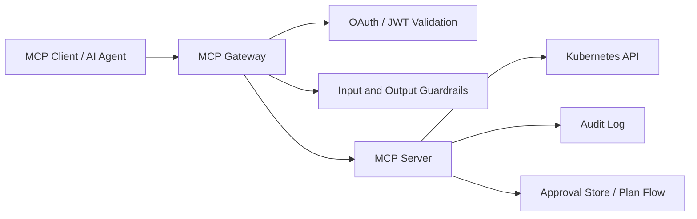

# Recommendation Brief for Kubernetes MCP Guard

## Context

Kubernetes MCP Guard is an experimental project that provides AI-safe Kubernetes operations through MCP. The project appears to have a strong initial architecture: an MCP server, gateway, auth layer, dev issuer, Docker packaging, GitHub Actions workflows, Docker Hub/GHCR publishing, and documentation for local development.

The next phase should focus less on adding major new runtime features and more on making the project easier to understand, easier to try, safer to operate, and more credible as an experimental open-source release.

This recommendation should be converted into implementation plans before making changes. Do not make broad architectural rewrites unless there is a clear reason and the plan is approved.

---

# Primary Goal

Prepare Kubernetes MCP Guard for a stronger experimental public release by improving:

1. Repository clarity
2. Published-image usability
3. Security posture
4. Release/readiness messaging
5. CI/CD quality
6. Documentation and examples
7. User confidence

The project should remain clearly labeled as experimental, but it should feel polished enough that an early adopter can understand, run, and evaluate it safely.

---

# Guiding Principles

## Preserve the current safety model

The current direction is good: do not expose raw `kubectl` or shell execution to AI clients. Continue relying on:

- Narrow MCP tool surface
- Kubernetes API client usage
- RBAC-aware access
- OAuth/auth gateway
- Approval-gated mutations
- Auditability
- Manifest validation
- Namespace boundaries
- Guardrails as defense-in-depth

Avoid adding “convenience” features that bypass these controls.

## Be explicit about what is experimental

The project should clearly say that APIs, configuration, deployment manifests, image names, and runtime behavior may change.

The project should also clearly say that the dev issuer and local OAuth mode are for development/testing only.

## Prefer practical improvements over large rewrites

Focus on changes that make the repo more useful and trustworthy immediately:

- Better README
- Better release docs
- Published image usage
- Security files
- CI improvements
- Example workflows
- Demo scenario

---

# Recommended Implementation Epics

## Epic 1: Improve README and project positioning

### Problem

The project concept is strong, but new users need an immediate explanation of:

- What the project does
- Why it exists
- What is safe about it
- What is experimental
- How to try it quickly
- Which images/packages are published
- Which components exist

There is also some naming inconsistency between the public project name “Kubernetes MCP Guard” and internal naming such as “InfraGate.”

### Recommended changes

Update the root `README.md` to include:

1. A concise project description near the top.
2. A status badge for the Docker workflow.
3. Docker Hub and GHCR image references.
4. A clear experimental status warning.
5. A “What this protects against” section.
6. A “What this does not protect against” section.
7. A short architecture overview.
8. A quickstart using published images.
9. A development quickstart using local builds.
10. A note explaining internal namespace/project naming if `InfraGate` remains in code/docs.

### Suggested README sections

```markdown
# Kubernetes MCP Guard

Experimental MCP gateway/server for AI-safe Kubernetes operations.

## Status

Experimental preview. Not recommended for production workloads yet.

## Why this exists

AI agents should not receive unrestricted cluster access. Kubernetes MCP Guard provides a safer control plane for inspection, diagnosis, and approval-gated changes.

## Safety model

- No raw shell execution
- Narrow MCP tool surface
- Read-only tools separated from mutation tools
- Mutation plans require approval before apply
- Kubernetes RBAC remains the hard permission boundary
- OAuth/JWT authentication through the gateway
- Audit logging
- Guardrails and redaction as defense-in-depth

## Published images

Docker Hub:

- `mirusser/kubernetes-mcp-guard-gateway`
- `mirusser/kubernetes-mcp-guard-devissuer`

GitHub Container Registry:

- `ghcr.io/mirusser/kubernetes-mcp-guard-gateway`
- `ghcr.io/mirusser/kubernetes-mcp-guard-devissuer`

## Quickstart

Add instructions here for running from published images.

## Development setup

Link to the existing setup guide.

## Production readiness

Explain what is not production-ready yet.
````

### Acceptance criteria

* A new user can understand the project in under two minutes.
* README clearly says the release is experimental.
* README includes Docker Hub and GHCR image names.
* README includes build/status badges.
* README links to setup docs.
* README explains any `InfraGate` naming still visible in the repository.

---

## Epic 2: Add published-image quickstart

### Problem

The project now publishes images, but the docs still focus heavily on building locally. Users should be able to try the released images without cloning and building everything.

### Recommended changes

Add documentation for running from published images.

Possible approaches:

1. Add a `compose.release.yaml` file that uses published images.
2. Add a compose override file, for example:

```text
deploy/mode-c/compose.release.yaml
```

3. Update docs to explain both local-build and released-image modes.

### Suggested implementation

Create or update a Docker Compose file that references:

```yaml
image: mirusser/kubernetes-mcp-guard-gateway:0.0.1
image: mirusser/kubernetes-mcp-guard-devissuer:0.0.1
```

or preferably:

```yaml
image: ghcr.io/mirusser/kubernetes-mcp-guard-gateway:0.0.1
image: ghcr.io/mirusser/kubernetes-mcp-guard-devissuer:0.0.1
```

Decide whether Docker Hub or GHCR should be the primary documented registry. It is okay to document both.

### Documentation should include

* Pull commands
* Compose command
* Required environment variables
* Local Kubernetes/kubeconfig assumptions
* How to verify the gateway is running
* How to connect an MCP client
* How to clean up

### Acceptance criteria

* A user can run the project using published images.
* The docs clearly distinguish local build mode from released image mode.
* The quickstart does not require the user to understand the full repository structure.
* The documented image tags match the release tags.

---

## Epic 3: Add production-readiness and security disclaimers

### Problem

Because this project deals with Kubernetes, OAuth, RBAC, AI agents, and mutation approvals, the documentation should be explicit about security boundaries.

### Recommended changes

Add a `docs/security-model.md` or equivalent file.

This should explain:

1. Hard security boundaries:

   * Kubernetes RBAC
   * JWT validation
   * Required scopes
   * Namespace enforcement
   * Approval-gated mutation flow

2. Defense-in-depth mechanisms:

   * Prompt/input guardrails
   * Output redaction
   * Audit logging
   * MCP tool annotations

3. Non-goals:

   * Not a replacement for Kubernetes RBAC
   * Not a replacement for a production identity provider
   * Not a full policy engine yet
   * Not a guarantee that AI-generated actions are correct
   * Not production-certified

4. Development-only components:

   * Dev issuer
   * HTTP/local metadata settings
   * Local/demo kubeconfig scripts

5. Recommended production requirements:

   * Real OIDC provider
   * TLS everywhere
   * Least-privilege service accounts
   * Network policies
   * External audit log storage
   * Image scanning
   * Pin released image versions
   * Avoid `latest` for production-like environments

### Acceptance criteria

* Security model is documented separately from setup instructions.
* README links to the security model.
* Dev-only components are clearly marked.
* Guardrails are accurately described as defense-in-depth, not a complete security boundary.

---

## Epic 4: Add LICENSE and SECURITY.md

### Problem

Without a license, users generally do not know whether they can reuse, modify, or redistribute the project. A security-focused project should also include a vulnerability reporting policy.

### Recommended changes

Add:

```text
LICENSE
SECURITY.md
```

### LICENSE

Choose one:

* MIT: simple and permissive
* Apache-2.0: permissive, includes explicit patent grant

For this type of infrastructure/security-adjacent project, Apache-2.0 may be a strong default.

### SECURITY.md should include

* Supported versions
* How to report vulnerabilities
* Whether to use GitHub Security Advisories
* Expected response time
* What information to include in reports
* A reminder not to publicly disclose vulnerabilities before coordination

### Suggested SECURITY.md structure

```markdown
# Security Policy

## Supported Versions

This project is currently experimental. Security fixes are expected to target the latest release only.

## Reporting a Vulnerability

Please report suspected vulnerabilities privately using GitHub Security Advisories if available.

Include:

- Affected version or commit
- Description of the issue
- Reproduction steps
- Potential impact
- Suggested mitigation, if known

Please do not open a public issue for security vulnerabilities.
```

### Acceptance criteria

* Repository has a clear open-source license.
* Repository has a vulnerability reporting policy.
* README links to both where appropriate.

---

## Epic 5: Improve CI/CD quality

### Problem

The existing CI/CD setup is good, but a security-oriented project benefits from stronger supply-chain and image-quality checks.

### Recommended changes

Add or improve workflows for:

1. Unit tests
2. Integration tests
3. Docker build
4. Docker image publishing
5. Image vulnerability scanning
6. Dependency scanning
7. Release validation

### Specific recommendations

#### Add container image scanning

Use a scanner such as:

* Trivy
* Grype

Scan built images before or after publishing. For experimental releases, do not necessarily fail on every medium vulnerability at first. Start with failing on critical vulnerabilities where a fix exists.

Suggested policy:

* Fail on `CRITICAL`
* Warn on `HIGH`
* Upload SARIF results to GitHub Security tab if possible

#### Improve Docker workflow naming

The current workflow description says:

```yaml
description: Push images to Docker Hub
```

But the workflow now pushes to Docker Hub and GHCR. Update it to:

```yaml
description: Push images to Docker Hub and GitHub Container Registry
```

#### Consider separating build and publish behavior

Current behavior is okay, but consider naming the job or workflow clearly:

* `Docker build`
* `Docker publish`
* `Container images`

#### Consider pinning actions by SHA later

Major-version pins are acceptable for now, but for a security-focused project, eventually pin GitHub Actions by commit SHA.

### Acceptance criteria

* CI shows status badges in README.
* Docker workflow description reflects both Docker Hub and GHCR.
* Image scan is present.
* Failed scans are understandable.
* Release builds are reproducible enough for experimental use.

---

## Epic 6: Improve package/release presentation

### Problem

The project now publishes images and has releases, but users need a clean release story.

### Recommended changes

Create a release checklist and release notes template.

Add:

```text
.github/release.yml
docs/release-process.md
```

or simpler:

```text
docs/releasing.md
```

### Release checklist should include

1. Confirm unit tests pass.
2. Confirm integration tests pass.
3. Confirm Docker workflow passes.
4. Confirm Docker Hub images are published.
5. Confirm GHCR images are published.
6. Confirm GitHub Packages are public if intended.
7. Confirm release notes include image names and tags.
8. Mark release as pre-release for experimental versions.
9. Verify quickstart commands use the released tag.
10. Verify no secrets are present in docs, logs, or examples.

### Release notes template

```markdown
## Kubernetes MCP Guard VERSION — Experimental Preview

This is an experimental release of Kubernetes MCP Guard.

### Images

Docker Hub:

- `mirusser/kubernetes-mcp-guard-gateway:VERSION`
- `mirusser/kubernetes-mcp-guard-devissuer:VERSION`

GitHub Container Registry:

- `ghcr.io/mirusser/kubernetes-mcp-guard-gateway:VERSION`
- `ghcr.io/mirusser/kubernetes-mcp-guard-devissuer:VERSION`

### Status

Experimental. Not recommended for production workloads.

### Changes

- ...
- ...

### Known limitations

- ...
- ...

### Upgrade notes

- ...
```

### Acceptance criteria

* There is a documented release process.
* Future releases can be created consistently.
* Release notes clearly identify image tags and experimental status.
* GitHub releases are marked as pre-releases while appropriate.

---

## Epic 7: Add end-to-end demo scenario

### Problem

The project’s value is easiest to understand through a concrete scenario. A demo will help users understand the approval-gated flow.

### Recommended demo

Create a scenario such as:

> “An AI client inspects a failing Kubernetes workload, diagnoses the likely issue, proposes a safe change, and applies it only after approval.”

### Demo should include

1. Setup a demo namespace.
2. Deploy a deliberately broken workload.
3. Use read-only tools to inspect status/events/logs.
4. Generate a mutation plan.
5. Show the approval step.
6. Apply the approved plan.
7. Verify the workload recovers.
8. Show audit output.

### Possible files

```text
docs/demo-failing-deployment.md
examples/failing-deployment/
examples/failing-deployment/deployment.yaml
examples/failing-deployment/fix.yaml
```

### Acceptance criteria

* A user can follow the demo step-by-step.
* The demo exercises both read-only and approval-gated mutation flows.
* The demo reinforces the safety model.
* The demo does not require production credentials.

---

## Epic 8: Strengthen configuration documentation

### Problem

The setup guide has useful configuration information, but it should be easy to find every environment variable, whether it is required, and whether it is safe for production.

### Recommended changes

Create a centralized configuration reference:

```text
docs/configuration.md
```

### Include a table with

* Variable name
* Component
* Required?
* Default
* Example
* Description
* Production guidance

### Example table

| Variable                                  | Component      |               Required | Default | Production guidance                   |
| ----------------------------------------- | -------------- | ---------------------: | ------- | ------------------------------------- |
| `INFRA_GATE_OAUTH_REQUIRE_HTTPS_METADATA` | Gateway        |                     No | `true`  | Keep `true` outside local development |
| `DOCKERHUB_NAMESPACE`                     | GitHub Actions | For Docker Hub publish | none    | Set to Docker Hub user/org namespace  |
| `DOCKERHUB_USERNAME`                      | GitHub Actions | For Docker Hub publish | none    | Use Docker Hub username               |
| `DOCKERHUB_TOKEN`                         | GitHub Actions | For Docker Hub publish | none    | Use access token, not password        |

### Acceptance criteria

* Configuration is documented in one place.
* Dev-only settings are clearly marked.
* Production-dangerous settings are clearly marked.
* README links to the config reference.

---

## Epic 9: Clarify architecture

### Problem

The project has multiple components. Users need to understand which part does what.

### Recommended changes

Add an architecture document:

```text
docs/architecture.md
```

### Include

1. Component diagram in Mermaid.
2. Request flow for read-only tools.
3. Request flow for mutation tools.
4. Approval flow.
5. Auth flow.
6. Audit flow.
7. Registry/image layout.

### Suggested Mermaid diagram



### Acceptance criteria

* A technically capable user can understand the architecture without reading all source code.
* The docs clearly explain that Kubernetes RBAC remains a core boundary.
* Mutation approval flow is documented clearly.

---

## Epic 10: Improve repository polish

### Recommended changes

Add or improve:

```text
CONTRIBUTING.md
CODE_OF_CONDUCT.md
CHANGELOG.md
docs/roadmap.md
.github/ISSUE_TEMPLATE/
.github/PULL_REQUEST_TEMPLATE.md
```

### CONTRIBUTING.md should include

* How to build
* How to test
* How to run locally
* How to run Docker Compose
* How to format/lint
* How to add MCP tools safely
* How to update docs

### PR template should ask

* Does this add or modify MCP tools?
* Does this affect mutation behavior?
* Does this affect auth?
* Does this affect RBAC assumptions?
* Does this update docs?
* Were tests added?
* Was the demo tested?

### Acceptance criteria

* Repo feels approachable to outside contributors.
* Safety-sensitive changes are called out during PR review.
* Basic contribution path is documented.

---

# Suggested Prioritization

## Phase 1: Public release polish

Do these first:

1. Update README
2. Add published-image quickstart
3. Add LICENSE
4. Add SECURITY.md
5. Add release notes template
6. Fix workflow wording for Docker Hub + GHCR

These are high-impact and relatively low-risk.

## Phase 2: Security and trust

Then do:

1. Add security model docs
2. Add image scanning
3. Add configuration reference
4. Add architecture docs
5. Confirm GHCR package visibility

These make the project more credible and safer to evaluate.

## Phase 3: Demo and adoption

Then do:

1. Add end-to-end demo scenario
2. Add example manifests
3. Add screenshots or demo GIF
4. Add contributor docs
5. Add roadmap

These help users understand the project quickly and attract feedback.

---

# Implementation Instructions for the AI Agent

Before editing files:

1. Inspect the current repository structure.
2. Identify existing docs that overlap with the recommended files.
3. Avoid duplicating information unnecessarily.
4. Prefer linking between docs over repeating long sections.
5. Preserve current working commands unless they are incorrect.
6. Keep the project clearly labeled experimental.
7. Do not remove existing safety warnings.
8. Do not weaken authentication, approval, namespace, RBAC, or manifest validation behavior.
9. Do not introduce raw shell execution as an MCP tool.
10. Do not add production claims unless they are explicitly supported.

For each epic:

1. Create a short implementation plan.
2. List files to add or modify.
3. Explain any assumptions.
4. Make changes in small commits or small PR-sized chunks.
5. Include acceptance criteria validation.
6. Update README links when adding new docs.

---

# Definition of Done

This recommendation is considered implemented when:

* README clearly explains the project, status, images, quickstart, and safety model.
* Published Docker Hub and GHCR images are documented.
* Users can run from published images.
* Experimental/pre-production limitations are obvious.
* LICENSE exists.
* SECURITY.md exists.
* Security model is documented.
* Release process is documented.
* CI includes image scanning or has a clear follow-up issue for it.
* Architecture is documented.
* At least one end-to-end demo exists or is planned with tracked tasks.
* The repository feels ready for external experimental users to try safely.


