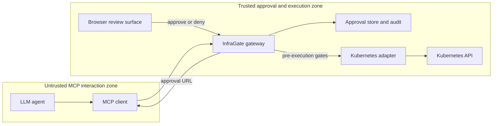
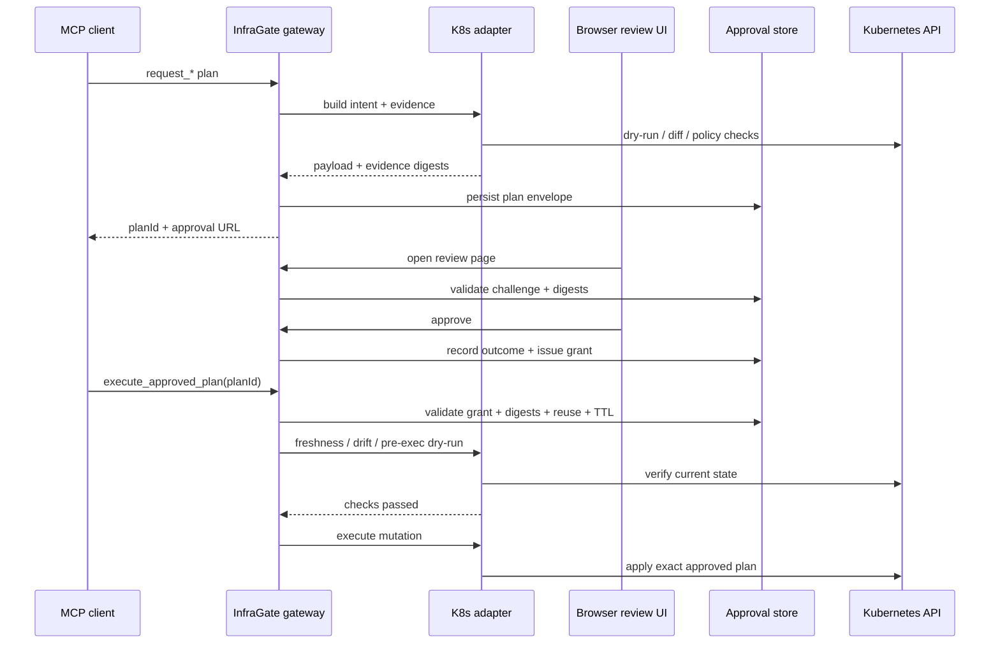

# MCP Capability Discoverability in the Safety Context

## Executive summary

As of the official **25 Nov 2025 MCP specification**, MCP absolutely does standardize a lot of *tool interface discoverability*: a tool has a name, description, `inputSchema`, optional `outputSchema`, optional `execution` metadata, and optional `annotations`. MCP also standardizes **user interaction** via elicitation, including **URL mode** for sensitive out-of-band flows, and it standardizes **authorization** patterns for the MCP client ↔ MCP server relationship. So the broad claim “MCP tells you nothing about what a tool can do” is too strong. MCP does tell you the tool’s *shape*, some execution hints, and how to ask the user for additional input. It just does **not** standardize the thing safety engineers actually lose sleep over at 3 a.m.: the trusted, reviewable, approval-bound meaning of a mutation. citeturn45view0turn45view1turn43view1turn45view4turn45view5turn42view2turn44view3

That distinction matters. MCP’s `ToolAnnotations` are explicitly **hints**, and the spec says clients should **never** make tool-use decisions from annotations received from untrusted servers. URL-mode elicitation is useful and important, but it is still an **interaction primitive**, not a full **mutation approval transaction**: it gives you a way to send a human to a trusted browser flow, but it does not define a standard plan object, review artifact model, digest binding, approval grant, reuse policy, approval TTL, or pre-execution validation contract tying the browser approval to the later `tools/call`. Tasks help with long-running operations and polling, but they do not solve authorization semantics either. citeturn43view1turn43view2turn43view6turn44view0turn44view1turn44view7

That is exactly where **Kubernetes-MCP-Guard**, internally structured around **InfraGate**, becomes interesting. The repo is not just “an MCP server with a login page.” It is an **application-layer mutation approval profile prototype**: a generic approval core plus a Kubernetes domain adapter that builds digest-bound plans, browser review pages, approval challenges, approval grants, audit events, and pre-execution gates. In plain English: MCP hands you the wrench; InfraGate bolts on the torque spec, lockout tag, witness signature, and “no, you may not delete prod because a prompt told you to.” That is strong and article-worthy material, precisely because the repo sits in a very real standards gap rather than pretending the gap is already closed. citeturn11view4turn11view8turn12view0turn12view4turn12view5turn13view7turn14view1turn15view6turn16view6turn17view0turn39view0turn39view1

## How MCP exposes capability information today

On the **specification `schema` page**, a `Tool` is defined with a `name`, optional `title`, optional `description`, mandatory `inputSchema`, optional `outputSchema`, optional `execution`, optional `annotations`, and `_meta`. The spec is therefore not silent about discoverability; it standardizes a fairly rich **structural interface contract**. The `description` is explicitly framed as something that may improve the model’s understanding of available tools, and `inputSchema` / `outputSchema` are JSON Schema objects for parameters and structured results. That is interface discovery in the strict sense. citeturn45view0turn45view1turn45view3

The important catch is that **structural discovery is not semantic safety discovery**. The same schema page defines `ToolAnnotations` with `readOnlyHint`, `destructiveHint`, `idempotentHint`, and `openWorldHint`, but the spec also says—very plainly—that **all properties in `ToolAnnotations` are hints** and are **not guaranteed** to faithfully describe behavior, and that clients should **never** make tool-use decisions based on annotations from untrusted servers. That sentence is doing a lot of work. It means the spec already knows annotations are not an enforceable safety contract; they are closer to “please behave” stickers than to a tamper-proof approval model. citeturn43view1turn43view2turn43view3turn43view4

MCP also now has a stronger story for **human interaction** than earlier versions did. In `client/elicitation`, the spec says elicitation supports **two modes**: `form` and `url`. It further says servers **must not** use form mode to collect sensitive information such as passwords, API keys, access tokens, or payment credentials, and **must** use **URL mode** for such interactions. The same page requires clients to clearly display the target domain and gather user consent before navigation. The 25 Nov 2025 changelog confirms that **URL mode elicitation** was added in that release. So, objectively, MCP now *does* standardize an out-of-band interaction primitive for sensitive workflows. That is an important update versus older mental models. citeturn45view4turn45view5turn41search5

The spec is also explicit that **URL mode elicitation is not MCP authorization**. The elicitation page says URL mode is for the MCP server to obtain sensitive data or **third-party authorization** on behalf of the user; the MCP client’s bearer token stays unchanged, and the client’s role is basically to give the human context and navigate them to the URL. It also says the MCP server **must not** rely on URL mode to authorize users for itself, and credentials obtained via URL mode **must not** be transmitted back to the MCP client. That is a very clean separation of concerns—and also a clue that URL mode, by itself, is not a mutation-approval standard. citeturn45view5turn44view7

For **long-running operations**, MCP defines `ToolExecution.taskSupport` as `forbidden`, `optional`, or `required`, and the tasks utility defines a `tasks` capability, task augmentation for request types such as `tools/call`, progress notifications, `related-task` metadata, and polling via `tasks/get`. In other words, MCP can help say “this operation might take a while; poll here.” That is useful plumbing for approval workflows, but it is still workflow plumbing, not a normative decision model for “what exactly did the human approve, and is the server still allowed to execute it right now?” citeturn43view2turn43view3turn43view6turn44view0turn44view1

Finally, MCP’s **authorization** story is real, but scoped. The authorization page standardizes things like **client ID metadata documents**, **preregistration**, and optional **dynamic client registration**, and the security best-practices guidance explicitly forbids **token passthrough** as an anti-pattern. The same guidance recommends a **progressive least-privilege scope model**. This is all good and necessary. It secures who can talk to whom and which scopes they hold, but it still does not define a standardized approval artifact for a high-risk mutation. OAuth tells you who the caller is; it does not tell you what exact Deployment patch a human approved fifteen minutes ago. citeturn42view2turn44view3turn44view4

### MCP features mapped to safety primitives

| Safety primitive needed for mutation safety | What MCP 2025-11-25 provides | What that means in practice |
|---|---|---|
| Discover tool parameters and output shape | `Tool.inputSchema`, optional `outputSchema`, `description`, `name`, `title`. citeturn45view0turn45view1 | Good for interface discovery. Not enough for impact discovery. |
| Basic risk hints | `readOnlyHint`, `destructiveHint`, `idempotentHint`, `openWorldHint`. citeturn43view1turn43view2 | Helpful hints, but the spec says they are not trustworthy for enforcement. |
| Send user to a safer browser flow | Elicitation `mode: "url"` for sensitive interactions. citeturn45view4turn45view5turn44view7 | Great primitive for OOB interaction. Not a full mutation-approval transaction. |
| Handle long-running operations | `ToolExecution.taskSupport`, tasks capability, polling via `tasks/get`. citeturn43view6turn44view0turn44view1 | Helps orchestration and status tracking, not approval semantics. |
| Client ↔ server authorization | Authorization spec plus security guidance; token passthrough forbidden. citeturn42view2turn44view3turn44view4 | Strong for transport/auth identity. Still not a standard approval model for mutations. |
| Mutation plan identity | No standard `plan` object in the tool schema / elicitation / tasks / auth pages. citeturn45view0turn45view4turn44view0turn42view2 | Gap. |
| Immutable review artifact model | No standard review snapshot, diff digest, or evidence artifact type. citeturn45view0turn43view1turn45view5 | Gap. |
| Approval-bound execution | URL mode exists, but the spec does not define grant binding from browser approval to later execution. citeturn45view5turn44view7turn43view6 | Gap. |
| Replay prevention / TTL / reuse policy | No standard approval challenge or grant semantics. citeturn45view0turn44view0turn45view5 | Gap. |
| Auditable approval lifecycle | No standard audit event vocabulary for plan/challenge/grant/execution. citeturn45view0turn44view0turn42view2 | Gap. |

## What MCP still lacks for safe mutation approvals

The cleanest way to say it is this: **MCP standardizes tool discoverability, not mutation governability**. A generic MCP client can learn that a tool accepts a JSON object, maybe that it is “destructive,” maybe that it supports tasks, and maybe that it can send the user to a URL. But none of those primitives define a trusted **mutation-intent envelope** saying “this exact requested state transition, on these exact targets, with this exact evidence set, is what will later execute if approved.” By inspection of the official tool schema, elicitation, tasks, and authorization pages, that object simply is not there. citeturn45view0turn45view1turn43view1turn45view5turn44view0turn42view2

The missing **review artifact model** is just as important. A real approval flow needs more than “tool X with args Y.” It needs a durable description of what the human actually reviewed: diff, dry-run result, policy findings, redactions, target objects, validity window, maybe renderer context. MCP has JSON schemas and free-text descriptions, but it does not define a standard typed review snapshot or even a common place where a server can say “this blob is the authoritative evidence package for approval.” That is why generic discovery alone feels thin in safety-sensitive domains. You can discover the screwdriver; you still cannot tell whether it is pointed at a rack screw or the cluster’s kneecap. citeturn45view0turn45view1turn43view1

**URL mode elicitation** is the most relevant official primitive here, and it is genuinely useful. It gives servers a standard way to push sensitive human interactions into a browser flow that the MCP client does not mediate end-to-end. But the spec is careful: URL mode is for gathering sensitive data or third-party authorization, the client token remains unchanged, and the MCP client’s job is basically context and navigation. What it does **not** standardize is the next step: how that browser interaction produces a durable, replay-resistant **approval grant** for a later mutation tool call. So URL mode solves the “please get the human out of the chat box” part, but not the “what exactly did they authorize, for how long, and how do we verify it at apply time?” part. citeturn45view5turn44view7

Tasks have a similar shape/value mismatch. They standardize long-running request handling, progress, related-task metadata, and polling. That means an approval workflow *could* use tasks for waiting states or notification plumbing. But tasks do not define approval semantics either: no challenge object, no approver identity binding, no review digest, no grant expiry, no single-execution policy. They are useful ductwork, not the lock on the door. Good ductwork matters; it just does not count as a safe. citeturn43view6turn44view0turn44view1

The final big gap is **domain semantics**. The `Tool` schema can tell a client the arguments are an object with some properties. `ToolAnnotations` can hint that the tool is read-only or destructive. But the spec explicitly warns those annotations are not trustworthy, and JSON Schema itself does not capture **blast radius**. A safe review UI for Kubernetes needs object identity, desired changes, server-side dry-run results, diffs, policy findings, and freshness checks. None of that falls naturally out of generic `inputSchema`. That is why domain adapters are not merely an implementation convenience; for high-stakes review, they are currently the only way to turn “here is some JSON” into “here is the exact operational change you are about to approve.” citeturn45view0turn45view1turn43view1

## Where InfraGate fits

InfraGate’s own docs describe the design almost exactly as a missing MCP layer. In `docs/mutation-approval-profile.md`, the repo splits the problem into a **generic approval core** and a **domain adapter**. The generic core owns plan envelopes, digest checks, approval challenges, challenge outcomes, approval grants, an audit spine, review-snapshot canonicalization, and pre-execution gate orchestration. The domain adapter owns mutation meaning, evidence, freshness checks, domain policy, and execution behavior. That is a very crisp answer to the spec gap: keep the generic lifecycle generic, but do not pretend Kubernetes semantics can be auto-discovered from vibes and a JSON schema. citeturn12view0turn12view1turn12view4turn12view5turn13view7

The repo’s proposed **plan envelope** in `docs/mutation-approval-profile.md` includes exactly the fields MCP lacks today: `planId`, `profile`, `operationType`, requester identity, approval policy, execution reuse policy, validity window, freshness policy, `intentDigest`, `reviewDigest`, and digest-bound evidence artifacts. The same document is explicit that `planId` is **not** an integrity mechanism; the digests are. It also distinguishes clearly between the **Intent Digest** for the executable mutation and the **Review Digest** for the human-reviewed snapshot. That separation is not just elegant; it is the difference between “I approved the concept of a patch” and “I approved this exact thing with this exact evidence.” citeturn12view1turn12view2turn12view3turn12view4

The flow document in `docs/mutation-approval-flow.md` then adds the missing lifecycle mechanics: **Challenge Outcome** is the terminal audit record for one approval attempt, while **Approval Grant** is the durable execution authorization consumed by pre-execution gates. It also lists the gate sequence before execution: validate the grant, check the plan window, authorize, recompute and compare the intent digest, recompute and compare the review digest, enforce the reuse policy, run freshness checks, and run required domain-policy checks. That is basically the approval-bound execution contract that MCP does not currently define. citeturn12view7turn12view8turn13view6turn13view7

That architecture is not just described in prose; it is reflected in the repo structure. `src/InfraGate.McpGateway/README.md` says the gateway adds authentication, prompt-injection guardrails, response sanitization, out-of-band plan approval, and guardrail audit logging, while Kubernetes-specific plan building and execution gates are delegated to `InfraGate.KubernetesAdapter`. `src/InfraGate.Approvals/README.md` says the approvals layer defines generic plan envelopes, challenge records, durable grants, digest-bound evidence summaries, and pre-execution gates, and that runtime persistence is PostgreSQL-backed. `src/InfraGate.McpServer/README.md` describes a private stdio MCP server that performs the raw Kubernetes reads, dry-runs, diffs, and mutations behind the gateway. In other words, the repo is structured the way the safety model says it should be structured. Nice when the code and the architecture note are not strangers. citeturn11view0turn11view1turn11view2turn11view3turn15view6turn16view6

At code level, the generic approval model is concrete. `src/InfraGate.Approvals/PlanEnvelope.cs` exposes a plan envelope with `profile`, `adapterId`, `operation`, `validFromUtc`, `validUntilUtc`, requester, approval policy, reuse policy, review-surface context, evidence artifacts, and both digests. `src/InfraGate.Approvals/PlanEnvelopeFactory.cs` defaults the approval policy to **SameSubject**, the reuse policy to **SingleExecution**, and computes the **review digest** over the validity window, requester, approval policy, reuse policy, freshness policy, review-surface context, evidence artifacts, and intent digest. `src/InfraGate.Approvals/ApprovalChallenge.cs` and `ApprovalGrant.cs` model the challenge and durable grant records, while `ApprovalDigest.cs` computes canonical SHA-256 digests. citeturn27view0turn28view1turn28view6turn29view0turn21view0turn22view0turn24view4turn22view3

InfraGate also implements the trust boundary around browser approval with more rigor than a casual “click here to approve” flow. In `GatewayApprovalService.cs`, challenge creation is bound to the **pending plan hash**, **requester subject**, **auth type**, **TTL**, **intent digest**, and **review digest**, and the gateway returns an approval URL when approval is required. At approval time, the same file revalidates the challenge against the current pending plan and rejects the approval if the digests or pending-plan hash have changed. It also enforces same-subject or operator-group authorization for the challenge outcome. `GatewayApprovalEndpoints.cs` requires authorization for the browser routes and validates anti-forgery tokens on the approval POST routes. This is the difference between “browser-based” and “actually approval-bound.” citeturn40view0turn34view2turn34view3turn34view4turn34view5turn34view6turn15view6

The repo further aligns with official MCP security guidance on the auth boundary. The gateway README says **OAuth access tokens are terminated at the gateway** and the downstream stdio server receives tool calls, not bearer tokens. That is very much in the spirit of MCP’s prohibition on token passthrough. The same README says destructive downstream tools are reachable only through the gateway’s approval-bound execution path, and `docs/security-model.md` makes clear that MCP clients may be untrusted or partially trusted and that prompt-injection guardrails are defense-in-depth rather than a hard boundary. That is a sober model, not fantasy football for security architecture. citeturn15view4turn15view6turn14view2turn14view5turn14view7turn44view3

The Kubernetes adapter is where the domain-specific semantics arrive. `KubernetesPlanPayload.cs` carries namespace, description, parameters, target objects, manifest, dry-run output, diffs, and policy findings. `KubernetesApprovalAdapter.cs` computes the **intent digest** from the operation, namespace, parameters, objects, and manifest, and separately computes evidence digests for dry-run output, diffs, and policy findings. `KubernetesPlanBuilder.cs` assembles the payload from live Kubernetes evidence, including server-side dry-run, diffs, and policy findings. `KubernetesPlanExecutor.cs` decodes the envelope, checks live drift, reruns policy and a pre-execution dry-run, publishes `pre_execution.checked`, and only then proceeds toward mutation. That is exactly the kind of adapter-owned semantic contract the MCP spec does not currently standardize. citeturn37view0turn39view3turn38view2turn38view4turn39view4turn39view5turn39view0turn39view1turn39view2

The repo even documents this flow operationally in `docs/demo-failing-deployment.md`: a failing Deployment is diagnosed through read-only tools, a mutation plan is requested, approval is required before `execute_approved_plan`, and the full path includes hash-bound approval, exact-plan apply, verification, and audit inspection. The public roadmap is appropriately modest, calling the project an **experimental reference implementation** for a possible MCP mutation-approval profile rather than pretending it is production-certified. That honesty is a feature, not a bug. citeturn11view6turn11view4turn14view3

### Repo components mapped to the missing primitives

| Missing primitive | InfraGate component | Evidence |
|---|---|---|
| Generic plan envelope | `src/InfraGate.Approvals/PlanEnvelope.cs`, `PlanEnvelopeFactory.cs` | Carries requester, policies, validity window, evidence artifacts, intent digest, review digest, and payload; factory defaults to same-subject + single-execution and computes review digest over approval-relevant metadata. citeturn27view0turn28view1turn28view6 |
| Challenge / grant split | `docs/mutation-approval-flow.md`, `ApprovalChallenge.cs`, `ApprovalGrant.cs` | Explicitly separates challenge outcome from durable approval grant. citeturn13view7turn21view0turn22view0 |
| Digest-bound execution | `ApprovalDigest.cs`, `ApprovalGrantValidation.cs`, `GatewayApprovalService.cs` | Canonical SHA-256 digests; grant validation compares digests; approval service rejects changed digests / plan hash at approval time. citeturn29view0turn27view3turn34view2 |
| Approval policy semantics | `ApprovalPolicy.cs`, `GatewayApprovalService.cs` | Same-subject and operator-approval policies are first-class and enforced during challenge outcomes. citeturn24view4turn34view3 |
| Challenge TTL and single-use routing | `InfraGate.Approvals/README.md`, `GatewayApprovalService.cs`, `ProposePlanHandler.cs` | Default 15-minute challenge TTL; approval access codes are short-lived and single-use; challenge TTL is capped by plan validity. citeturn16view4turn16view6turn40view0turn40view2 |
| Browser OOB review with CSRF protection | `GatewayApprovalEndpoints.cs` | Authenticated GET/POST approval endpoints with anti-forgery validation. citeturn34view4turn34view5turn34view6 |
| Domain-readable review evidence | `KubernetesPlanPayload.cs`, `KubernetesApprovalAdapter.cs`, `KubernetesPlanBuilder.cs` | Review surface gets manifest, dry-run, diffs, and policy findings—not just raw generic args. citeturn37view0turn39view3turn39view4turn39view5 |
| Pre-execution gates | `ApprovalPreExecutionGate.cs`, `KubernetesPlanExecutor.cs` | Generic core validates grant/digest/reuse; adapter checks drift, policy, and pre-exec dry-run. citeturn23view0turn39view0turn39view1turn39view2 |
| Audit spine | `docs/mutation-approval-profile.md`, `InfraGate.Approvals/README.md` | Defines approval lifecycle events such as `plan.created`, `challenge.*`, `grant.issued`, `pre_execution.*`, and execution outcomes. citeturn12view6turn16view7 |
| Defense-in-depth prompt-injection handling | `docs/security-model.md`, `GuardedToolRunner.cs` | Request scanning, response redaction, JSONL guardrail audit, explicit note that these are not hard boundaries. citeturn14view2turn14view3turn35view2turn35view5 |

## A concrete MCP Mutation Approval Profile

If someone wanted to write the article as both critique and constructive proposal, the strongest move would be to frame InfraGate as a **candidate Mutation Approval Profile** layered on top of MCP, not as “MCP is broken and therefore everything is doomed.” MCP already has the right *adjacent* pieces: tool discovery, elicitation with URL mode, tasks, and authorization. The profile would standardize the parts between them that are currently left to each implementation. That is much more actionable than yelling at JSON-RPC in a dark room. citeturn45view0turn45view4turn43view6turn42view2turn11view8

The **data model** should start with a generic **Plan Envelope**. It needs at least: opaque `planId`; `profile`; `operationType`; requester subject; approval policy; execution reuse policy; validity window; freshness policy; `intentDigest`; `reviewDigest`; review-surface context; evidence artifact summaries; and an adapter payload pointer or embedded payload. That is almost one-for-one with the repo’s `docs/mutation-approval-profile.md` and `PlanEnvelope` / `PlanEnvelopeFactory` implementation, which is a good sign because it means the idea is already executable, not just conference-talk vapor. citeturn12view1turn12view2turn12view4turn27view0turn28view1turn28view6

The **API surface** should be minimal and opinionated. A safe baseline would be: a way to **propose or request a mutation plan**, a way to **retrieve review status**, a way to **subscribe or poll** for status updates, a browser-based **review / approve / deny** path, and a final **execute approved plan** operation that accepts `planId`—not a blob of mutable execution arguments. InfraGate already approximates this with `request_*`, `execute_approved_plan`, `get_plan_status`, `wait_for_plan_approval`, `plan://{planId}/status`, and the browser approval routes. Standardizing the interaction would let clients know what to expect without hard-coding product-specific tool names forever. citeturn15view4turn15view6turn31view3turn31view5turn34view4turn34view5turn34view6

The **cryptographic binding** should use at least two digests. The **intent digest** must cover the exact executable mutation intent. The **review digest** must cover what the human reviewed: validity window, requester, approval policy, reuse policy, freshness policy, review surface metadata, evidence artifact digests, and the intent digest itself. InfraGate already does exactly this in the docs and code, and that dual-digest split is, in my view, the most technically important idea in the repo. Without it, “approved” is just a mood. citeturn12view4turn12view5turn28view1turn29view0turn39view3

The **grant semantics** should be explicit. Approval must produce not just a polite boolean but a durable **Approval Grant** bound to the plan identifier, requester, approver, source challenge, digests, policy, reuse rules, and expiry. Challenges should be terminal records with statuses such as approved, denied, rejected, expired, and canceled; grants should be what execution consumes. InfraGate already models that separation in both docs and code. That design deserves to be called out in the article because it is exactly the missing distinction in most ad hoc “human in the loop” tool integrations. citeturn12view5turn12view6turn13view6turn13view7turn21view0turn22view0turn27view5

The profile also needs **domain adapter hooks**. This is the part where the article should be blunt: purely generic approval is not enough for production operations. An adapter has to define canonicalization of mutation intent, evidence generation, evidence digesting, review rendering metadata, freshness checks, domain policy checks, and execution behavior. InfraGate’s Kubernetes adapter is a persuasive reference because it binds all of those things to concrete artifacts: objects, manifests, server-side dry-run output, diffs, policy findings, and live drift checks. If the standard tries to pretend that every domain is equally reviewable from flat JSON input schemas, it will become a very elegant way to standardize false confidence. citeturn12view0turn17view0turn37view0turn39view3turn39view4turn39view5turn39view0

Finally, the profile should set **UI expectations**. The review surface must be authoritative, show the target domain / host / server identity, display the immutable evidence snapshot, surface digests or their stable identifiers, clearly identify approver and requester policy, and protect the browser interaction with standard web controls such as CSRF protection and authenticated sessions. The MCP spec already says URL-mode clients should gather consent before navigation and display the target domain; InfraGate’s browser routes add anti-forgery and authenticated approval pages on top. That is a strong baseline for what a standardized review UI contract should demand. citeturn45view4turn45view5turn34view4turn34view5turn34view6turn14view1

## Limitations and engineering trade-offs

The biggest trade-off is the obvious one: **approval fatigue**. InfraGate’s design is strongest when the dangerous path always requires a trusted browser approval plus grant validation. But that can become operationally expensive if every small mutation in a noisy environment needs a human click. The repo itself is honest that it is experimental and not a full policy engine, which is the right level of humility. A production deployment would probably need risk-tiering, reusable low-risk grants under strict conditions, or policy-based auto-approval scopes for certain environments or object classes. Otherwise the system becomes very safe in the same way that unplugging the cluster is very safe. citeturn14view3turn11view4turn12view6

The second trade-off is **state management**. Approval systems create state: plans, challenges, grants, access codes, audit events, and review artifacts. InfraGate has moved runtime approval state into PostgreSQL and defines challenge TTLs and single-use access codes, which is good. But any serious deployment will still need retention rules, garbage collection, operational monitoring, and careful handling of orphaned plans or expired-but-still-visible review pages. The repo already gestures toward this with explicit TTLs, terminal challenge states, PostgreSQL-backed persistence, and startup schema validation; getting the lifecycle ergonomics right is the next engineering hill to climb. citeturn16view4turn16view6turn15view5turn13view6turn40view0

The third trade-off is the big design tension you called out in the conversation: **discoverability vs. domain adapters**. In a perfect world, a client could plug into any MCP server, read a standard set of safety semantics, render a trustworthy review page, and enforce a generic approval policy. In the actual 2025-11-25 spec world, tool discovery is mostly structural and annotations are expressly untrusted hints. So today, domain adapters are not really a failure of abstraction; they are what happens when you need a human to approve something more meaningful than “this JSON object appears to contain feelings.” InfraGate’s split between generic approval core and adapter is therefore not a weakness; it is a pragmatic acceptance of what MCP currently standardizes and what it does not. citeturn43view1turn45view0turn12view0turn17view0turn17view2

The fourth limitation is that **browser OOB alone is not enough**. InfraGate’s security docs are wisely explicit that prompt-injection scanning and response redaction are defense-in-depth, not hard boundaries. Likewise, browser approval without digest checks and pre-execution validation would still be vulnerable to state drift or bait-and-switch execution. The repo’s strength is that it does not stop at “show user a web page”; it ties that page to digests, grants, freshness checks, and a second dry-run before mutation. Any article on this topic should emphasize that distinction, because too many people hear “human in the loop” and mentally substitute “security achieved.” That is not how any of this works. citeturn14view1turn14view2turn14view4turn34view2turn39view0turn39view1

## Verdict and short roadmap

This is **absolutely worthy material for an article**. The hook is not “my repo is cool.” The hook is: **MCP now standardizes interface discovery, OOB URL interaction, tasks, and authorization, but it still does not standardize approval-bound mutation semantics. Here is a concrete reference implementation of what that missing layer looks like.** That is timely, specific, grounded in official sources, and backed by working code and docs rather than hand-wavy “AI safety” ambient incense. citeturn45view0turn45view4turn43view6turn42view2turn11view8turn11view4

If I were turning this into an article, I would position the next steps like this. First, separate the problem into **what MCP already gives you** and **what must be profiled above MCP**; that keeps the piece objective and avoids overstating the criticism. Second, propose an **MCP Mutation Approval Profile** centered on envelopes, digests, grants, TTLs, reuse policy, domain hooks, and browser review requirements, using InfraGate as the reference implementation. Third, suggest how MCP’s existing features could support that profile: **URL-mode elicitation** as a standard OOB entry point, **tasks/resources** for status propagation, and **authorization** for least-privilege client/server identity. That gives the article a standards-forward tone instead of a bunker vibe. citeturn45view4turn44view0turn44view1turn42view2turn44view4turn15view4turn31view5

My bottom line is simple. If the question is, “Does MCP today standardize what a tool *is capable of* in the safety sense?” the correct answer is: **partly at the interface level, no at the approval-semantic level**. If the question is, “Where does InfraGate fit?” the answer is: **exactly in that semantic gap**, and in a technically serious way. That makes it not just article-worthy, but one of the more useful concrete case studies for discussing what “safe-by-design MCP mutations” would actually require. citeturn45view0turn43view1turn45view5turn12view5turn13view7turn39view0turn39view3

## Open questions and limitations

A few questions remain open, and they are worth flagging explicitly rather than pretending the standards fairy will sort them out overnight. The official spec now includes URL-mode elicitation, but it does **not yet** define a mutation-approval-specific profile that reuses URL mode as a normative approval step; InfraGate therefore remains an implementation-level proposal rather than a standard. The repo’s own roadmap also frames it as an **experimental reference implementation**, not a production-certified system. And while the repo documents strong approval semantics for Kubernetes, the broader question of how far that pattern can be generalized without weakening human review remains unresolved—precisely because MCP’s generic discovery model still does not carry trusted domain intent. citeturn45view5turn11view4turn17view0turn43view1r