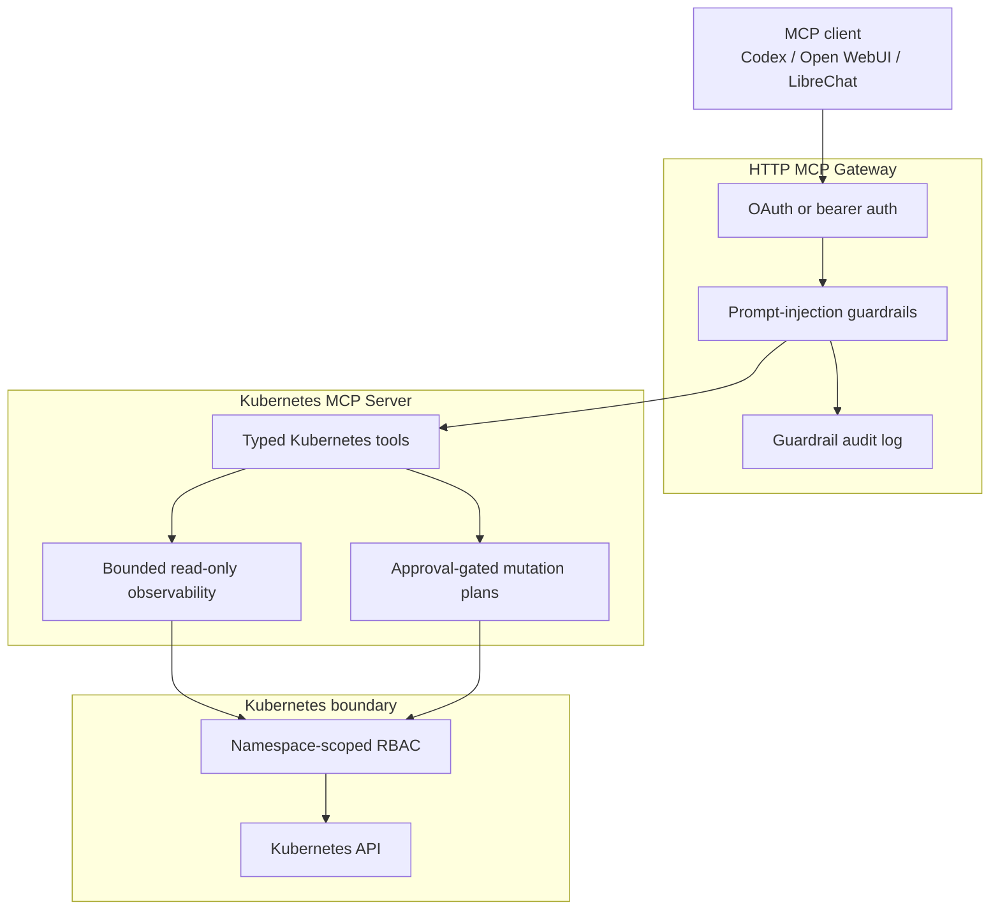

# Kubernetes MCP Guard 🛡️: AI-safe Kubernetes operations through MCP

Kubernetes MCP Guard is a .NET 10 gateway/server for AI-assisted Kubernetes operations through the Model Context Protocol.

It lets MCP clients such as Codex, Open WebUI, LibreChat etc. inspect clusters, propose changes, and apply only approved mutations through OAuth-aware authentication, prompt-injection guardrails, audit logging, namespace-scoped RBAC, bounded observability, and exact-plan approval checks. 

<sub><em>This project is experimental, it's APIs, image tags, configuration, and runtime behavior may change.</em></sub>


[](https://github.com/mirusser/Kubernetes-MCP-Guard/actions/workflows/unit-tests.yml)
[](https://github.com/mirusser/Kubernetes-MCP-Guard/actions/workflows/integration-tests.yml)
[](https://github.com/mirusser/Kubernetes-MCP-Guard/actions/workflows/package-docker.yml)
[](https://sonarcloud.io/summary/new_code?id=mirusser_Kubernetes-MCP-Guard)
[](https://sonarcloud.io/summary/new_code?id=mirusser_Kubernetes-MCP-Guard)

## What It Does ⚙️

- Exposes Kubernetes operations through the Model Context Protocol (MCP), with a stdio Kubernetes server behind a local HTTP gateway.
- Uses the Kubernetes API via `KubernetesClient`; it does not shell out to `kubectl` for runtime operations.
- Adds OAuth/static bearer authentication at the gateway, including MCP protected-resource metadata and insufficient-scope challenges.
- Applies prompt-injection guardrails around model-visible tool input/output, with warn, redact, and audit behavior.
- Keeps mutation paths approval-gated: create a plan first, then apply the exact approved plan.
- Limits Kubernetes blast radius with namespace-scoped RBAC and typed, bounded tool surfaces.


<sub><em>Simplified architectural graph. Full version [here](docs/MCP-compliance.md)</em></sub>

## Why It Matters 🔐

AI infrastructure tools are powerful, but power is not the same thing as safety. Kubernetes MCP Guard treats AI-assisted ops as a systems design problem: capability needs identity, boundaries, auditability, and human approval at the point where state changes.

That makes the project a practical slice of a bigger direction: MCP-native infrastructure operations where agents can inspect, explain, and propose, while production-grade controls decide what actually changes.

## What This Demonstrates 🚀

- AI systems knowledge: MCP transports, tool contracts, elicitation-style approval, and prompt-injection risk around model-visible data.
- Security judgment: OAuth resource-server behavior, scope enforcement, protected-resource metadata, audit identity, and least-privilege RBAC.
- Kubernetes fluency: typed API usage, server-side apply planning, rollout checks, Events, Pod logs, resource summaries, and namespace isolation.
- Product engineering taste: small operational surface, clear user flows, safety defaults, and readable documentation for humans and agents.
- Modern .NET implementation: .NET 10, dependency injection, async APIs, focused tests, and project-level separation of auth, gateway, server, issuer, and test concerns.

## Published Images

Released image tags follow the GitHub release tag (`vX.Y.Z`); the floating `latest` tag is also published.

| Registry | Gateway | Dev Issuer |
| --- | --- | --- |
| GHCR (recommended) | `ghcr.io/mirusser/kubernetes-mcp-guard-gateway:<tag>` | `ghcr.io/mirusser/kubernetes-mcp-guard-devissuer:<tag>` |
| Docker Hub | `mirusser/kubernetes-mcp-guard-gateway:<tag>` | `mirusser/kubernetes-mcp-guard-devissuer:<tag>` |

## How To Run ▶️

### Option 1 — Run from published images (no build required)

**Prerequisites:** [Docker Compose v2](https://docs.docker.com/compose/install/), [minikube](https://minikube.sigs.k8s.io/docs/start/), `git`.

```bash
git clone https://github.com/mirusser/Kubernetes-MCP-Guard.git

cd Kubernetes-MCP-Guard

./scripts/create-demo-kubeconfig.sh --compose
TAG=latest docker compose -f deploy/mode-c/compose.release.yaml up
```

Replace `latest` with a specific release tag (e.g. `v0.1.0`) for a stable run. Available tags are listed on the [Releases page](https://github.com/mirusser/Kubernetes-MCP-Guard/releases).

**Connect Codex CLI:**

1. Add this block to `~/.codex/config.toml` (create the file if it does not exist):

```toml
[mcp_servers.infra-gate]
url = "http://127.0.0.1:3001/mcp"
oauth_resource = "http://127.0.0.1:3001/mcp"
scopes = ["mcp:tools"]
```

2. Then log in:

```bash
codex mcp login infra-gate
```

### Option 2 — Build and run from source

**Prerequisites:** [.NET 10 SDK](https://dotnet.microsoft.com/download/dotnet/10.0), Docker Compose v2, minikube, `git`.

```bash
./scripts/create-demo-kubeconfig.sh --compose
docker compose -f deploy/mode-c/compose.yaml up --build
```

Connect Codex the same way as Option 1.

*Other run modes (stdio-only, static bearer token) and full setup details are in the [Setup Guide](docs/setup-guide.md).*

## Current Capabilities 🧰

### Gateway Protections 🛡️

| Layer | Behavior |
|---|---|
| Authentication | OAuth 2.1 JWT or local static bearer token |
| Prompt-injection guardrails | Warn and redact suspicious model-visible input/output |
| Audit logging | JSONL guardrail audit with identity resolution |
| MCP compliance | Streamable HTTP transport, protected-resource metadata, step-up authorization |

### Read-Only Observability 🔎

| Tool | Purpose |
|---|---|
| `get_k8s_status` | Deployments, Services, ConfigMaps, Pods, and ReplicaSets in a namespace |
| `get_k8s_events` | Bounded `events.k8s.io/v1` cluster diagnostics |
| `get_pod_logs` | Bounded Pod log reads (tail lines + byte cap) |
| `get_k8s_resource` | Focused resource summary — no Secret values, ConfigMap data, or raw manifests |
| `get_deployment_diagnostics` | Deployment health, related Pods, ReplicaSets, and Events |
| `get_pod_diagnostics` | Pod status, conditions, container state, and Events |
| `get_service_diagnostics` | Service endpoints, backing Pods, and Events |

### Approval-Gated Mutations ✅

| Tool | Purpose |
|---|---|
| `request_apply_manifest` | Plan a server-side apply for `Deployment`, `Service`, or `ConfigMap` |
| `request_delete_manifest` | Plan a resource deletion |
| `request_scale_deployment` | Plan a replica count change |
| `request_restart_deployment` | Plan a rollout restart |
| `request_set_deployment_image` | Plan a container image update |
| `apply_approved_plan` | Apply an exact-hash-verified, user-approved plan |

## Compatibility

| Area | Supported / tested |
| --- | --- |
| .NET | .NET 10 |
| Kubernetes | minikube / local cluster initially |
| MCP transport | HTTP MCP endpoint at `/mcp` |
| OIDC | DevIssuer (dev), Keycloak planned, Entra ID later |
| Container registries | GHCR, Docker Hub |
| Platforms | linux/amd64 initially |

## Explore The Project 🧭

- Developer runbook: [docs/devs-readme.md](docs/devs-readme.md)
- Setup guide: [docs/setup-guide.md](docs/setup-guide.md)
- MCP compliance notes: [docs/MCP-compliance.md](docs/MCP-compliance.md)
- Kubernetes MCP server: [src/InfraGate.McpServer/README.md](src/InfraGate.McpServer/README.md)
- HTTP MCP gateway: [src/InfraGate.McpGateway/README.md](src/InfraGate.McpGateway/README.md)
- Gateway auth: [src/InfraGate.McpGateway.Auth/README.md](src/InfraGate.McpGateway.Auth/README.md)
- Local dev OAuth issuer: [src/InfraGate.DevIssuer/README.md](src/InfraGate.DevIssuer/README.md)

**Naming note:** The public name is **Kubernetes MCP Guard**. The internal codename **InfraGate** appears in `.slnx`, project folders, env-var prefixes (`INFRA_GATE_*`), and Docker labels. They refer to the same project; the rename is gradual and does not change runtime behavior.

## Project Policies

- License: [Apache-2.0](LICENSE)
- Security policy: [SECURITY.md](SECURITY.md)
- Release process: [docs/releasing.md](docs/releasing.md)
