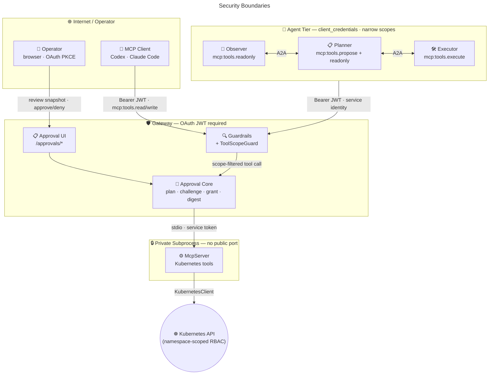

# 🛡️ Kubernetes MCP Guard

**Human-approved, AI-driven Kubernetes remediation through a guarded MCP gateway.**

> **Remediation, by design:**
>
> Observer detects anomalies.  
> Planner proposes an evidence-backed plan.  
> Human reviewer approves out-of-band.  
> Executor runs only the approved digest-bound plan.  
> Everything is auditable.  

</br>

[](https://github.com/mirusser/Kubernetes-MCP-Guard/actions/workflows/ci.yml)
[](https://github.com/mirusser/Kubernetes-MCP-Guard/actions/workflows/integration-tests.yml)
[](https://github.com/mirusser/Kubernetes-MCP-Guard/actions/workflows/publish.yml)
[](https://sonarcloud.io/summary/new_code?id=mirusser_Kubernetes-MCP-Guard)
[](https://sonarcloud.io/summary/new_code?id=mirusser_Kubernetes-MCP-Guard)
![Badge Hi Mom]<br>

<sub>    </sub>


## 📝 TL;DR
**When something breaks, the system can collect evidence, propose a bounded fix, dry-run it, package it into a reviewable plan, and wait for a human to approve.**

It is a security-first bridge between AI agents and Kubernetes, with out-of-band, OAuth-authenticated, human-in-the-loop (HITL), plan-based approval for every gateway-exposed mutation.

### Why?

AI agents can help diagnose infrastructure problems, but giving them direct mutation access is risky. Kubernetes MCP Guard explores a safer pattern: agents may observe, dry-run, and propose bounded remediations, while humans approve the exact digest-bound plan before any Kubernetes write occurs.

## 🎬 Demo

https://github.com/user-attachments/assets/4e06b4ee-db80-4d74-96cc-38dfbb413042

> [!NOTE]
> **Demo scenario:**  
>  
> 1. A Deployment is intentionally broken.  
> 2. The Observer detects the unhealthy workload.  
> 3. The Planner proposes a bounded remediation.  
> 4. An approval access code is sent to the configured operator by email.
> 5. An authenticated human approves the exact plan in the browser.  
> 6. The Executor applies the approved mutation.  
>  

The walkthrough in [docs/demo-failing-deployment.md](docs/demo-failing-deployment.md) shows the full flow against a deliberately broken Deployment.

## 🧠 Core Ideas

Kubernetes MCP Guard explores a practical safety pattern for AI-assisted operations:

- **Plan before mutate:** every gateway-exposed write starts as a `request_*` plan built from Kubernetes server-side dry-run evidence.
- **Separate review channel:** the MCP client receives an approval URL, while approval happens through `/approvals/*` in a browser OAuth session.
- **Digest-bound approval:** execution is bound to an Intent Digest for the executable mutation and a Review Digest for the human-reviewed snapshot.
- **Durable grant model:** an approved Approval Challenge records a Challenge Outcome and issues an Approval Grant consumed by pre-execution gates.
- **Narrow Kubernetes scope:** namespace allow-lists, namespace-scoped RBAC, supported-kind checks, and bounded read tools keep the operational surface small.
- **Auditable controls:** guardrail and approval events are written as JSONL streams with identity, digest, grant, and execution context.
- **Structured multi-agent coordination:** Observer, Planner, and Executor are independent processes (agents) that communicate over the [A2A protocol](https://google.github.io/A2A/) (via `a2a-dotnet`), each with a separate OAuth service identity and a narrow gateway scope. The Planner owns a durable per-anomaly Task that persists across restarts and enforces one-remediation-per-anomaly without cross-service locking.

The repository also separates the generic approval lifecycle from the Kubernetes adapter, so the core language is not tied to one infrastructure domain.

<sub><em>See [CONTEXT.md](CONTEXT.md), [docs/mutation-approval-profile.md](docs/mutation-approval-profile.md), [docs/mutation-approval-flow.md](docs/mutation-approval-flow.md).</em></sub>

## 🗺️ Architecture



The Observer notifies the Planner and the Planner dispatches to the Executor synchronously and waits for the outcome. 
 
The Planner's internal remediation pipeline is a concurrent DAG built on `Microsoft.Agents.AI.Workflows`, fanning each incoming anomaly through independent: 
`Filter → Dedupe → LLM-Decide → Validate → Propose executor chains`.


Full request-flow diagrams live in [docs/architecture.md](docs/architecture.md).

## 🔐 Approval Flow

The central safety property is that approval is necessary but not sufficient. A human approval creates execution authorization, but execution still has to pass the pre-execution gates immediately before Kubernetes is mutated.

| Phase | What happens | What can block it |
| --- | --- | --- |
| **Plan** | A human-driven MCP client calls `request_*`, or the Planner calls `propose_plan`; the Kubernetes adapter gathers dry-run, diff, and policy evidence; the generic core stores a Plan Envelope with Intent and Review Digests. | Namespace rejection, manifest allow-list rejection, dry-run failure, domain policy denial, unsupported legacy plan format. |
| **Approve** | The client calls `execute_approved_plan`; the gateway creates or reuses a short-lived Approval Challenge and returns a browser URL. The browser renders the stored review snapshot, not model-supplied approval text. | Expired challenge, wrong authenticated subject, anti-forgery failure, changed digest binding, denied/rejected/canceled Challenge Outcome. |
| **Execute** | After approval, the client retries `execute_approved_plan`; the gateway validates the Approval Grant, digests, validity window, reuse policy, freshness checks, and domain policy checks before the adapter writes. | Missing/expired/mismatched grant, digest mismatch, already-applied Single-Execution Plan, second dry-run failure, policy failure, live-state drift. |

<sub><em>Current implementation notes are tracked in [docs/mutation-approval-profile.md#current-repository-fit](docs/mutation-approval-profile.md#current-repository-fit).</em></sub>


## 🧰 Current Capabilities

### 🤖🔎 Anomaly Observer

The [InfraGate.Observer](src/InfraGate.Observer/README.md) is an LLM-driven agent that periodically inspects the cluster through the gateway's read-only tools and emits structured Anomaly Reports.

| Capability | Description |
| --- | --- |
| Scheduled observation | Background `IHostedService` runs cycles on a configurable cadence (default 60s). |
| On-demand trigger | `POST /observe-now` returns a synchronous `AnomalyReport[]` with a 30s timeout. |
| Anomaly detection | LLM-assisted classification across four categories: Pod unhealthy, Deployment unavailable, Service no endpoints, Warning events. |
| Severity classification | Rules-derived `High`/`Medium`/`Low` with LLM disagreement telemetry. |
| Deduplication & resolution | In-memory dedupe window suppresses repeat reports; automatic `Resolved` emission when anomalies clear. |
| Handoff | Log sink always on; JSON file sink and Planner A2A handoff are opt-in; see [docs/configuration.md](docs/configuration.md). |

### 🤖📋 Remediation Planner

The [InfraGate.Planner](src/InfraGate.Planner/README.md) consumes Anomaly Reports, chooses a bounded remediation operation, and creates approval-pending Operator Approval Policy plans through `propose_plan`.

| Capability | Description |
| --- | --- |
| Anomaly intake | Receives `AnomalyHandoffBatch` payloads from the Observer over A2A; each anomaly is processed independently through a concurrent DAG pipeline: Filter → Dedupe → LLM-Decide → Validate → Propose. |
| Operation menu | Chooses only `restart_deployment`, `scale_deployment`, or `set_deployment_image` in v1. |
| Plan proposal | Calls `propose_plan` to create a digest-bound Plan Envelope for operator approval. |
| Approval notification | `propose_plan` creates an Approval Access Code and sends the configured operator email through the gateway SMTP sender when configured. |
| Durable task lifecycle | One A2A Task per anomaly (keyed by `contextId`) tracks state from `Submitted` through `Working`, `AuthRequired` (awaiting operator approval), to `Completed`/`Failed`/`Rejected`. Persisted to PostgreSQL when `InfraGate__Planner__AuditConnectionString` is set; otherwise in-memory. |
| Scope boundary | Planner can propose plans and use read-only inspection tools; it cannot execute plans. |

### 🤖🛠️ Remediation Executor

The [InfraGate.Executor](src/InfraGate.Executor/README.md) consumes Planner proposals, waits for approval, and executes only after the gateway reports that an Approval Grant exists.

| Capability | Description |
| --- | --- |
| Proposal intake | Receives plan ids from the Planner over synchronous A2A dispatch. |
| Approval wait | Calls `wait_for_plan_approval` for each plan id until approval, timeout, or terminal status. |
| Approved execution | Calls `execute_approved_plan` only after approval is reported. |
| Scope boundary | Executor can wait and execute approved plans; it cannot create plans or call read-only inspection tools. |
| Gateway gates | The gateway still enforces approval grants, digests, freshness, policy checks, and single execution. |

### 🛡️ Gateway Protections

| Layer | Current behavior |
| --- | --- |
| MCP transport | HTTP MCP endpoint at `/mcp` using Streamable HTTP. |
| Authentication | OAuth JWT validation for MCP calls; browser OAuth cookie for approval pages. |
| OAuth discovery | Protected-resource metadata and insufficient-scope challenges for MCP clients. |
| Approval authority | Browser approval endpoints under `/approvals/*` with same-subject binding and anti-forgery checks. |
| Guardrails | Warn on suspicious request patterns and redact suspicious response content before it returns to the MCP client. |
| Audit | Separate JSONL streams for guardrail findings and approval lifecycle events. |

### 🔎 Read-Only Observability

| Tool | Purpose |
| --- | --- |
| `get_allowed_namespaces` | Return the namespace allow-list configured for the server. |
| `get_k8s_status` | Summarize Deployments, Services, ConfigMaps, Pods, and ReplicaSets in a namespace. |
| `get_k8s_events` | Read bounded `events.k8s.io/v1` diagnostics. |
| `get_pod_logs` | Read bounded Pod logs with tail-line and byte caps. |
| `get_k8s_resource` | Return a focused resource summary without Secret values, ConfigMap data, or raw manifests. |
| `get_deployment_diagnostics` | Inspect Deployment health, related Pods, ReplicaSets, and Events. |
| `get_pod_diagnostics` | Inspect Pod status, conditions, container state, and Events. |
| `get_service_diagnostics` | Inspect Service endpoints, backing Pods, and Events. |


### ✅ Gateway Approval Tools

| Tool | Purpose |
| --- | --- |
| `request_apply_manifest` | Dry-run and plan server-side apply for `Deployment`, `Service`, or `ConfigMap`. |
| `request_delete_manifest` | Dry-run and plan deletion for supported manifest kinds. |
| `request_scale_deployment` | Dry-run and plan a Deployment replica-count change. |
| `request_restart_deployment` | Dry-run and plan a Deployment rollout restart. |
| `request_set_deployment_image` | Dry-run and plan a Deployment container image update. |
| `propose_plan` | Create an approval-pending Operator Approval Policy plan for the autonomous Planner operation menu. |
| `execute_approved_plan` | Create the browser approval challenge or execute an approved, digest-bound plan after gates pass. |
| `get_plan_status` | Read the current approval status for a plan. |
| `wait_for_plan_approval` | Wait briefly for an out-of-band browser approval and return status JSON without applying the plan. |

Direct Kubernetes mutation tools exist inside the private server surface for the adapter executor. The HTTP gateway exposes `request_*` wrappers plus `execute_approved_plan` instead of exposing raw destructive tools to MCP clients.

## ⚡ Quick Start


Prerequisites: [Docker Compose v2](https://docs.docker.com/compose/install/), [kubectl](https://kubernetes.io/docs/tasks/tools/), [minikube](https://minikube.sigs.k8s.io/docs/start/), and [git](https://git-scm.com/).

Review [docs/configuration.md](docs/configuration.md) before changing runtime settings.

### 📦 From Packages

The default quickstart uses published images and committed local-demo defaults.

```bash
git clone https://github.com/mirusser/Kubernetes-MCP-Guard.git
cd Kubernetes-MCP-Guard

export InfraGate__OpenRouter__ApiKey="<openrouter-api-key>"
make quickstart
```

`make quickstart` starts the local Keycloak-backed OAuth path, PostgreSQL approval store, and published gateway image with `TAG=latest`. Pin a release with `TAG=v0.1.0 make quickstart`. The committed no-SDK defaults come from the `smoke-release` Run Profile: `deploy/local-oauth/release.env.example` supplies both Compose interpolation and `InfraGate__...` runtime settings.

### 🛠️ From Source

Use source mode when you want the gateway, Observer, Planner, and Executor built from local code. This path requires the [.NET 10 SDK](https://dotnet.microsoft.com/download/dotnet/10.0) and an OpenRouter API key for the LLM-backed agents. The Docker build compiles the optional secondary, read-only `kubernetes-mcp-server` downstream in its own Go builder stage; install the [Go 1.26.3+ toolchain](https://go.dev/dl/) on the host only when running that downstream or its live integration test directly via `./scripts/install-kubernetes-mcp-server.sh`.

```bash
export InfraGate__OpenRouter__ApiKey="<openrouter-api-key>"
make quickstart-source
```

The source quickstart generates `deploy/generated/local-compose.env` (default configuration) from `deploy/run-profiles.yaml` and starts the gateway, Observer, Planner, and Executor from local source builds.

Useful follow-up commands:

```bash
make quickstart-logs
make quickstart-down
```

Other run modes and full setup details are in [docs/setup-guide.md](docs/setup-guide.md).

### ⌨️ Connect Codex CLI

Add this to `~/.codex/config.toml`:

```toml
[mcp_servers.infra-gate]
url = "http://127.0.0.1:3001/mcp"
oauth_resource = "http://127.0.0.1:3001/mcp"
scopes = ["mcp:tools.read"]
```

Use `mcp:tools.write` for sessions where you intend to create and apply mutation plans. The legacy `mcp:tools` scope grants full access for backward compatibility.

Then authenticate and start Codex:

```bash
codex mcp login infra-gate
codex
```

### 💬 Connect Claude Code 

```bash
claude mcp add-json --scope user infra-gate \
  '{"type":"http","url":"http://127.0.0.1:3001/mcp","oauth":{"scopes":"mcp:tools.read"}}'

claude
/mcp
```

## 📦 Container Images

Release images are built by the Docker workflow and published to GHCR and Docker Hub.

| Registry | Gateway image |
| --- | --- |
| GitHub Container Registry | `ghcr.io/mirusser/kubernetes-mcp-guard-gateway:<tag>` |
| Docker Hub | `mirusser/kubernetes-mcp-guard-gateway:<tag>` |

Use specific release tags for stable demos. The `:dev` tag tracks the development branch, and `:latest` tracks the most recent stable release.

## 🧩 Compatibility

| Area | Supported / tested |
| --- | --- |
| .NET | .NET 10 |
| Kubernetes | minikube / local cluster initially |
| MCP transport | HTTP MCP endpoint at `/mcp` |
| OIDC | Keycloak local/dev path; external OIDC providers by configuration |
| Container registries | GHCR, Docker Hub |
| Platforms | linux/amd64 initially |


## 🧭 Project Map

- Developer runbook, local runs, MCP tool contracts, and verification: [docs/devs-readme.md](docs/devs-readme.md).
- Setup paths, run profiles, environment variables, and production guidance: [docs/setup-guide.md](docs/setup-guide.md) and [docs/configuration.md](docs/configuration.md).
- [docs/architecture.md](docs/architecture.md), [docs/security-model.md](docs/security-model.md), [docs/tool-permissions.md](docs/tool-permissions.md): request flows, safety boundaries, and per-tool permissions.
- [docs/observability-model.md](docs/observability-model.md): telemetry signals, the audit-event correlation path, the dev-only Aspire Dashboard, and the Audit Timeline navigator (`/audit/timeline/{planId}`).
- Runtime services: [McpGateway](src/InfraGate.McpGateway/README.md), [McpServer](src/InfraGate.McpServer/README.md), [Observer](src/InfraGate.Observer/README.md), [Planner](src/InfraGate.Planner/README.md), and [Executor](src/InfraGate.Executor/README.md).
- Approval and Kubernetes domain: [Approvals](src/InfraGate.Approvals/README.md), [Approvals.Postgres](src/InfraGate.Approvals.Postgres/README.md), and [KubernetesAdapter](src/InfraGate.KubernetesAdapter/README.md).
- Validation and demos: [tests](tests), [failing-deployment example](examples/failing-deployment/README.md), and [local SonarQube](tools/sonarqube/README.md).

## ⚖️ Boundaries And Non-Goals

> [!IMPORTANT]
> - The project is experimental and not production-certified.  
> - The local Keycloak realm runs in development mode over HTTP and is not a production identity provider.  
> - Prompt-injection guardrails are defense-in-depth, not a guaranteed hard security boundary.  
> - The tool surface does not expose shell execution, `kubectl` passthrough, exec, attach, port-forward, namespace creation, RBAC manipulation, Secret reads, raw manifest reads, or cluster-scoped writes.  
> - This is not a full Kubernetes policy engine and not an MCP standard.  

See [docs/security-model.md](docs/security-model.md) for the full threat model.

<sub><em>It is a working reference implementation for a possible MCP mutation-approval profile, designed for early technical evaluation in local or tightly controlled environments, not production-certified infrastructure.</em></sub>

<sub><em>The codebase uses **InfraGate** as the internal project name.</em></sub>

## 📜 Governance

- License: [Apache-2.0](LICENSE)
- Security policy: [SECURITY.md](SECURITY.md)
- Contributing guide: [CONTRIBUTING.md](CONTRIBUTING.md)
- Changelog: [CHANGELOG.md](CHANGELOG.md)
- Release process: [docs/releasing.md](docs/releasing.md)

---

<p align="center">
  <sub><em>Built with ❤️, ☕ and careful little guardrails 🛡️✨</em></sub>
</p>

[Badge Hi Mom]: https://img.shields.io/badge/Hi-mom!-ff69b4
