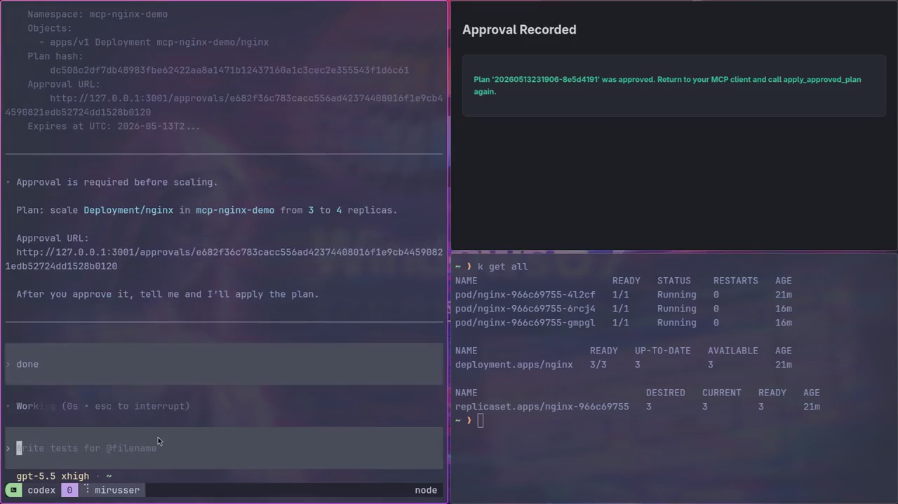
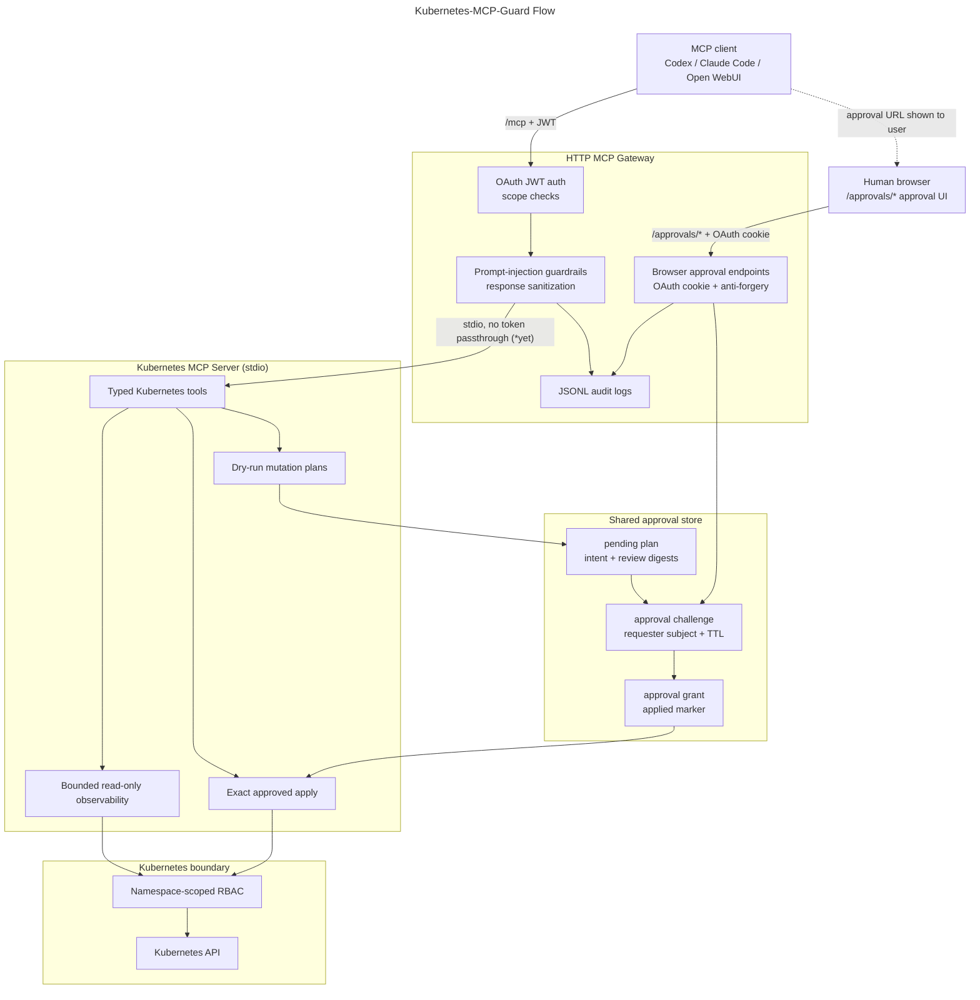
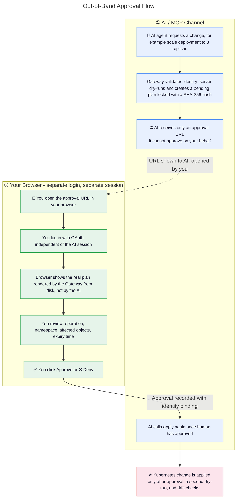

# 🛡️ Kubernetes MCP Guard 

**Bridging the gap between AI Agents and Production Infrastructure with a Security-First Gateway.**

**A Kubernetes MCP gateway with Human-in-the-Loop (HITL) approval for AI-driven operations with OAuth and guardrails**


[](https://github.com/mirusser/Kubernetes-MCP-Guard/actions/workflows/unit-tests.yml)
[](https://github.com/mirusser/Kubernetes-MCP-Guard/actions/workflows/integration-tests.yml)
[](https://github.com/mirusser/Kubernetes-MCP-Guard/actions/workflows/package-docker.yml)
[](https://sonarcloud.io/summary/new_code?id=mirusser_Kubernetes-MCP-Guard)
[](https://sonarcloud.io/summary/new_code?id=mirusser_Kubernetes-MCP-Guard)

<sub>   </sub>


## 🎯 The Problem
Giving AI agents direct access to Kubernetes is risky. Without a safety layer, an LLM hallucination, prompt injection, or overbroad credential could turn a suggestion into an unsafe cluster change.

## 🚀 The Solution
Kubernetes-MCP-Guard is a .NET 10 gateway for the Model Context Protocol (MCP). AI agents can inspect bounded Kubernetes state and request changes, but mutations are staged as dry-run plans and require an OAuth-authenticated human to approve the exact Gateway-rendered plan in a separate browser session before anything is applied.

## 💎 Key Business Value

- **Browser-based HITL approval:** AI can propose a change, but only the authenticated human requester can approve or deny the final plan through the Gateway approval UI.
- **Separated trust channels:** MCP clients receive an approval URL, while approval happens through `/approvals/*` with a browser OAuth cookie, anti-forgery checks, same-subject binding, and a short-lived challenge.
- **Bounded Kubernetes access:** Namespace allow-lists, namespace-scoped RBAC, typed tools, and supported-kind checks keep the Kubernetes surface narrow.
- **Auditable safety controls:** Prompt-injection guardrails, approval audit events, Intent/Review Digests, dry-runs, grants, and drift checks make decisions traceable before and after execution.

---

## Demo

[](assets/demo-github.mp4)

[Open demo video](https://raw.githubusercontent.com/mirusser/Kubernetes-MCP-Guard/main/assets/demo-github.mp4)

---

## 🗺️ System Architecture

The following diagram shows the two trust channels: the AI-facing MCP path and the browser-based HITL approval path. The MCP client can request and retry a plan, but approval is handled by the Gateway UI through a separate human browser session.




### 🔐 How Approval-Gated Mutations Work

The diagram below shows what happens when an AI agent tries to change your cluster. The key point: **the AI cannot approve its own requests**. Approval happens in your browser through a separate OAuth-authenticated session bound to the same subject that requested the plan.



<sub><em>Even if the AI agent is compromised, it cannot self-approve. Approval must come from your browser session, a channel the AI does not control.</em></sub>
<sub><em>Simplified architectural graph. Full version [here](docs/architecture.md)</em></sub>

#### The Three Security Gates

Every mutation passes through three independent checkpoints. Each one can block execution regardless of whether the others passed:

| Phase | What happens | What can block it |
|---|---|---|
| **① Plan** | AI calls `request_*`; the gateway asks the Kubernetes adapter to gather server-side dry-run, policy, and diff evidence; the generic core stores a pending plan envelope with Intent and Review Digests | Dry-run failure, policy violation (privileged containers, hostPath, dangerous caps, …), or unsupported legacy plan format |
| **② Approve** | Human opens the approval URL; browser renders the plan from the server-side file, not the AI's description; human clicks Approve or Deny; the gateway records a Challenge Outcome and issues an Approval Grant only for approval | Challenge expired (default 15 min TTL), approver subject does not match requester, anti-forgery validation fails, or the pending-plan hash/digest binding changed after the URL was created |
| **③ Execute** | AI calls `execute_approved_plan` again; the gateway validates the Approval Grant, digest bindings, plan validity window, and reuse marker, then the Kubernetes adapter re-runs declared freshness checks before calling raw execution tools | Missing/expired/mismatched grant, digest mismatch, plan already applied, second dry-run failure, policy failure on re-validation, or live state drifted since approval |

The Intent Digest binds the executable mutation intent, while the Review Digest binds the trusted browser review snapshot. If the plan changes before approval, the browser approval is refused. If it changes after approval but before execution, `execute_approved_plan` is refused. After a successful apply, the applied marker blocks reuse of the same Single-Execution Plan.

### 🛠️ Technical Architecture

- **MCP gateway boundary:** The HTTP gateway exposes `/mcp`, validates OAuth JWT issuer, audience, lifetime, signature, and scope, then forwards tool calls to a private stdio Kubernetes MCP server without passing bearer tokens downstream.
- **OAuth-aware clients:** The gateway publishes MCP protected-resource metadata and returns insufficient-scope challenges so MCP clients can discover the required resource and `mcp:tools` scope. Browser approval pages use an OAuth code flow and a Gateway cookie.
- **Guarded model-visible data:** The gateway scans tool arguments and responses for prompt-injection patterns, warns or redacts suspicious content, and writes JSONL guardrail audit events with the resolved OAuth identity.
- **Dry-run-first mutations:** `request_*` tools create pending plans only after Kubernetes `dryRun=All` succeeds. Browser approval renders the stored server-side plan, dry-run result, policy findings, and diff.
- **Digest-bound execution:** Approved applies require a valid Approval Grant bound to the Intent Digest and Review Digest. The Kubernetes adapter re-runs declared freshness checks, detects live-state drift when diff evidence exists, re-checks policy where relevant, and marks successful plans as applied.
- **Narrow Kubernetes surface:** Runtime operations use the Kubernetes .NET client, namespace allow-lists, namespace-scoped RBAC, bounded read-only tools, and mutation support limited to `Deployment`, `Service`, `ConfigMap`, and narrow Deployment operations.

## 📦 Container Images

Images are automatically built and scanned by the Docker workflow. Release tags publish versioned images, and the `dev` branch publishes moving `:dev` images for the self-hosted development deployment.

| Registry | Gateway |
| --- | --- |
| GitHub (GHCR) | `ghcr.io/mirusser/kubernetes-mcp-guard-gateway:<tag>` |
| Docker Hub | `mirusser/kubernetes-mcp-guard-gateway:<tag>` |

**Versioning:** Use specific tags (e.g., `:v0.1.0`) for production stability. The `:dev` tag tracks the development branch, and the `:latest` tag tracks the most recent stable release.

Example pull:
``` bash
docker pull ghcr.io/mirusser/kubernetes-mcp-guard-gateway:latest
```

## ⚡ Quick Start

### Option 1 — Run from published images (no build required)

**Prerequisites:** [Docker Compose v2](https://docs.docker.com/compose/install/), [minikube](https://minikube.sigs.k8s.io/docs/start/), `git`.

```bash
git clone https://github.com/mirusser/Kubernetes-MCP-Guard.git

cd Kubernetes-MCP-Guard

./scripts/create-demo-kubeconfig.sh --compose
TAG=latest docker compose --env-file deploy/local-oauth/release.env.example \
  -f deploy/local-oauth/compose.release.yaml up
```

The committed `deploy/local-oauth/release.env.example` provides the required configuration — no .NET SDK needed. Replace `latest` with a specific release tag (e.g. `v0.1.0`) for a stable run. Available tags are listed on the [Releases page](https://github.com/mirusser/Kubernetes-MCP-Guard/releases).
This starts the Keycloak-backed local OAuth path.

#### **Connect Codex CLI:**

1. Add this block to `~/.codex/config.toml` (create the file if it does not exist):

```toml
[mcp_servers.infra-gate]
url = "http://127.0.0.1:3001/mcp"
oauth_resource = "http://127.0.0.1:3001/mcp"
scopes = ["mcp:tools"]
```

2. Then log in:

```bash
codex mcp login infra-gate # authenticate 
codex # run codex
```

#### **Connect Claude Code:**

```bash
# 1. Add/register the MCP server
claude mcp add-json --scope user infra-gate \
  '{"type":"http","url":"http://127.0.0.1:3001/mcp","oauth":{"scopes":"mcp:tools"}}'

# 2. Start Claude Code
claude

# 3. Inside Claude Code, open MCP manager/auth flow
/mcp
```

 After successful log in you may start with: 
 ```text
 Explain briefly what are the capabilities of MCP server: infra-gate
 ```

### Option 2 — Build and run from source

**Prerequisites:** [.NET 10 SDK](https://dotnet.microsoft.com/download/dotnet/10.0), Docker Compose v2, minikube, `git`.

```bash
./scripts/create-demo-kubeconfig.sh --compose
./scripts/generate-env.sh local-compose
docker compose --env-file deploy/generated/local-compose.env \
  -f deploy/local-oauth/compose.yaml up --build
```

Connect Codex the same way as Option 1.

*Other run modes and full setup details are in the [Setup Guide](docs/setup-guide.md).*

## 🧰 Current Capabilities 

### 🛡️ Gateway Protections 

| Layer | Behavior |
|---|---|
| Authentication | OAuth 2.1 JWT for MCP plus browser OAuth cookie for approvals |
| Prompt-injection guardrails | Warn and redact suspicious model-visible input/output |
| Audit logging | JSONL guardrail audit with identity resolution |
| MCP compliance | Streamable HTTP transport, protected-resource metadata, step-up authorization |

### 🔎 Read-Only Observability 

| Tool | Purpose |
|---|---|
| `get_allowed_namespaces` | Namespace allow-list the server is configured to access |
| `get_k8s_status` | Deployments, Services, ConfigMaps, Pods, and ReplicaSets in a namespace |
| `get_k8s_events` | Bounded `events.k8s.io/v1` cluster diagnostics |
| `get_pod_logs` | Bounded Pod log reads (tail lines + byte cap) |
| `get_k8s_resource` | Focused resource summary — no Secret values, ConfigMap data, or raw manifests |
| `get_deployment_diagnostics` | Deployment health, related Pods, ReplicaSets, and Events |
| `get_pod_diagnostics` | Pod status, conditions, container state, and Events |
| `get_service_diagnostics` | Service endpoints, backing Pods, and Events |

### ✅ Approval-Gated Mutations 

| Tool | Purpose |
|---|---|
| `request_apply_manifest` | Dry-run and plan a server-side apply for `Deployment`, `Service`, or `ConfigMap` |
| `request_delete_manifest` | Dry-run and plan a resource deletion |
| `request_scale_deployment` | Dry-run and plan a replica count change |
| `request_restart_deployment` | Dry-run and plan a rollout restart |
| `request_set_deployment_image` | Dry-run and plan a container image update |
| `execute_approved_plan` | Repeat dry-run, then apply an exact-hash-verified, user-approved plan |

## 🎬 See It In Action 

End-to-end walkthrough of the approval-gated workflow against a deliberately broken Deployment: [docs/demo-failing-deployment.md](docs/demo-failing-deployment.md). Uses the demo manifests under [examples/failing-deployment/](examples/failing-deployment/).

## Compatibility

| Area | Supported / tested |
| --- | --- |
| .NET | .NET 10 |
| Kubernetes | minikube / local cluster initially |
| MCP transport | HTTP MCP endpoint at `/mcp` |
| OIDC | Keycloak local/dev path, external OIDC providers by configuration |
| Container registries | GHCR, Docker Hub |
| Platforms | linux/amd64 initially |

## 🧭 Explore The Project 

- Developer runbook: [docs/devs-readme.md](docs/devs-readme.md)
- Setup guide: [docs/setup-guide.md](docs/setup-guide.md)
- Configuration reference: [docs/configuration.md](docs/configuration.md)
- MCP compliance notes: [docs/MCP-compliance.md](docs/MCP-compliance.md)
- Security model: [docs/security-model.md](docs/security-model.md)
- Tool permissions matrix: [docs/tool-permissions.md](docs/tool-permissions.md)
- Production OIDC guide: [docs/production-oidc.md](docs/production-oidc.md)
- Public roadmap: [docs/roadmap.md](docs/roadmap.md)
- Kubernetes MCP server: [src/InfraGate.McpServer/README.md](src/InfraGate.McpServer/README.md)
- HTTP MCP gateway: [src/InfraGate.McpGateway/README.md](src/InfraGate.McpGateway/README.md)
- Gateway auth: [src/InfraGate.McpGateway.Auth/README.md](src/InfraGate.McpGateway.Auth/README.md)
- Approval storage & audit: [src/InfraGate.Approvals/README.md](src/InfraGate.Approvals/README.md)
- Kubernetes approval adapter: [src/InfraGate.KubernetesAdapter/README.md](src/InfraGate.KubernetesAdapter/README.md)

<sub><em>**Naming note:** The public name is **Kubernetes MCP Guard**. The internal codename **InfraGate** appears in `.slnx`, project folders, env-var prefixes (`INFRA_GATE_*`), and Docker labels. They refer to the same project; the rename is gradual and does not change runtime behavior.</em></sub>


## ⚖️ Governance & Policies

- License: [Apache-2.0](LICENSE)
- Security policy: [SECURITY.md](SECURITY.md)
- Contributing guide: [CONTRIBUTING.md](CONTRIBUTING.md)
- Changelog: [CHANGELOG.md](CHANGELOG.md)
- Release process: [docs/releasing.md](docs/releasing.md)

---
