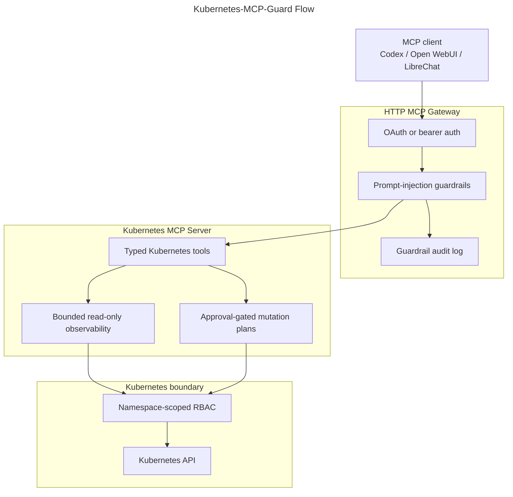

# Kubernetes MCP Guard 🛡️: AI-safe Kubernetes operations through MCP

**Bridging the gap between AI Agents and Production Infrastructure with a Security-First Gateway.**

[](https://github.com/mirusser/Kubernetes-MCP-Guard/actions/workflows/unit-tests.yml)
[](https://github.com/mirusser/Kubernetes-MCP-Guard/actions/workflows/integration-tests.yml)
[](https://github.com/mirusser/Kubernetes-MCP-Guard/actions/workflows/package-docker.yml)
[](https://sonarcloud.io/summary/new_code?id=mirusser_Kubernetes-MCP-Guard)
[](https://sonarcloud.io/summary/new_code?id=mirusser_Kubernetes-MCP-Guard)

<sub>   </sub>

## 🎯 The Problem
Giving AI agents direct access to Kubernetes is risky. Without a safety layer, an LLM "hallucination" or a prompt injection could accidentally delete a production namespace or leak sensitive secrets.

## 🚀 The Solution
Kubernetes-MCP-Guard is a high-performance gateway built on .NET 10 and the Model Context Protocol (MCP). It provides a secure, audited, and human-gated interface that allows AI agents (like Claude Code or Open WebUI) to interact with your clusters without compromising safety.

## 💎 Key Business Value

- **Human-in-the-Loop Governance:** AI can propose changes, but only a human can approve the final execution plan.
- **Enterprise-Grade Security:** Integrated with OAuth-aware authentication and Namespace-scoped RBAC to ensure the AI only sees what it is allowed to see.
- **AI Safety & Auditing:** Built-in prompt-injection guardrails and full audit logging for compliance and troubleshooting
- **Cutting-Edge Stack:** Architected using the latest .NET 10 features and the industry-standard MCP protocol.

---

## 🗺️ System Architecture

The following diagram illustrates the secure request flow from the AI client through the Guardrails and into the Kubernetes cluster.


<sub><em>Simplified architectural graph. Full version [here](docs/MCP-compliance.md)</em></sub>

### 🛠️ Technical & Architectural Highlights

- **AI Integration & Safety:** Deep implementation of Model Context Protocol (MCP), handling tool contracts, elicitation-style approval workflows, and mitigating prompt-injection risks within model-visible data.

- **Security & Identity:** Implemented OAuth 2.0 resource-server patterns, including scope enforcement, identity-based audit logging, and strict Least-Privilege RBAC for Kubernetes interactions.

- **Cloud-Native Engineering:** Advanced usage of the Official Kubernetes .NET Client, utilizing Server-Side Apply (SSA) for dry-run planning, real-time Pod log streaming, and namespace isolation.

- **Modern .NET 10 Stack:** Built with a focus on Clean Architecture, leveraging Dependency Injection, high-performance Async/Await patterns, and a modular project structure that separates Auth, Gateway, and Core logic.

- **Product Mindset:** Prioritized a "small operational surface" and human-readable audit logs, ensuring the tool is as safe for a human SRE as it is powerful for an AI agent.

##### 🏗️ Implementation Details:
- Exposes Kubernetes operations through the Model Context Protocol (MCP), with a stdio Kubernetes server behind a local HTTP gateway.
- Uses the Kubernetes API via `KubernetesClient`; it does not shell out to `kubectl` for runtime operations.
- Adds OAuth/static bearer authentication at the gateway, including MCP protected-resource metadata and insufficient-scope challenges.
- Applies prompt-injection guardrails around model-visible tool input/output, with warn, redact, and audit behavior.
- Keeps mutation paths approval-gated: create a plan first, then apply the exact approved plan.
- Limits Kubernetes blast radius with namespace-scoped RBAC and typed, bounded tool surfaces.

## 📦 Container Images

Images are automatically built, scanned, and published to multiple registries for every release.

| Registry | Gateway (Core) | Dev Issuer (Auth) |
| --- | --- | --- |
| GitHub (GHCR) | `ghcr.io/mirusser/kubernetes-mcp-guard-gateway:<tag>` | `ghcr.io/mirusser/kubernetes-mcp-guard-devissuer:<tag>` |
| Docker Hub | `mirusser/kubernetes-mcp-guard-gateway:<tag>` | `mirusser/kubernetes-mcp-guard-devissuer:<tag>` |

**Versioning:** Use specific tags (e.g., `:v0.1.0`) for production stability. The `:latest` tag tracks the most recent stable release.

Example pull:
``` bash
docker pull ghcr.io/mirusser/kubernetes-mcp-guard-gateway:latest
```

## ⚡ Quick Start

### Option 1 — Run from published images (no build required)

**Prerequisites:** [Docker Compose v2](https://docs.docker.com/compose/install/), [minikube](https://minikube.sigs.k8s.io/docs/start/), `git`.

```bash
git clone https://github.com/mirusser/Kubernetes-MCP-Guard.git

cd Kubernetes-MCP-Guard

./scripts/create-demo-kubeconfig.sh --compose
TAG=latest docker compose -f deploy/mode-c/compose.release.yaml up
```

Replace `latest` with a specific release tag (e.g. `v0.1.0`) for a stable run. Available tags are listed on the [Releases page](https://github.com/mirusser/Kubernetes-MCP-Guard/releases).

#### **Connect Codex CLI:**

1. Add this block to `~/.codex/config.toml` (create the file if it does not exist):

```toml
[mcp_servers.infra-gate]
url = "http://127.0.0.1:3001/mcp"
oauth_resource = "http://127.0.0.1:3001/mcp"
scopes = ["mcp:tools"]
```

2. Then log in:

```bash
codex mcp login infra-gate # authenticate 
codex # run codex
```

#### **Connect Claude Code:**

```bash
# 1. Add/register the MCP server
claude mcp add-json --scope user infra-gate \
  '{"type":"http","url":"http://127.0.0.1:3001/mcp","oauth":{"scopes":"mcp:tools"}}'

# 2. Start Claude Code
claude

# 3. Inside Claude Code, open MCP manager/auth flow
/mcp
```

 After successful log in you may start with: 
 ```text
 Explain briefly what are the capabilities of MCP server: infra-gate
 ```

### Option 2 — Build and run from source

**Prerequisites:** [.NET 10 SDK](https://dotnet.microsoft.com/download/dotnet/10.0), Docker Compose v2, minikube, `git`.

```bash
./scripts/create-demo-kubeconfig.sh --compose
docker compose -f deploy/mode-c/compose.yaml up --build
```

Connect Codex the same way as Option 1.

*Other run modes (stdio-only, static bearer token) and full setup details are in the [Setup Guide](docs/setup-guide.md).*

## 🧰 Current Capabilities 

### 🛡️ Gateway Protections 

| Layer | Behavior |
|---|---|
| Authentication | OAuth 2.1 JWT or local static bearer token |
| Prompt-injection guardrails | Warn and redact suspicious model-visible input/output |
| Audit logging | JSONL guardrail audit with identity resolution |
| MCP compliance | Streamable HTTP transport, protected-resource metadata, step-up authorization |

### 🔎 Read-Only Observability 

| Tool | Purpose |
|---|---|
| `get_k8s_status` | Deployments, Services, ConfigMaps, Pods, and ReplicaSets in a namespace |
| `get_k8s_events` | Bounded `events.k8s.io/v1` cluster diagnostics |
| `get_pod_logs` | Bounded Pod log reads (tail lines + byte cap) |
| `get_k8s_resource` | Focused resource summary — no Secret values, ConfigMap data, or raw manifests |
| `get_deployment_diagnostics` | Deployment health, related Pods, ReplicaSets, and Events |
| `get_pod_diagnostics` | Pod status, conditions, container state, and Events |
| `get_service_diagnostics` | Service endpoints, backing Pods, and Events |

### ✅ Approval-Gated Mutations 

| Tool | Purpose |
|---|---|
| `request_apply_manifest` | Plan a server-side apply for `Deployment`, `Service`, or `ConfigMap` |
| `request_delete_manifest` | Plan a resource deletion |
| `request_scale_deployment` | Plan a replica count change |
| `request_restart_deployment` | Plan a rollout restart |
| `request_set_deployment_image` | Plan a container image update |
| `apply_approved_plan` | Apply an exact-hash-verified, user-approved plan |

## Compatibility

| Area | Supported / tested |
| --- | --- |
| .NET | .NET 10 |
| Kubernetes | minikube / local cluster initially |
| MCP transport | HTTP MCP endpoint at `/mcp` |
| OIDC | DevIssuer (dev), Keycloak planned, Entra ID later |
| Container registries | GHCR, Docker Hub |
| Platforms | linux/amd64 initially |

## 🧭 Explore The Project 

- Developer runbook: [docs/devs-readme.md](docs/devs-readme.md)
- Setup guide: [docs/setup-guide.md](docs/setup-guide.md)
- MCP compliance notes: [docs/MCP-compliance.md](docs/MCP-compliance.md)
- Kubernetes MCP server: [src/InfraGate.McpServer/README.md](src/InfraGate.McpServer/README.md)
- HTTP MCP gateway: [src/InfraGate.McpGateway/README.md](src/InfraGate.McpGateway/README.md)
- Gateway auth: [src/InfraGate.McpGateway.Auth/README.md](src/InfraGate.McpGateway.Auth/README.md)
- Local dev OAuth issuer: [src/InfraGate.DevIssuer/README.md](src/InfraGate.DevIssuer/README.md)

<sub><em>**Naming note:** The public name is **Kubernetes MCP Guard**. The internal codename **InfraGate** appears in `.slnx`, project folders, env-var prefixes (`INFRA_GATE_*`), and Docker labels. They refer to the same project; the rename is gradual and does not change runtime behavior.</em></sub>


## ⚖️ Governance & Policies

- License: [Apache-2.0](LICENSE)
- Security policy: [SECURITY.md](SECURITY.md)
- Release process: [docs/releasing.md](docs/releasing.md)
