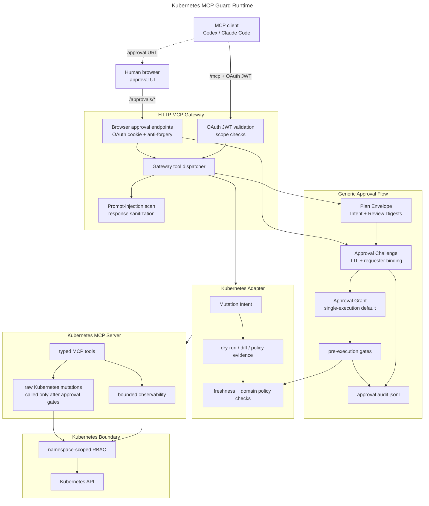

# 🛡️ Kubernetes MCP Guard

**A security-first bridge between AI agents and Kubernetes, with out of band Human-in-the-Loop (HITL) approval for every gateway-exposed mutation.**

An *experimental* .NET 10 MCP gateway for AI-assisted Kubernetes operations. 

Agents can inspect a narrow cluster surface and propose changes, but writes are staged as server-side dry-run plans and execute only after an OAuth-authenticated human approves the exact review snapshot in a separate browser session.

<sub><em>It is a working reference implementation for a possible MCP mutation-approval profile, designed for early technical evaluation in local or tightly controlled environments rather than production-certified infrastructure.</em></sub>

<sub><em>Kubernetes MCP Guard is internally named **InfraGate**, </em></sub>

[](https://github.com/mirusser/Kubernetes-MCP-Guard/actions/workflows/unit-tests.yml)
[](https://github.com/mirusser/Kubernetes-MCP-Guard/actions/workflows/integration-tests.yml)
[](https://github.com/mirusser/Kubernetes-MCP-Guard/actions/workflows/package-docker.yml)
[](https://sonarcloud.io/summary/new_code?id=mirusser_Kubernetes-MCP-Guard)
[](https://sonarcloud.io/summary/new_code?id=mirusser_Kubernetes-MCP-Guard)

<sub>   </sub>

## 🎯 What It Demonstrates

Kubernetes MCP Guard explores a practical safety pattern for AI-assisted operations:

- **Plan before mutate:** every gateway-exposed write starts as a `request_*` plan built from Kubernetes server-side dry-run evidence.
- **Separate review channel:** the MCP client receives an approval URL, while approval happens through `/approvals/*` in a browser OAuth session.
- **Digest-bound approval:** execution is bound to an Intent Digest for the executable mutation and a Review Digest for the human-reviewed snapshot.
- **Durable grant model:** an approved Approval Challenge records a Challenge Outcome and issues an Approval Grant consumed by pre-execution gates.
- **Narrow Kubernetes scope:** namespace allow-lists, namespace-scoped RBAC, supported-kind checks, and bounded read tools keep the operational surface small.
- **Auditable controls:** guardrail and approval events are written as JSONL streams with identity, digest, grant, and execution context.

The repository also separates the generic approval lifecycle from the Kubernetes adapter, so the core language is not tied to one infrastructure domain. 

<sub><em>See [CONTEXT.md](CONTEXT.md), [docs/mutation-approval-profile.md](docs/mutation-approval-profile.md), [docs/mutation-approval-flow.md](docs/mutation-approval-flow.md).</em></sub>

## 🎬 Demo

https://github.com/user-attachments/assets/7f43c34f-6516-4141-ad26-e488112d8afd

The walkthrough in [docs/demo-failing-deployment.md](docs/demo-failing-deployment.md) shows the full flow against a deliberately broken Deployment: diagnose, request a plan, approve in the browser, execute, verify, and inspect audit logs.

## 🗺️ Architecture



Full request-flow diagrams live in [docs/architecture.md](docs/architecture.md).

## 🔐 Approval Flow

The central safety property is that approval is necessary but not sufficient. A human approval creates execution authorization, but execution still has to pass the pre-execution gates immediately before Kubernetes is mutated.

| Phase | What happens | What can block it |
| --- | --- | --- |
| **Plan** | The MCP client calls `request_*`; the Kubernetes adapter gathers dry-run, diff, and policy evidence; the generic core stores a Plan Envelope with Intent and Review Digests. | Namespace rejection, manifest allow-list rejection, dry-run failure, domain policy denial, unsupported legacy plan format. |
| **Approve** | The client calls `execute_approved_plan`; the gateway creates or reuses a short-lived Approval Challenge and returns a browser URL. The browser renders the stored review snapshot, not model-supplied approval text. | Expired challenge, wrong authenticated subject, anti-forgery failure, changed digest binding, denied/rejected/canceled Challenge Outcome. |
| **Execute** | After approval, the client retries `execute_approved_plan`; the gateway validates the Approval Grant, digests, validity window, reuse policy, freshness checks, and domain policy checks before the adapter writes. | Missing/expired/mismatched grant, digest mismatch, already-applied Single-Execution Plan, second dry-run failure, policy failure, live-state drift. |

<sub><em>Current implementation notes are tracked in [docs/mutation-approval-profile.md#current-repository-fit](docs/mutation-approval-profile.md#current-repository-fit). Remaining profile work is intentionally documented as future direction, not as shipped standard behavior.</em></sub>


## 🧰 Current Capabilities

### 🛡️ Gateway Protections

| Layer | Current behavior |
| --- | --- |
| MCP transport | HTTP MCP endpoint at `/mcp` using Streamable HTTP. |
| Authentication | OAuth JWT validation for MCP calls; browser OAuth cookie for approval pages. |
| OAuth discovery | Protected-resource metadata and insufficient-scope challenges for MCP clients. |
| Approval authority | Browser approval endpoints under `/approvals/*` with same-subject binding and anti-forgery checks. |
| Guardrails | Warn on suspicious request patterns and redact suspicious response content before it returns to the MCP client. |
| Audit | Separate JSONL streams for guardrail findings and approval lifecycle events. |

### 🔎 Read-Only Observability

| Tool | Purpose |
| --- | --- |
| `get_allowed_namespaces` | Return the namespace allow-list configured for the server. |
| `get_k8s_status` | Summarize Deployments, Services, ConfigMaps, Pods, and ReplicaSets in a namespace. |
| `get_k8s_events` | Read bounded `events.k8s.io/v1` diagnostics. |
| `get_pod_logs` | Read bounded Pod logs with tail-line and byte caps. |
| `get_k8s_resource` | Return a focused resource summary without Secret values, ConfigMap data, or raw manifests. |
| `get_deployment_diagnostics` | Inspect Deployment health, related Pods, ReplicaSets, and Events. |
| `get_pod_diagnostics` | Inspect Pod status, conditions, container state, and Events. |
| `get_service_diagnostics` | Inspect Service endpoints, backing Pods, and Events. |

### ✅ Approval-Gated Mutations

| Tool | Purpose |
| --- | --- |
| `request_apply_manifest` | Dry-run and plan server-side apply for `Deployment`, `Service`, or `ConfigMap`. |
| `request_delete_manifest` | Dry-run and plan deletion for supported manifest kinds. |
| `request_scale_deployment` | Dry-run and plan a Deployment replica-count change. |
| `request_restart_deployment` | Dry-run and plan a Deployment rollout restart. |
| `request_set_deployment_image` | Dry-run and plan a Deployment container image update. |
| `execute_approved_plan` | Create the browser approval challenge or execute an approved, digest-bound plan after gates pass. |

Direct Kubernetes mutation tools exist inside the private server surface for the adapter executor. The HTTP gateway exposes `request_*` wrappers plus `execute_approved_plan` instead of exposing raw destructive tools to MCP clients.

## ⚡ Quick Start

### 📦 Run Published Images

Prerequisites: [Docker Compose v2](https://docs.docker.com/compose/install/), [minikube](https://minikube.sigs.k8s.io/docs/start/), and `git`.

```bash
git clone https://github.com/mirusser/Kubernetes-MCP-Guard.git
cd Kubernetes-MCP-Guard

./scripts/create-demo-kubeconfig.sh --compose

TAG=latest docker compose --env-file deploy/local-oauth/release.env.example \
  -f deploy/local-oauth/compose.release.yaml up
```

This starts the local Keycloak-backed OAuth path and the published gateway image. Replace `latest` with a release tag such as `v0.1.0` for a stable image. The committed no-SDK env template supplies both Docker Compose interpolation values and the gateway container runtime environment.

### 🛠️ Build From Source

Prerequisites: [.NET 10 SDK](https://dotnet.microsoft.com/download/dotnet/10.0), Docker Compose v2, minikube, and `git`.

```bash
./scripts/create-demo-kubeconfig.sh --compose
./scripts/generate-env.sh local-compose
docker compose --env-file deploy/generated/local-compose.env \
  -f deploy/local-oauth/compose.yaml up --build
```

Other run modes and full setup details are in [docs/setup-guide.md](docs/setup-guide.md).

### 🤖 Connect Codex CLI

Add this to `~/.codex/config.toml`:

```toml
[mcp_servers.infra-gate]
url = "http://127.0.0.1:3001/mcp"
oauth_resource = "http://127.0.0.1:3001/mcp"
scopes = ["mcp:tools"]
```

Then authenticate and start Codex:

```bash
codex mcp login infra-gate
codex
```

### 💬 Connect Claude Code

```bash
claude mcp add-json --scope user infra-gate \
  '{"type":"http","url":"http://127.0.0.1:3001/mcp","oauth":{"scopes":"mcp:tools"}}'

claude
/mcp
```

After login, a useful first prompt is:

```text
Explain briefly what capabilities the MCP server infra-gate exposes.
```

## 📦 Container Images

Release images are built by the Docker workflow and published to GHCR and Docker Hub.

| Registry | Gateway image |
| --- | --- |
| GitHub Container Registry | `ghcr.io/mirusser/kubernetes-mcp-guard-gateway:<tag>` |
| Docker Hub | `mirusser/kubernetes-mcp-guard-gateway:<tag>` |

Use specific release tags for stable demos. The `:dev` tag tracks the development branch, and `:latest` tracks the most recent stable release.

## 🧩 Compatibility

| Area | Supported / tested |
| --- | --- |
| .NET | .NET 10 |
| Kubernetes | minikube / local cluster initially |
| MCP transport | HTTP MCP endpoint at `/mcp` |
| OIDC | Keycloak local/dev path; external OIDC providers by configuration |
| Container registries | GHCR, Docker Hub |
| Platforms | linux/amd64 initially |

## ⚖️ Boundaries And Non-Goals

- The project is experimental and not production-certified.
- The local Keycloak realm runs in development mode over HTTP and is not a production identity provider.
- Prompt-injection guardrails are defense-in-depth, not a guaranteed hard security boundary.
- The tool surface does not expose shell execution, `kubectl` passthrough, exec, attach, port-forward, namespace creation, RBAC manipulation, Secret reads, raw manifest reads, or cluster-scoped writes.
- This is not a full Kubernetes policy engine and not an MCP standard.

See [docs/security-model.md](docs/security-model.md) for the full threat model.

## 🧭 Project Map

- [docs/devs-readme.md](docs/devs-readme.md): developer runbook, local runs, tool contracts, and verification.
- [docs/setup-guide.md](docs/setup-guide.md): setup paths for local OAuth, source builds, and published images.
- [docs/configuration.md](docs/configuration.md): environment variables, defaults, and production guidance.
- [docs/security-model.md](docs/security-model.md): hard boundaries, defense-in-depth controls, assumptions, and non-goals.
- [docs/MCP-compliance.md](docs/MCP-compliance.md): MCP transport and OAuth notes.
- [docs/tool-permissions.md](docs/tool-permissions.md): per-tool RBAC verbs, bounds, and approval requirements.
- [docs/production-oidc.md](docs/production-oidc.md): production OIDC guidance.
- [docs/roadmap.md](docs/roadmap.md): public roadmap and current/future scope.
- [src/InfraGate.McpGateway/README.md](src/InfraGate.McpGateway/README.md): HTTP MCP gateway, forwarding, guardrails, approval endpoints, and audit behavior.
- [src/InfraGate.Approvals/README.md](src/InfraGate.Approvals/README.md): generic approval storage, challenges, grants, gates, and audit payloads.
- [src/InfraGate.KubernetesAdapter/README.md](src/InfraGate.KubernetesAdapter/README.md): Kubernetes mutation intent, evidence, policy, freshness checks, and execution.
- [src/InfraGate.McpServer/README.md](src/InfraGate.McpServer/README.md): private Kubernetes MCP server and typed tool surface.

## 📜 Governance

- License: [Apache-2.0](LICENSE)
- Security policy: [SECURITY.md](SECURITY.md)
- Contributing guide: [CONTRIBUTING.md](CONTRIBUTING.md)
- Changelog: [CHANGELOG.md](CHANGELOG.md)
- Release process: [docs/releasing.md](docs/releasing.md)
