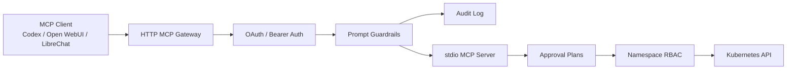

# InfraGate: AI-safe Kubernetes operations through MCP 🧠

InfraGate is a .NET 10 project exploring how AI assistants can operate against Kubernetes without turning "agentic" into "unbounded." It connects MCP clients such as Codex, Open WebUI, or LibreChat to Kubernetes through a guarded gateway, strict RBAC, OAuth-aware authentication, audit trails, and explicit approval gates.

The core idea: let AI help with real infrastructure work while keeping the dangerous parts narrow, reviewable, and accountable.

## What It Does ⚙️

- Exposes Kubernetes operations through the Model Context Protocol (MCP), with both a stdio server and a local HTTP gateway.
- Uses the Kubernetes API via `KubernetesClient`; it does not shell out to `kubectl` for runtime operations.
- Adds OAuth/static bearer authentication at the gateway, including MCP protected-resource metadata and insufficient-scope challenges.
- Applies prompt-injection guardrails around model-visible tool input/output, with warn, redact, and audit behavior.
- Keeps mutation paths approval-gated: create a plan first, then apply the exact approved plan.
- Limits Kubernetes blast radius with namespace-scoped RBAC and typed, bounded tool surfaces.

## Why It Matters 🔐

AI infrastructure tools are powerful, but power is not the same thing as safety. InfraGate treats AI-assisted ops as a systems design problem: capability needs identity, boundaries, auditability, and human approval at the point where state changes.

That makes the project a practical slice of a bigger direction: MCP-native infrastructure operations where agents can inspect, explain, and propose, while production-grade controls decide what actually changes.

## What This Demonstrates 🚀

- AI systems knowledge: MCP transports, tool contracts, elicitation-style approval, and prompt-injection risk around model-visible data.
- Security judgment: OAuth resource-server behavior, scope enforcement, protected-resource metadata, audit identity, and least-privilege RBAC.
- Kubernetes fluency: typed API usage, server-side apply planning, rollout checks, Events, Pod logs, resource summaries, and namespace isolation.
- Product engineering taste: small operational surface, clear user flows, safety defaults, and readable documentation for humans and agents.
- Modern .NET implementation: .NET 10, dependency injection, async APIs, focused tests, and project-level separation of auth, gateway, server, issuer, and test concerns.

## Current Capabilities

- Read-only observability:
  - `get_k8s_status` for deployments, services, config maps, pods, and replica sets.
  - `get_k8s_events` for bounded `events.k8s.io/v1` diagnostics.
  - `get_pod_logs` for bounded Pod log reads.
  - `get_k8s_resource` for focused summaries without Secret values, ConfigMap values, or raw manifests.
- Approval-gated mutations:
  - Server-side apply and delete plans for `apps/v1 Deployment`, `v1 Service`, and `v1 ConfigMap`.
  - Deployment scale and restart plans.
  - Exact-plan hash checks before application.
- Gateway protections:
  - OAuth JWT or local static bearer auth.
  - Prompt-injection warning/redaction.
  - Guardrail audit JSONL output.
  - MCP compliance notes for streamable HTTP and authorization behavior.

## Explore The Project

- Developer runbook: [docs/devs-readme.md](docs/devs-readme.md)
- Setup guide: [docs/setup-guide.md](docs/setup-guide.md)
- MCP compliance notes: [docs/MCP-COMPLIANCE.md](docs/MCP-COMPLIANCE.md)
- Kubernetes stdio server: [src/InfraGate.McpServer/README.md](src/InfraGate.McpServer/README.md)
- HTTP MCP gateway: [src/InfraGate.McpGateway/README.md](src/InfraGate.McpGateway/README.md)
- Gateway auth: [src/InfraGate.McpGateway.Auth/README.md](src/InfraGate.McpGateway.Auth/README.md)
- Local dev OAuth issuer: [src/InfraGate.DevIssuer/README.md](src/InfraGate.DevIssuer/README.md)
