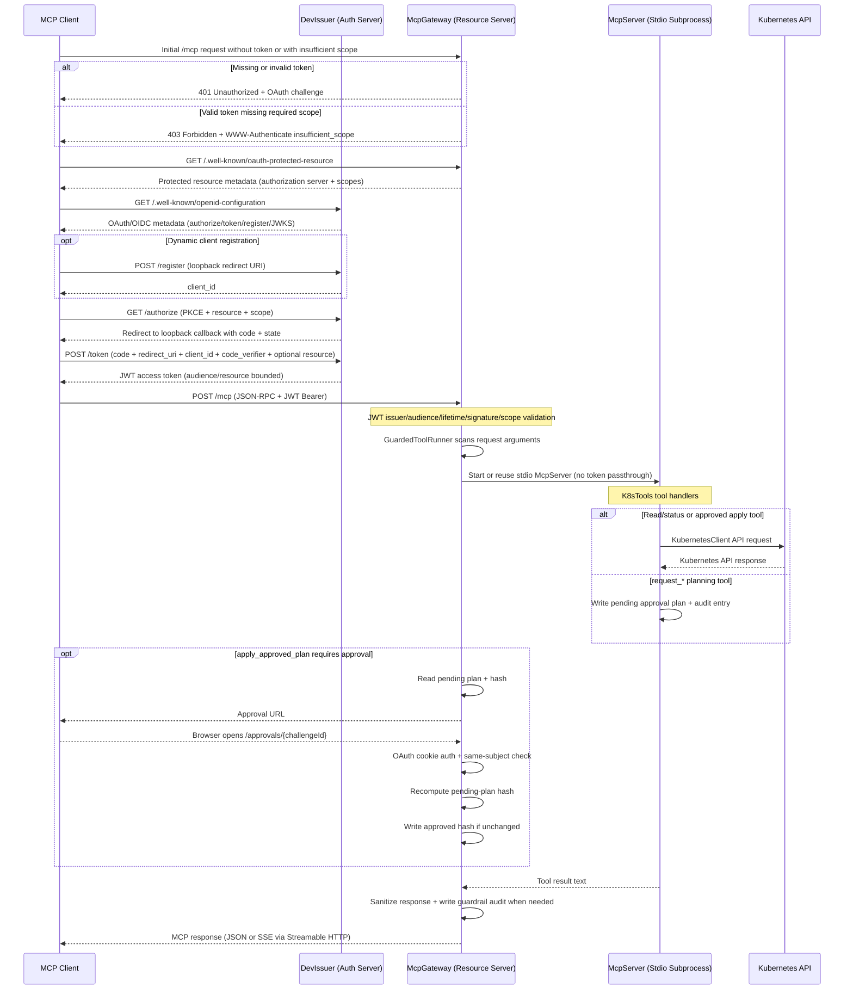

# MCP Protocol Compliance & Architecture Flow

This document details the compliance of the **InfraGate** project against the official Model Context Protocol (MCP) specifications (as of `2025-11-25`), specifically focusing on the HTTP Gateway + OAuth DevIssuer path.

## Architecture & Request Flow

The following diagram illustrates the OAuth login path and representative tool calls, emphasizing how authentication, guardrails, approval, and transport layers interact.

---

## 1. Transports Specification (Streamable HTTP)
**Status: ✅ Fully Compliant**

The Gateway delegates the transport layer to the official `ModelContextProtocol.AspNetCore` SDK. 
* **Key Mechanisms:**
  * Uses `.WithHttpTransport()` in `Program.cs`.
  * Clients send `POST` requests with JSON-RPC messages to `/mcp`.
  * Streamable HTTP response handling is delegated to the official SDK, including JSON-RPC responses and Server-Sent Events (SSE) where appropriate.

---

## 2. Authorization Specification (OAuth 2.1 / OIDC)
**Status: ✅ Fully Compliant**

The MCP Authorization standard is built heavily on Draft OAuth 2.1, emphasizing Resource Indicators (RFC 8707) and Protected Resource Metadata (RFC 9728).

### A. Protected Resource Discovery & Step-Up Authorization
* **Methods:** `GatewayAuthentication.AddGatewayAuthentication`
* **Implementation:** The Gateway uses `.AddMcp(mcpOptions => ...)` to host the `/.well-known/oauth-protected-resource` metadata.
* **Step-Up Auth:** Hooks into `JwtBearerEvents.OnForbidden` to append the mandatory `WWW-Authenticate: Bearer error="insufficient_scope", resource_metadata="..."` header on 403 responses, allowing clients to dynamically negotiate missing scopes.

### B. Resource Parameter Binding (RFC 8707)
* **Methods:** `DevIssuerApplication.Authorize`, `DevIssuerApplication.TokenAsync`
* **Implementation:** The DevIssuer strictly validates the `resource` parameter during authorization. The authorization code is bound to that resource, so token exchange may omit `resource` for client compatibility, but an explicitly wrong token-exchange resource is rejected. Tokens are issued with a specific `Audience` (`aud`) claim bounded to that exact resource URI, mitigating the Confused Deputy problem.

### C. Authorization Code Protection (PKCE)
* **Methods:** `DevIssuerApplication.TokenAsync` (specifically `PkceMatches`)
* **Implementation:** `DevIssuer` rejects fallback methods and strictly enforces `code_challenge_method=S256`. The `code_verifier` is validated against the stored challenge before token issuance.

### D. Token Passthrough Prevention
* **Methods:** `DownstreamMcpClient.GetClientAsync`
* **Implementation:** The spec warns against forwarding access tokens to downstream services. The `McpGateway` acts as a true structural firewall: it fully terminates the OAuth JWT and initiates a `StdioClientTransport` to the `InfraGate.McpServer`. No tokens or network contexts are passed to the downstream worker, structurally eliminating Token Passthrough vulnerabilities.

### E. Open Redirection & Localhost Risks
* **Methods:** `DevIssuerApplication.RegisterClientAsync`, `DevIssuerStore.ClientAllowsRedirectUri`
* **Implementation:** Validates that dynamic client registrations use loopback `http` redirect URIs (`IsLoopbackHttpUri`) to prevent attackers from phishing authorization codes to external domains.

---

## Security Consideration: Development vs. Production
As per the MCP spec: *"All authorization server endpoints MUST be served over HTTPS."* 
Because the `DevIssuer` is purely a localhost test harness, it runs on HTTP and disables the `RequireHttpsMetadata` flag on the Gateway. This is a deliberate development exception managed by the `INFRA_GATE_OAUTH_REQUIRE_HTTPS_METADATA` environment variable, which MUST be true in production scenarios.
