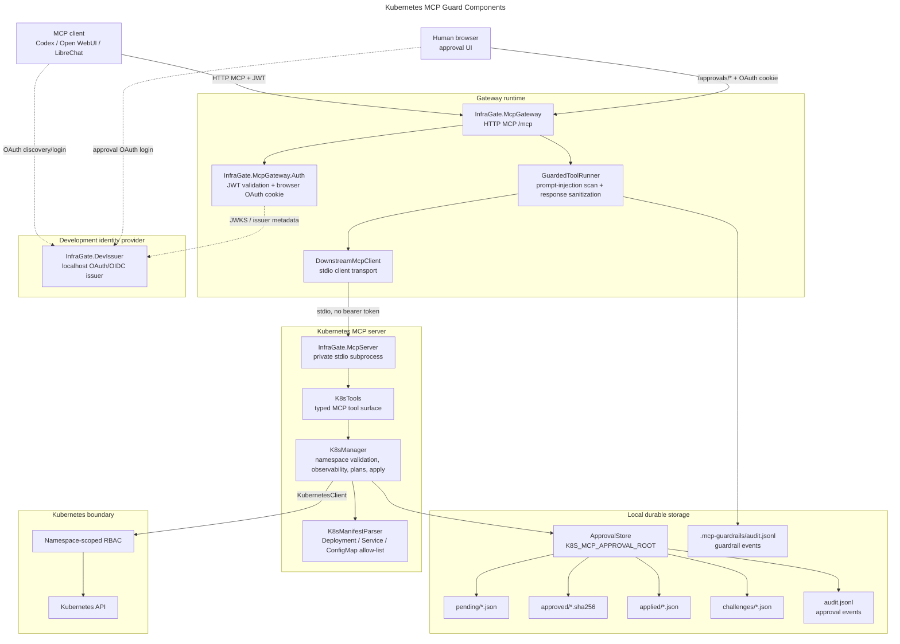
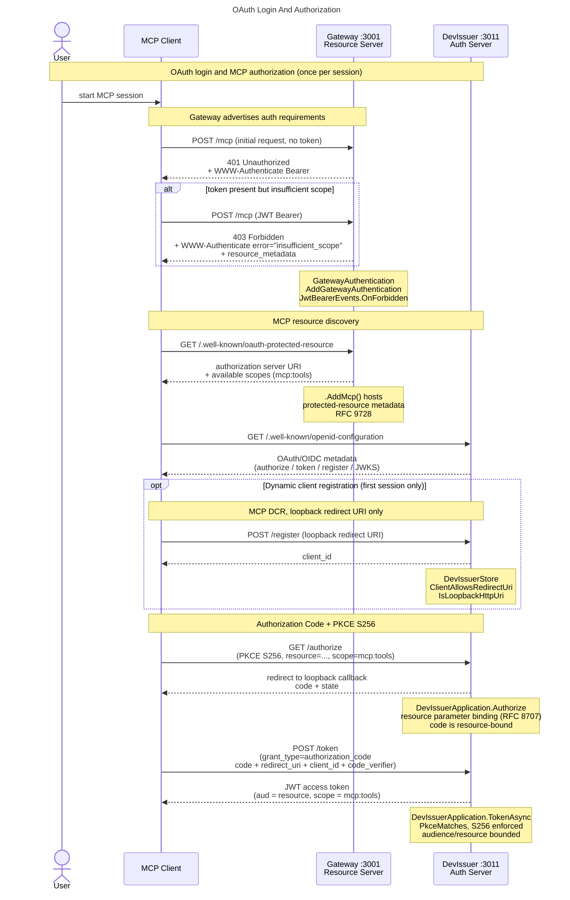
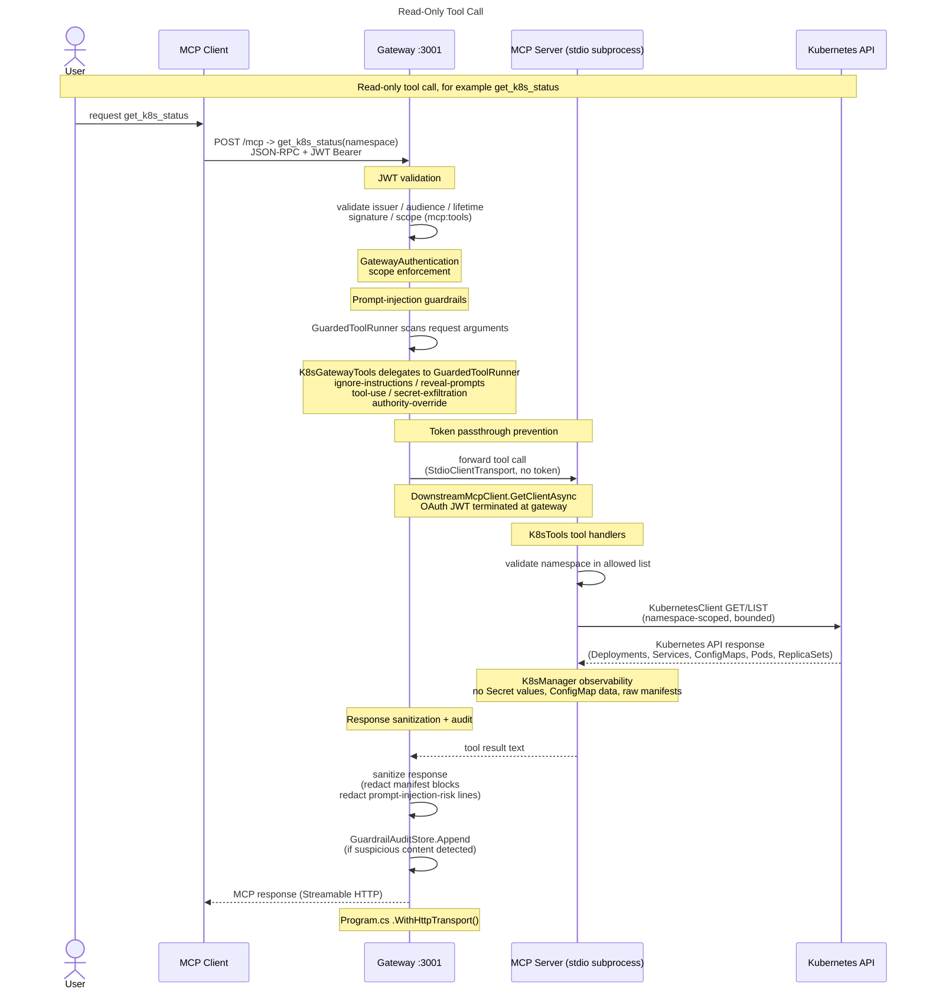
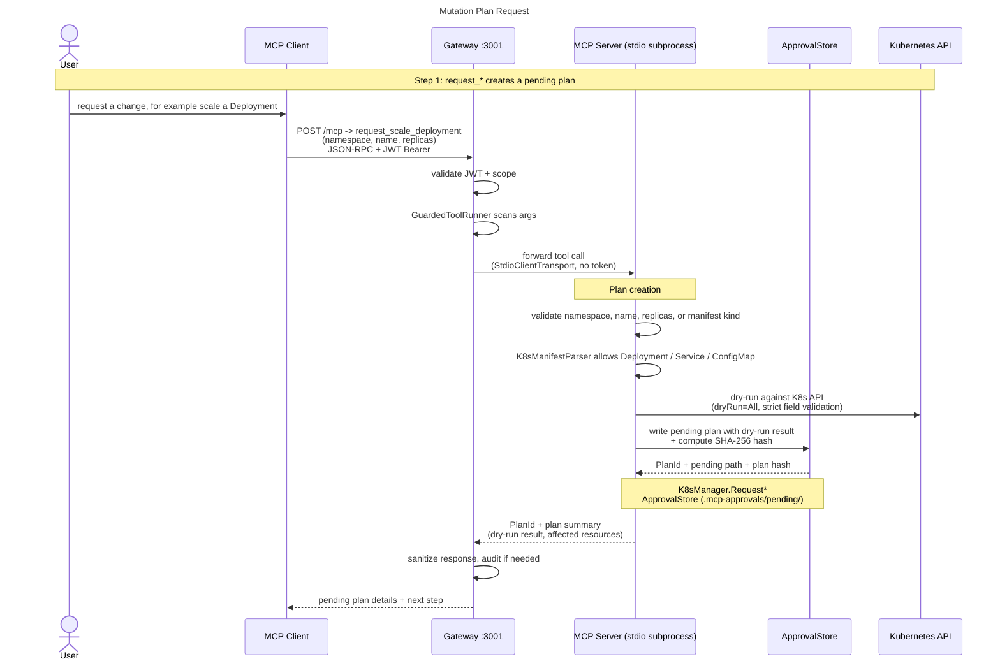
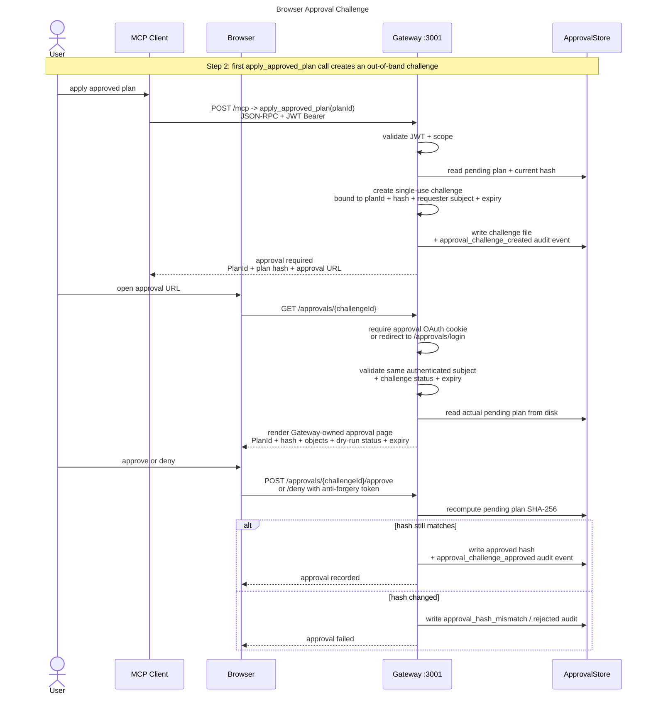
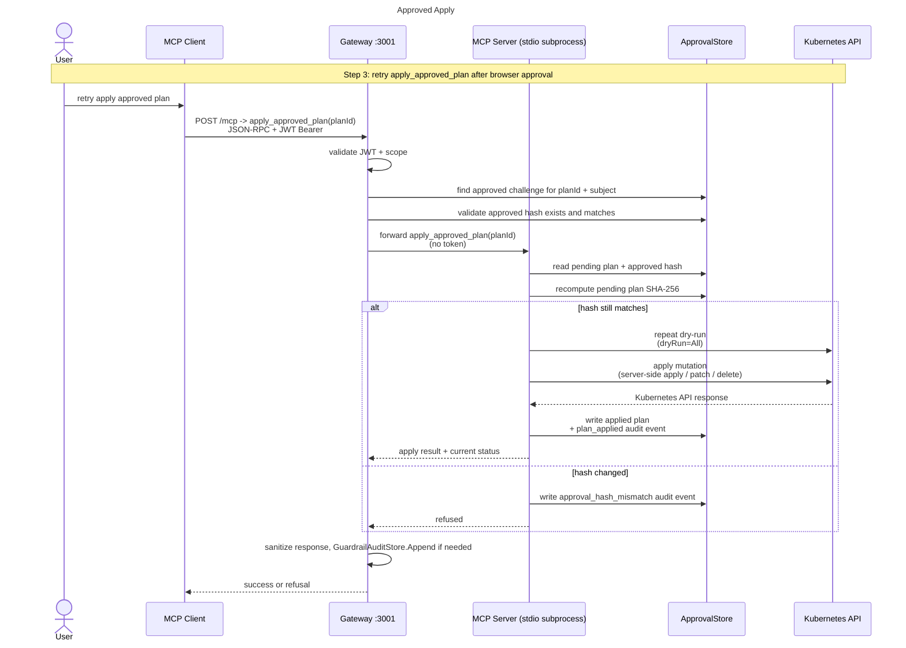
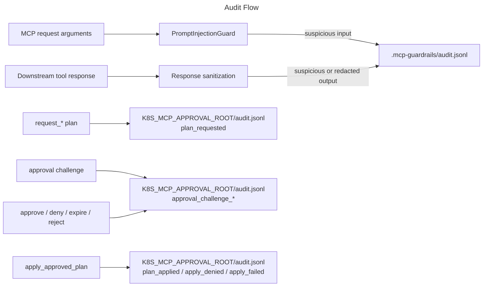

# Architecture

This document is the consolidated system map for Kubernetes MCP Guard. It focuses on components and request flows; detailed protocol, security, tool-permission, and configuration references live in:

- [docs/MCP-compliance.md](MCP-compliance.md) for MCP transport, OAuth 2.1, PKCE, protected-resource metadata, and RFC 8707 details.
- [docs/security-model.md](security-model.md) for hard boundaries, threat model, non-goals, and production warnings.
- [docs/tool-permissions.md](tool-permissions.md) for per-tool RBAC verbs, OAuth scope, and approval requirements.
- [docs/configuration.md](configuration.md) for environment variables, defaults, examples, and production guidance.

## Component Map

In source mode, the gateway launches the server project as a private stdio subprocess. In container mode, the `mcp-gateway` image contains the published server assembly and starts it through `dotnet /app/server/InfraGate.McpServer.dll`. DevIssuer is a development-only identity provider; production deployments use an external OIDC issuer.

## OAuth Login And MCP Authorization

## Read-Only Tool Call

## Mutation Plan Request

## Browser Approval Challenge

The MCP client receives only the approval URL and status text. It does not submit approval content through MCP, and the browser approval session must authenticate as the same subject that requested the plan.

## Approved Apply

## Audit Flow

Guardrail audit and approval audit are separate streams. Guardrail audit records model-visible prompt-injection findings and response redaction actions. Approval audit records plan, challenge, approval, denial, expiry, hash mismatch, and apply events under `K8S_MCP_APPROVAL_ROOT/audit.jsonl`.

## Image And Registry Layout

| Runtime image | GHCR | Docker Hub | Contains |
| --- | --- | --- | --- |
| Gateway | `ghcr.io/mirusser/kubernetes-mcp-guard-gateway:<tag>` | `mirusser/kubernetes-mcp-guard-gateway:<tag>` | `InfraGate.McpGateway`, `InfraGate.McpGateway.Auth`, `InfraGate.Approvals`, and published downstream server assembly at `/app/server/InfraGate.McpServer.dll` |
| DevIssuer | `ghcr.io/mirusser/kubernetes-mcp-guard-devissuer:<tag>` | `mirusser/kubernetes-mcp-guard-devissuer:<tag>` | `InfraGate.DevIssuer` development OAuth/OIDC issuer |

The local/demo source Compose file builds both images locally, and the local/demo release Compose file pulls GHCR images by default while documenting Docker Hub equivalents. The deployment Compose files under `deploy/compose/` deploy the gateway image only; development uses the local Keycloak setup script, while production uses a real OIDC provider. Tags and CI/CD settings are owned by [docs/configuration.md](configuration.md) and the release process docs.
