# Developer Runbook

This is the developer/runbook guide. Unless noted otherwise, run commands from the repository root.

Kubernetes MCP Guard is a .NET 10 MCP gateway/server for AI-safe Kubernetes operations:

- `src/InfraGate.McpServer` is a .NET 10 stdio Kubernetes MCP server using the official C# MCP SDK.
- `src/InfraGate.McpGateway` is a local HTTP MCP gateway that fronts the MCP server with OAuth auth, browser approval pages, and warn+redact prompt-injection guardrails.
- `src/InfraGate.Observer`, `src/InfraGate.Planner`, and `src/InfraGate.Executor` are the autonomous read/propose/execute agents. They use separate service identities and narrow gateway scopes.
- `deploy/local-oauth` is the local OAuth path: Keycloak imports `deploy/keycloak/infra-gate-realm.json` with MCP clients, loopback DCR policy, demo users, and the approval UI client.
- The MCP server uses the Kubernetes API through `KubernetesClient`, not runtime `kubectl` process execution.
- Mutating actions are two-step: request a plan through MCP, then approve it in the Gateway browser UI before changing Kubernetes.
- The server allows only configured namespaces. Manifest apply/delete is limited to `apps/v1 Deployment`, `v1 Service`, and `v1 ConfigMap`; other mutating tools are narrow Deployment operations.
- Read-only observability tools expose bounded Events, Pod logs, focused resource summaries, and diagnostics without exposing Secret values, ConfigMap values, raw manifests, exec, attach, or port-forward.
- `deploy/minikube/rbac.yaml` creates a namespace-scoped ServiceAccount, Role, and RoleBinding.
- `scripts/create-demo-kubeconfig.sh` creates a short-lived service-account kubeconfig at `.kube/mcp-nginx-demo.config`; `--compose` also writes `.kube/mcp-nginx-demo.compose.config`.
- MCP transport and OAuth compliance notes for the HTTP gateway path are tracked in [MCP-compliance.md](MCP-compliance.md).

Current architecture delivers:

- HTTP MCP gateway with OAuth JWT auth at `/mcp`
- Stdio Kubernetes MCP server (private subprocess, OAuth JWT terminated at gateway; downstream service-token auth available as defense-in-depth)
- Namespace-scoped RBAC as the hard permission boundary
- Bounded read-only observability + approval-gated mutation plans
- Browser-based out-of-band approval with same-subject binding for human-originated plans and operator-group approval for Planner-originated plans
- Optional Observer to Planner to Executor remediation handoff
- Prompt-injection guardrails + JSONL audit logging

```mermaid
graph LR
    Client["MCP client<br/>(Codex / Claude Code)"]
    Gateway["HTTP MCP Gateway :3001"]
    Auth["OAuth JWT + scope enforcement"]
    Guardrails["Guardrails + audit"]
    K8sMcp["Kubernetes MCP Server<br/>(stdio subprocess)"]
    Approval["Out-of-band browser<br/>approval UI"]
    Rbac["Namespace-scoped RBAC"]
    K8s["Kubernetes API"]

    Client -->|"/mcp + JWT"| Gateway
    Gateway --> Auth --> Guardrails
    Guardrails -->|"stdio + service token"| K8sMcp --> Rbac --> K8s
    Client -->|"receive approval URL"| Approval
    Approval -->|"cookie session"| Gateway
```



Future directions include multi-user isolation, Docker MCP support, and integration with additional MCP hosts (Open WebUI, LibreChat).

### Bootstrap Minikube RBAC

```bash
./scripts/create-demo-kubeconfig.sh
```

The generated token is valid for 24 hours. Re-run the script when it expires.

Quick RBAC checks:

```bash
kubectl --kubeconfig .kube/mcp-nginx-demo.config auth can-i create deployments -n mcp-nginx-demo
kubectl --kubeconfig .kube/mcp-nginx-demo.config auth can-i patch configmaps -n mcp-nginx-demo
kubectl --kubeconfig .kube/mcp-nginx-demo.config auth can-i get pods/log -n mcp-nginx-demo
kubectl --kubeconfig .kube/mcp-nginx-demo.config auth can-i list events.events.k8s.io -n mcp-nginx-demo
kubectl --kubeconfig .kube/mcp-nginx-demo.config auth can-i create namespaces
kubectl --kubeconfig .kube/mcp-nginx-demo.config auth can-i create deployments -n default
```

Expected: `yes`, `yes`, `yes`, `yes`, `no`, then `no`.

### Run Containerized OAuth

This is the supported local OAuth path. See [Keycloak local OAuth in the setup guide](setup-guide.md#keycloak-local-oauth) for full details, Codex CLI config, and tradeoff notes.

Compose files under `deploy/local-oauth/` and `deploy/compose/` use `${VAR}` substitution; generate the env file from the canonical run-profiles YAML first.

For published images (no local build):

```bash
./scripts/create-demo-kubeconfig.sh --compose
TAG=latest docker compose --env-file deploy/local-oauth/release.env.example \
  -f deploy/local-oauth/compose.release.yaml up
```

For building from source:

```bash
./scripts/create-demo-kubeconfig.sh --compose
./scripts/generate-env.sh local-compose
docker compose --env-file deploy/generated/local-compose.env \
  -f deploy/local-oauth/compose.yaml up --build
```

`scripts/generate-env.sh` compiles the profile from `deploy/run-profiles.yaml` and supplies absolute host paths for local build runs. The published-image path uses the committed no-SDK release env template. The smoke test scripts (`scripts/smoke-test-local.sh`, `scripts/smoke-test-release.sh`) generate and use their smoke-profile files automatically.

### Docker image publishing

Images are pushed to Docker Hub and GitHub Container Registry (GHCR) on the `dev` branch, version tags, or manual dispatch.
PRs and pushes to `main` build without pushing.

The deployment triggers are separate:

- Push to `dev`: pushes `:dev` images, then deploys `deploy/compose/development.yaml` on the `development` environment's self-hosted GitHub Actions runner. Run `sudo ./scripts/setup-development-deploy.sh` once to prepare the machine, start local Keycloak, and verify host/container reachability; the optional GitHub Environment variable `DEPLOY_PATH` overrides the workflow default `/opt/infra-gate`.
- Push a `v*` tag: pushes release images including the raw tag (for example `:v1.0.0`). The Docker workflow does not deploy production for now.

The development deployment defaults to a local Keycloak OIDC provider at `http://127.0.0.1:3010/realms/infra-gate`; any production deployment should use a real OIDC provider.

Trigger a push:

```bash
git tag v1.0.0 && git push origin v1.0.0
```

Or trigger manually from Actions → Docker workflow → Run workflow → check `push_images`.

Required repository variables and secrets are listed in the [configuration reference](configuration.md).
Development runtime configuration is kept in `/etc/infra-gate/development.env` and created locally by `scripts/setup-development-deploy.sh`. GitHub Actions copies only the development Compose file and never writes kubeconfigs or OIDC runtime settings.

Image built: `kubernetes-mcp-guard-gateway`.

### Run the HTTP MCP gateway

The source-run gateway listens on `http://127.0.0.1:3001/mcp` by default, accepts OAuth JWT access tokens, serves browser approval pages under `/approvals`, and starts the downstream stdio server itself. For source-run OAuth debugging, start only Keycloak through the Compose path first:

```bash
./scripts/generate-env.sh local-compose
docker compose --env-file deploy/generated/local-compose.env \
  -f deploy/local-oauth/compose.yaml up keycloak postgres
```

Then run the gateway with OAuth enabled:

```bash
export REPO_ROOT="$(pwd)"
export InfraGate__Runtime__Environment=Development
export InfraGate__Auth__OAuthAuthority="http://127.0.0.1:3010/realms/infra-gate"
export InfraGate__Auth__OAuthMetadataAddress="http://127.0.0.1:3010/realms/infra-gate/.well-known/openid-configuration"
export InfraGate__Auth__OAuthResource="http://127.0.0.1:3001/mcp"
export InfraGate__Auth__OAuthScope="mcp:tools"
export InfraGate__Auth__OAuthRequireHttpsMetadata=false
export InfraGate__Auth__ApprovalOAuthClientId="infra-gate-approval-ui"
export InfraGate__Auth__ApprovalOAuthAuthorizationEndpoint="http://127.0.0.1:3010/realms/infra-gate/protocol/openid-connect/auth"
export InfraGate__Auth__ApprovalOAuthTokenEndpoint="http://127.0.0.1:3010/realms/infra-gate/protocol/openid-connect/token"
export InfraGate__Approval__BaseUrl="http://127.0.0.1:3001"
export InfraGate__Gateway__DownstreamProject="${REPO_ROOT}/src/InfraGate.McpServer/InfraGate.McpServer.csproj"
export InfraGate__Kubernetes__KubeConfig="${REPO_ROOT}/.kube/mcp-nginx-demo.config"
export InfraGate__Approval__Root="${REPO_ROOT}/.mcp-approvals"
export InfraGate__Approval__Postgres__ConnectionString="Host=localhost;Port=5432;Database=infra-gate;Username=infra-gate;Password=infra-gate-dev-password"
export InfraGate__Approval__Postgres__RunMigrationsOnStartup=true
export InfraGate__Kubernetes__AllowedNamespaces__0=mcp-nginx-demo

dotnet run --project src/InfraGate.McpGateway/InfraGate.McpGateway.csproj
```

Set `InfraGate__Auth__OAuthRequireHttpsMetadata=false` only for a localhost-only issuer during development.

For an external OAuth/OIDC issuer, use its issuer URL for `InfraGate__Auth__OAuthAuthority`. The gateway remains a resource server only; external issuer setup, users, clients, login, consent, PKCE policy, and token issuance stay outside the gateway. See [docs/production-oidc.md](production-oidc.md) for production OIDC guidance.

For the supported Keycloak container path, the Compose file sets the internal metadata/token endpoints and approval redirect values for you.

### Optional secondary read-only Kubernetes MCP downstream

The Gateway can also start the pinned upstream `kubernetes-mcp-server` as an off-by-default secondary source for broader read-only Kubernetes inspection. This source never contributes destructive tools or `request_*` wrappers.

For a source run, install the binary, generate its fixed read-only TOML, and set the optional process configuration before starting the Gateway:

```bash
./scripts/create-demo-kubeconfig.sh
./scripts/install-kubernetes-mcp-server.sh
dotnet run --project src/InfraGate.RunProfiles -- generate-toml local-source-gateway \
  --output deploy/generated/local-source-gateway.kubernetes-mcp-server.toml

export REPO_ROOT="$(pwd)"
export InfraGate__Gateway__KubernetesMcpServer__Command="${REPO_ROOT}/.tools/bin/kubernetes-mcp-server"
export InfraGate__Gateway__KubernetesMcpServer__Arguments__0="--config"
export InfraGate__Gateway__KubernetesMcpServer__Arguments__1="${REPO_ROOT}/deploy/generated/local-source-gateway.kubernetes-mcp-server.toml"
export InfraGate__Gateway__KubernetesMcpServer__WorkingDirectory="${REPO_ROOT}"
export InfraGate__Gateway__KubernetesMcpServer__Kubeconfig="${REPO_ROOT}/.kube/mcp-nginx-demo-viewer.config"
export InfraGate__Gateway__KubernetesMcpServer__Context="minikube-mcp"
export InfraGate__Gateway__KubernetesMcpServer__AllowedNamespaces__0="mcp-nginx-demo"
```

The viewer kubeconfig is distinct from `.kube/mcp-nginx-demo.config`, which remains the primary mutation-capable credential. Missing, wildcard, or shared secondary credentials fail configuration validation.

The local installer requires `curl`, `sha256sum`, and `jq`; no Go toolchain is needed. It downloads the official release binary and verifies it against the pinned version and per-platform SHA-256 in `scripts/kubernetes-mcp-server.manifest.json` before trusting it — Docker builds use the same manifest and installer in a dedicated Alpine stage. See the [configuration reference](configuration.md#mcpgateway) for the process settings and [ADR-0033](adr/0033-kubernetes-mcp-server-readonly-secondary-downstream.md) for the trust boundary and architectural decision.

### Downstream stdio service token auth

The gateway proves its identity to the downstream stdio server using a short-lived OAuth client-credentials token. This is a defense-in-depth measure — not the primary security boundary. The primary boundary is the trusted-launch model (containment, human approval, and per-action authorization described in the security controls section of `src/InfraGate.McpGateway/README.md`).

The downstream auth settings bind from `InfraGate:DownstreamAuth` and use the framework `InfraGate__DownstreamAuth__*` environment variable shape:

| Variable | Purpose |
|---|---|
| `InfraGate__DownstreamAuth__Required` | Set to `true` to enforce. Set to `false` to opt out (development only). |
| `InfraGate__DownstreamAuth__Authority` | OIDC issuer URL (e.g. `http://127.0.0.1:3010/realms/infra-gate`). |
| `InfraGate__DownstreamAuth__MetadataAddress` | Optional alternative metadata address for container-internal access. |
| `InfraGate__DownstreamAuth__RequireHttpsMetadata` | Set to `false` for localhost-only issuers in development. |
| `InfraGate__DownstreamAuth__Audience` | Expected audience on the service token (default: `urn:infra-gate:mcp-server`). |
| `InfraGate__DownstreamAuth__Scope` | Scope to request (default: `mcp:downstream`). |
| `InfraGate__DownstreamAuth__GatewayClientId` | Gateway service client ID (gateway side only; never passed to the server subprocess). |
| `InfraGate__DownstreamAuth__GatewayClientSecret` | Gateway service client secret (gateway side only; never passed to the server subprocess). |

To disable downstream auth for local development without Keycloak:

```bash
export InfraGate__DownstreamAuth__Required=false
```

The gateway excludes `InfraGate__DownstreamAuth__GatewayClientId` and `InfraGate__DownstreamAuth__GatewayClientSecret` from the subprocess environment allowlist. The server subprocess never receives the gateway's client credentials. The server receives only the shared fields (`InfraGate__DownstreamAuth__Required`, `InfraGate__DownstreamAuth__Authority`, `InfraGate__DownstreamAuth__Audience`, `InfraGate__DownstreamAuth__Scope`, and `InfraGate__DownstreamAuth__RequireHttpsMetadata`) to configure its JWT validator.

Token values are redacted from guardrail audit logs. `InfraGate__DownstreamAuth__GatewayClientSecret` is never emitted to server-side run profiles or logged.

Codex CLI HTTP MCP config:

```toml
[mcp_servers.infra-gate]
url = "http://127.0.0.1:3001/mcp"
oauth_resource = "http://127.0.0.1:3001/mcp"
scopes = ["mcp:tools"]
```

Then run:

```bash
codex mcp login infra-gate
```

Guardrail audit output settings are listed in [configuration.md](configuration.md).

### Run the stdio MCP server directly

From the repo directory run:

```bash
REPO_ROOT="$(pwd)"
codex mcp add infra-gate \
  --env InfraGate__Runtime__Environment=Development \
  --env InfraGate__Kubernetes__KubeConfig="${REPO_ROOT}/.kube/mcp-nginx-demo.config" \
  --env InfraGate__Kubernetes__AllowedNamespaces__0=mcp-nginx-demo \
  -- dotnet run --project "${REPO_ROOT}/src/InfraGate.McpServer/InfraGate.McpServer.csproj"
```

Next time, with the same environment, run:

```bash
dotnet run --project src/InfraGate.McpServer/InfraGate.McpServer.csproj
```

### Stdio MCP client config

Use this shape for a local stdio MCP client:

```json
{
  "mcpServers": {
    "infra-gate": {
      "command": "dotnet",
      "args": [
        "run",
        "--project",
        "/absolute/path/to/infra-gate/src/InfraGate.McpServer/InfraGate.McpServer.csproj"
      ],
      "env": {
        "InfraGate__Runtime__Environment": "Development",
        "InfraGate__Kubernetes__KubeConfig": "/absolute/path/to/infra-gate/.kube/mcp-nginx-demo.config",
        "InfraGate__Kubernetes__AllowedNamespaces__0": "mcp-nginx-demo"
      }
    }
  }
}
```

### Available MCP tools

The HTTP gateway forwards read-only stdio tools as-is, hides raw destructive stdio tools, and generates approval-plan wrappers for each destructive tool:

- `get_allowed_namespaces()`
- `get_k8s_status(namespace, labelSelector = null)`
- `get_k8s_events(namespace, labelSelector = null, fieldSelector = null, limit = 50)`
- `get_pod_logs(namespace, podName, container = null, tailLines = 200, previous = false)`
- `get_k8s_resource(namespace, kind, name)`
- `get_deployment_diagnostics(namespace, name, limit = 50)`
- `get_pod_diagnostics(namespace, podName, limit = 50)`
- `get_service_diagnostics(namespace, name, limit = 50)`
- `request_apply_manifest(namespace, manifest)`
- `request_delete_manifest(namespace, manifest)`
- `request_scale_deployment(namespace, name, replicas)`
- `request_restart_deployment(namespace, name)`
- `request_set_deployment_image(namespace, name, container, image)`
- `execute_approved_plan(planId)`
- `get_plan_status(planId)`
- `wait_for_plan_approval(planId, timeoutSeconds = 55)`

When calling the stdio server directly, use the read-only evidence tools (`dry_run_*`, `diff_manifest`, `check_live_drift`) or raw destructive tools (`apply_manifest`, `delete_manifest`, `scale_deployment`, `restart_deployment`, `set_deployment_image`). Direct stdio does not expose `request_*`, `execute_approved_plan`, `get_plan_status`, or `wait_for_plan_approval`; those are gateway-owned.

Logs and Events are untrusted Kubernetes workload/cluster output. The HTTP gateway sanitizes suspicious model-visible output before returning it; direct stdio use of `InfraGate.McpServer` bypasses that gateway guardrail layer.

Observability bounds: Events and diagnostics default to `limit = 50` and allow up to `100`; diagnostics cap related Pods and ReplicaSets to `50`; Pod logs default to `tailLines = 200`, allow up to `500`, and use a fixed `65536` byte cap. Focused resource summaries support `Deployment`, `ReplicaSet`, `Pod`, `Service`, and `ConfigMap`; `Secret` details are intentionally rejected.

Approval flow:

1. Ask the HTTP gateway for a plan with `request_apply_manifest`, `request_scale_deployment`, etc. The Kubernetes adapter calls the downstream evidence tools first and stores the dry-run, policy, and diff evidence in the adapter payload inside the pending plan envelope.
2. Call `execute_approved_plan` with the returned `PlanId`.
3. The Gateway returns an approval URL instead of applying.
4. Open the URL in a browser, sign in with the same OAuth identity, review the Gateway-rendered pending plan and dry-run status, and approve or deny it.
5. Call `execute_approved_plan` again. The Gateway forwards only after an Approval Grant exists and still matches the pending plan's Intent Digest and Review Digest; the Kubernetes adapter repeats declared freshness checks immediately before the raw write.

MCP 2026-07-28 clients can include `plan://{planId}/status` in a `subscriptions/listen` request and react to the subscription-tagged `notifications/resources/updated` after browser approval. Clients without resource notification support can call `get_plan_status` in a polling loop or `wait_for_plan_approval(planId, timeoutSeconds)` before retrying `execute_approved_plan`.

The MCP client never submits approval content. Approval challenges are bound to the plan id, current pending-plan hash, requester subject, expected Intent Digest, expected Review Digest, expiry, and Single-Execution status.

Approval state and audit are persisted in PostgreSQL (`InfraGate.Approvals.Postgres`). Guardrail audit remains file-backed under the configured guardrail audit root.

The Anomaly Observer and Remediation Planner each write a separate per-component Audit Stream (ADR-0020) to Postgres. The connection strings are:

| Component | Environment variable |
|---|---|
| Anomaly Observer | `InfraGate__Observer__AuditConnectionString` |
| Remediation Planner | `InfraGate__Planner__AuditConnectionString` |

Each component runs `PostgresAuditOutboxMigrationRunner` on startup to apply its schema migration. The `approvals` schema migration (`0001-initial-approval-persistence.sql`) was retrofitted in place (ADR-0020) — if you have a local `approvals` schema from before this change, drop it before next startup:

```sql
DROP SCHEMA approvals CASCADE;
```

### Telemetry (Gateway, Observer, Planner, Executor)

All four services register an OpenTelemetry `TracerProvider`/`MeterProvider` via `AddInfraGateTelemetry` (ADR-0026). By default, completed agent and workflow spans appear as structured log events in the Serilog output (`Debug` level) with token counts, duration, model, and trace correlation fields.

| Environment variable | Effect |
|---|---|
| `OTEL_EXPORTER_OTLP_ENDPOINT` | Enable OTLP export (e.g. `http://localhost:4317`) to Aspire dashboard, Jaeger, or a Collector. Unset by default. |
| `OTEL_INSTRUMENTATION_GENAI_CAPTURE_MESSAGE_CONTENT` | Set to `true` to include LLM prompt/response text in spans. **Off by default** — do not enable in production. |

`deploy/local-oauth/compose.yaml` runs a standalone `aspire-dashboard` container (dev/demo only — not a production telemetry backend) that receives OTLP on `4317` and serves its UI on `18888` (`http://127.0.0.1:18888` by default). `deploy/run-profiles.yaml`'s `local-compose` profile sets `telemetry.otlpEndpoint` and `telemetry.dashboardToken`, which `InfraGate.RunProfiles` emits into the generated env file as `OTEL_EXPORTER_OTLP_ENDPOINT` and `ASPIRE_DASHBOARD_TOKEN`. The dashboard's browser-token auth reads `ASPIRE_DASHBOARD_TOKEN` from that generated env file — regenerate it (`./scripts/generate-env.sh local-compose --force`) and change `dashboardToken` in `run-profiles.yaml` before sharing a dev stack. Run `./scripts/print-dashboard-url.sh` after generating the env file to print the ready-to-open login URL (`http://127.0.0.1:18888/login?t=<token>`) instead of assembling it by hand.

### Verification

```bash
dotnet build InfraGate.slnx
dotnet run --project src/InfraGate.RunProfiles -- validate
dotnet test InfraGate.slnx --no-build --filter "Category!=Keycloak"
INFRA_GATE_RUN_INTEGRATION=1 dotnet test InfraGate.slnx --no-build --filter "Category!=Keycloak"
INFRA_GATE_RUN_GATEWAY_INTEGRATION=1 dotnet test tests/InfraGate.McpGateway.Tests/InfraGate.McpGateway.Tests.csproj --no-build
dotnet test tests/InfraGate.Observer.IntegrationTests/InfraGate.Observer.IntegrationTests.csproj --no-build
dotnet test tests/InfraGate.Observer.E2E.Tests/InfraGate.Observer.E2E.Tests.csproj --no-build --filter "Category=ObserverE2E"
# Full agentic Observer -> Planner -> Approval -> Executor loop against the live compose
# stack, a real Keycloak login, and a real Mailpit inbox; requires the compose stack
# running (Keycloak, Mailpit), minikube + RBAC + the broken nginx-demo deployment from
# Step 1, a usable KUBECONFIG, and a real InfraGate__OpenRouter__ApiKey (billed calls)
INFRA_GATE_RUN_REMEDIATION_E2E=1 INFRA_GATE_OBSERVER_REAL_LLM=1 dotnet test tests/InfraGate.Remediation.E2E.Tests/InfraGate.Remediation.E2E.Tests.csproj --no-build --filter "Category=RemediationE2E"
dotnet test tests/InfraGate.McpGateway.KeycloakTests/InfraGate.McpGateway.KeycloakTests.csproj --no-build --filter "Category=Keycloak"  # requires Docker
./scripts/coverage.sh
kubectl --kubeconfig .kube/mcp-nginx-demo.config -n mcp-nginx-demo get deployment,service,configmap,pods,replicasets -o wide
```

The stdio integration test drives the MCP server directly, while the gateway integration test drives the HTTP MCP endpoint, downstream stdio bridge, gateway guardrails, approval plans, and Kubernetes path. Both live integration modes expect a usable kubeconfig, defaulting to `.kube/mcp-nginx-demo.config` when `KUBECONFIG` is unset.
The Observer integration tests use an in-process stub MCP gateway and do not require Docker, Keycloak, or Kubernetes. The Observer E2E contract tests are discovered in the default run but early-return unless `INFRA_GATE_RUN_OBSERVER_E2E=1`; when enabled they call the Observer at `INFRA_GATE_OBSERVER_E2E_BASE_URL` (default `http://127.0.0.1:3003`) and use the same response-shape assertions for the optional `INFRA_GATE_OBSERVER_REAL_LLM=1` path.
Code coverage HTML reports are generated at `coverage-report/index.html` by running `./scripts/coverage.sh`.
Local SonarQube pre-push analysis is documented in [tools/sonarqube/README.md](../tools/sonarqube/README.md).
