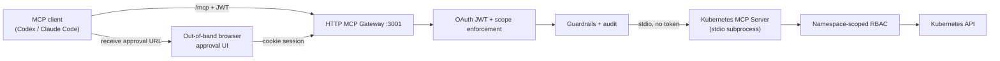

# Developer Runbook

This is the developer/runbook guide. Unless noted otherwise, run commands from the repository root.

Kubernetes MCP Guard is a .NET 10 MCP gateway/server for AI-safe Kubernetes operations:

- `src/InfraGate.McpServer` is a .NET 10 stdio Kubernetes MCP server using the official C# MCP SDK.
- `src/InfraGate.McpGateway` is a local HTTP MCP gateway that fronts the MCP server with OAuth auth, browser approval pages, and warn+redact prompt-injection guardrails.
- `src/InfraGate.DevIssuer` is a dev-only localhost OAuth issuer with OIDC-style discovery metadata for testing Codex MCP OAuth login without an external provider.
- The MCP server uses the Kubernetes API through `KubernetesClient`, not runtime `kubectl` process execution.
- Mutating actions are two-step: request a plan through MCP, then approve it in the Gateway browser UI before changing Kubernetes.
- The server allows only configured namespaces. Manifest apply/delete is limited to `apps/v1 Deployment`, `v1 Service`, and `v1 ConfigMap`; other mutating tools are narrow Deployment operations.
- Read-only observability tools expose bounded Events, Pod logs, focused resource summaries, and diagnostics without exposing Secret values, ConfigMap values, raw manifests, exec, attach, or port-forward.
- `deploy/minikube/rbac.yaml` creates a namespace-scoped ServiceAccount, Role, and RoleBinding.
- `scripts/create-demo-kubeconfig.sh` creates a short-lived service-account kubeconfig at `.kube/mcp-nginx-demo.config`; `--compose` also writes `.kube/mcp-nginx-demo.compose.config`.
- MCP transport and OAuth compliance notes for the HTTP gateway path are tracked in [MCP-compliance.md](MCP-compliance.md).

Current architecture delivers:

- HTTP MCP gateway with OAuth JWT auth at `/mcp`
- Stdio Kubernetes MCP server (private subprocess, no bearer token passthrough)
- Namespace-scoped RBAC as the hard permission boundary
- Bounded read-only observability + approval-gated mutation plans
- Browser-based out-of-band approval with same-subject binding
- Prompt-injection guardrails + JSONL audit logging



Future directions include multi-user isolation, Docker MCP support, and integration with additional MCP hosts (Open WebUI, LibreChat).

### Bootstrap Minikube RBAC

```bash
./scripts/create-demo-kubeconfig.sh
```

The generated token is valid for 24 hours. Re-run the script when it expires.

Quick RBAC checks:

```bash
kubectl --kubeconfig .kube/mcp-nginx-demo.config auth can-i create deployments -n mcp-nginx-demo
kubectl --kubeconfig .kube/mcp-nginx-demo.config auth can-i patch configmaps -n mcp-nginx-demo
kubectl --kubeconfig .kube/mcp-nginx-demo.config auth can-i get pods/log -n mcp-nginx-demo
kubectl --kubeconfig .kube/mcp-nginx-demo.config auth can-i list events.events.k8s.io -n mcp-nginx-demo
kubectl --kubeconfig .kube/mcp-nginx-demo.config auth can-i create namespaces
kubectl --kubeconfig .kube/mcp-nginx-demo.config auth can-i create deployments -n default
```

Expected: `yes`, `yes`, `yes`, `yes`, `no`, then `no`.

### Run Containerized OAuth

This is the recommended local OAuth path. See [Mode B in the setup guide](setup-guide.md#mode-b--http-gateway--oauth-devissuer) for full details, Codex CLI config, and tradeoff notes.

For published images (no local build):

```bash
./scripts/create-demo-kubeconfig.sh --compose
TAG=latest docker compose -f deploy/mode-c/compose.release.yaml up
```

For building from source:

```bash
./scripts/create-demo-kubeconfig.sh --compose
docker compose -f deploy/mode-c/compose.yaml up --build
```

### Docker image publishing

Images are pushed to Docker Hub and GitHub Container Registry (GHCR) on the `dev` branch, version tags, or manual dispatch.
PRs and pushes to `main` build without pushing.

The deployment triggers are separate:

- Push to `dev`: pushes `:dev` images, then deploys `deploy/compose/development.yaml` to the GitHub `development` environment over SSH.
- Push a `v*` tag: pushes release images including the raw tag (for example `:v1.0.0`), then deploys `deploy/compose/production.yaml` to the GitHub `production` environment over SSH.

Both remote Docker deployments are gateway-only and use a real OIDC provider. `InfraGate.DevIssuer` remains local/demo only through the `deploy/mode-c` Compose files.

Trigger a push:

```bash
git tag v1.0.0 && git push origin v1.0.0
```

Or trigger manually from Actions → Docker workflow → Run workflow → check `push_images`.

Required repository variables and secrets are listed in the [configuration reference](configuration.md).
Remote hosts keep runtime configuration in `/etc/infra-gate/development.env` or `/etc/infra-gate/production.env`; GitHub Actions copies only the Compose file and never writes kubeconfigs or OIDC runtime settings.

Images built: `kubernetes-mcp-guard-devissuer`, `kubernetes-mcp-guard-gateway`.

### Run the HTTP MCP gateway

The source-run gateway listens on `http://127.0.0.1:3001/mcp` by default, accepts OAuth JWT access tokens, serves browser approval pages under `/approvals`, and starts the downstream stdio server itself.

For local OAuth/Codex login without an external issuer, run the repo-local dev issuer in a separate terminal:

```bash
export INFRA_GATE_ENVIRONMENT=Development
dotnet run --project src/InfraGate.DevIssuer/InfraGate.DevIssuer.csproj
```

The dev issuer listens on `http://127.0.0.1:3011` by default, exposes OAuth/OIDC discovery metadata, dynamic client registration, authorization-code + PKCE, and JWKS endpoints, and issues ephemeral JWT access tokens for `http://127.0.0.1:3001/mcp` with `mcp:tools`. It is for localhost development only; registrations, authorization codes, and signing keys are in memory and are reset on restart. See [configuration.md](configuration.md) for environment variable defaults and production guidance.

Then start the gateway with OAuth enabled:

```bash
export REPO_ROOT="$(pwd)"
export INFRA_GATE_ENVIRONMENT=Development
export INFRA_GATE_OAUTH_AUTHORITY="http://127.0.0.1:3011"
export INFRA_GATE_OAUTH_RESOURCE="http://127.0.0.1:3001/mcp"
export INFRA_GATE_OAUTH_SCOPE="mcp:tools"
export INFRA_GATE_OAUTH_REQUIRE_HTTPS_METADATA=false
export INFRA_GATE_APPROVAL_OAUTH_CLIENT_ID="infra-gate-approval-ui"
export INFRA_GATE_APPROVAL_OAUTH_AUTHORIZATION_ENDPOINT="http://127.0.0.1:3011/authorize"
export INFRA_GATE_APPROVAL_OAUTH_TOKEN_ENDPOINT="http://127.0.0.1:3011/token"
export INFRA_GATE_APPROVAL_BASE_URL="http://127.0.0.1:3001"
export INFRA_GATE_DOWNSTREAM_PROJECT="${REPO_ROOT}/src/InfraGate.McpServer/InfraGate.McpServer.csproj"
export KUBECONFIG="${REPO_ROOT}/.kube/mcp-nginx-demo.config"
export K8S_MCP_APPROVAL_ROOT="${REPO_ROOT}/.mcp-approvals"
export K8S_MCP_ALLOWED_NAMESPACES=mcp-nginx-demo

dotnet run --project src/InfraGate.McpGateway/InfraGate.McpGateway.csproj
```

Set `INFRA_GATE_OAUTH_REQUIRE_HTTPS_METADATA=false` only for a localhost-only issuer during development.

For an external OAuth/OIDC issuer, use its issuer URL for `INFRA_GATE_OAUTH_AUTHORITY`. The gateway remains a resource server only; external issuer setup, users, clients, login, consent, PKCE policy, and token issuance stay outside the gateway. See [docs/production-oidc.md](production-oidc.md) for production OIDC guidance.

Optional dev issuer settings are documented in [configuration.md](configuration.md). For the containerized Docker bridge path, the Compose files set the internal endpoint and approval redirect values for you.

Codex CLI HTTP MCP config:

```toml
[mcp_servers.infra-gate]
url = "http://127.0.0.1:3001/mcp"
oauth_resource = "http://127.0.0.1:3001/mcp"
scopes = ["mcp:tools"]
```

Then run:

```bash
codex mcp login infra-gate
```

Guardrail audit output settings are listed in [configuration.md](configuration.md).

### Run the stdio MCP server directly

From the repo directory run:

```bash
REPO_ROOT="$(pwd)"
codex mcp add infra-gate \
  --env INFRA_GATE_ENVIRONMENT=Development \
  --env KUBECONFIG="${REPO_ROOT}/.kube/mcp-nginx-demo.config" \
  --env K8S_MCP_APPROVAL_ROOT="${REPO_ROOT}/.mcp-approvals" \
  --env K8S_MCP_ALLOWED_NAMESPACES=mcp-nginx-demo \
  -- dotnet run --project "${REPO_ROOT}/src/InfraGate.McpServer/InfraGate.McpServer.csproj"
```

Next time, with the same environment, run:

```bash
dotnet run --project src/InfraGate.McpServer/InfraGate.McpServer.csproj
```

### Stdio MCP client config

Use this shape for a local stdio MCP client:

```json
{
  "mcpServers": {
    "infra-gate": {
      "command": "dotnet",
      "args": [
        "run",
        "--project",
        "/absolute/path/to/infra-gate/src/InfraGate.McpServer/InfraGate.McpServer.csproj"
      ],
      "env": {
        "INFRA_GATE_ENVIRONMENT": "Development",
        "KUBECONFIG": "/absolute/path/to/infra-gate/.kube/mcp-nginx-demo.config",
        "K8S_MCP_APPROVAL_ROOT": "/absolute/path/to/infra-gate/.mcp-approvals",
        "K8S_MCP_ALLOWED_NAMESPACES": "mcp-nginx-demo"
      }
    }
  }
}
```

### Available MCP tools

The HTTP gateway exposes the same tool names and arguments as the stdio server:

- `get_allowed_namespaces()`
- `get_k8s_status(namespace, labelSelector = null)`
- `get_k8s_events(namespace, labelSelector = null, fieldSelector = null, limit = 50)`
- `get_pod_logs(namespace, podName, container = null, tailLines = 200, previous = false)`
- `get_k8s_resource(namespace, kind, name)`
- `get_deployment_diagnostics(namespace, name, limit = 50)`
- `get_pod_diagnostics(namespace, podName, limit = 50)`
- `get_service_diagnostics(namespace, name, limit = 50)`
- `request_apply_manifest(namespace, manifest)`
- `request_delete_manifest(namespace, manifest)`
- `request_scale_deployment(namespace, name, replicas)`
- `request_restart_deployment(namespace, name)`
- `request_set_deployment_image(namespace, name, container, image)`
- `apply_approved_plan(planId)`

Logs and Events are untrusted Kubernetes workload/cluster output. The HTTP gateway sanitizes suspicious model-visible output before returning it; direct stdio use of `InfraGate.McpServer` bypasses that gateway guardrail layer.

Observability bounds: Events and diagnostics default to `limit = 50` and allow up to `100`; diagnostics cap related Pods and ReplicaSets to `50`; Pod logs default to `tailLines = 200`, allow up to `500`, and use a fixed `65536` byte cap. Focused resource summaries support `Deployment`, `ReplicaSet`, `Pod`, `Service`, and `ConfigMap`; `Secret` details are intentionally rejected.

Approval flow:

1. Ask the MCP server for a plan with `request_apply_manifest`, `request_scale_deployment`, etc. The server runs Kubernetes `dryRun=All` first and stores the dry-run result in the pending plan.
2. Call `apply_approved_plan` with the returned `PlanId`.
3. The Gateway returns an approval URL instead of applying.
4. Open the URL in a browser, sign in with the same OAuth identity, review the Gateway-rendered pending plan and dry-run status, and approve or deny it.
5. Call `apply_approved_plan` again. The Gateway forwards only after the approved hash exists and still matches; the server repeats dry-run immediately before the real write.

The MCP client never submits approval content. Approval challenges are bound to the plan id, current plan hash, requester subject, expiry, and single-use status.

The approval file stores the SHA-256 hash of the pending plan, including recorded dry-run data. If the pending plan changes after approval, or a fresh pre-apply dry-run fails, the MCP server refuses to apply it. Audit events are written under `.mcp-approvals/audit.jsonl`.

### Verification

```bash
dotnet build InfraGate.slnx
dotnet test InfraGate.slnx --no-build --filter "Category!=Keycloak"
INFRA_GATE_RUN_INTEGRATION=1 dotnet test InfraGate.slnx --no-build --filter "Category!=Keycloak"
INFRA_GATE_RUN_GATEWAY_INTEGRATION=1 dotnet test tests/InfraGate.McpGateway.Tests/InfraGate.McpGateway.Tests.csproj --no-build
dotnet test tests/InfraGate.McpGateway.KeycloakTests/InfraGate.McpGateway.KeycloakTests.csproj --no-build --filter "Category=Keycloak"  # requires Docker
./scripts/coverage.sh
kubectl --kubeconfig .kube/mcp-nginx-demo.config -n mcp-nginx-demo get deployment,service,configmap,pods,replicasets -o wide
```

The stdio integration test drives the MCP server directly, while the gateway integration test drives the HTTP MCP endpoint, downstream stdio bridge, gateway guardrails, approval plans, and Kubernetes path. Both live integration modes expect a usable kubeconfig, defaulting to `.kube/mcp-nginx-demo.config` when `KUBECONFIG` is unset.
Code coverage HTML reports are generated at `coverage-report/index.html` by running `./scripts/coverage.sh`.
