# Developer Runbook

This is the developer/runbook guide. Unless noted otherwise, run commands from the repository root.

Kubernetes MCP Guard is a .NET 10 MCP gateway/server for AI-safe Kubernetes operations:

- `src/InfraGate.McpServer` is a .NET 10 stdio Kubernetes MCP server using the official C# MCP SDK.
- `src/InfraGate.McpGateway` is a local HTTP MCP gateway that fronts the MCP server with OAuth auth, browser approval pages, and warn+redact prompt-injection guardrails.
- `deploy/local-oauth` is the local OAuth path: Keycloak imports `deploy/keycloak/infra-gate-realm.json` with MCP clients, loopback DCR policy, demo users, and the approval UI client.
- The MCP server uses the Kubernetes API through `KubernetesClient`, not runtime `kubectl` process execution.
- Mutating actions are two-step: request a plan through MCP, then approve it in the Gateway browser UI before changing Kubernetes.
- The server allows only configured namespaces. Manifest apply/delete is limited to `apps/v1 Deployment`, `v1 Service`, and `v1 ConfigMap`; other mutating tools are narrow Deployment operations.
- Read-only observability tools expose bounded Events, Pod logs, focused resource summaries, and diagnostics without exposing Secret values, ConfigMap values, raw manifests, exec, attach, or port-forward.
- `deploy/minikube/rbac.yaml` creates a namespace-scoped ServiceAccount, Role, and RoleBinding.
- `scripts/create-demo-kubeconfig.sh` creates a short-lived service-account kubeconfig at `.kube/mcp-nginx-demo.config`; `--compose` also writes `.kube/mcp-nginx-demo.compose.config`.
- MCP transport and OAuth compliance notes for the HTTP gateway path are tracked in [MCP-compliance.md](MCP-compliance.md).

Current architecture delivers:

- HTTP MCP gateway with OAuth JWT auth at `/mcp`
- Stdio Kubernetes MCP server (private subprocess, OAuth JWT terminated at gateway; downstream service-token auth available as defense-in-depth)
- Namespace-scoped RBAC as the hard permission boundary
- Bounded read-only observability + approval-gated mutation plans
- Browser-based out-of-band approval with same-subject binding
- Prompt-injection guardrails + JSONL audit logging

```mermaid
graph LR
    Client["MCP client<br/>(Codex / Claude Code)"]
    Gateway["HTTP MCP Gateway :3001"]
    Auth["OAuth JWT + scope enforcement"]
    Guardrails["Guardrails + audit"]
    K8sMcp["Kubernetes MCP Server<br/>(stdio subprocess)"]
    Approval["Out-of-band browser<br/>approval UI"]
    Rbac["Namespace-scoped RBAC"]
    K8s["Kubernetes API"]

    Client -->|"/mcp + JWT"| Gateway
    Gateway --> Auth --> Guardrails
    Guardrails -->|"stdio + service token"| K8sMcp --> Rbac --> K8s
    Client -->|"receive approval URL"| Approval
    Approval -->|"cookie session"| Gateway
```



Future directions include multi-user isolation, Docker MCP support, and integration with additional MCP hosts (Open WebUI, LibreChat).

### Bootstrap Minikube RBAC

```bash
./scripts/create-demo-kubeconfig.sh
```

The generated token is valid for 24 hours. Re-run the script when it expires.

Quick RBAC checks:

```bash
kubectl --kubeconfig .kube/mcp-nginx-demo.config auth can-i create deployments -n mcp-nginx-demo
kubectl --kubeconfig .kube/mcp-nginx-demo.config auth can-i patch configmaps -n mcp-nginx-demo
kubectl --kubeconfig .kube/mcp-nginx-demo.config auth can-i get pods/log -n mcp-nginx-demo
kubectl --kubeconfig .kube/mcp-nginx-demo.config auth can-i list events.events.k8s.io -n mcp-nginx-demo
kubectl --kubeconfig .kube/mcp-nginx-demo.config auth can-i create namespaces
kubectl --kubeconfig .kube/mcp-nginx-demo.config auth can-i create deployments -n default
```

Expected: `yes`, `yes`, `yes`, `yes`, `no`, then `no`.

### Run Containerized OAuth

This is the supported local OAuth path. See [Keycloak local OAuth in the setup guide](setup-guide.md#keycloak-local-oauth) for full details, Codex CLI config, and tradeoff notes.

Compose files under `deploy/local-oauth/` and `deploy/compose/` use `${VAR}` substitution; generate the env and appsettings files from the canonical run-profiles YAML first.

For published images (no local build):

```bash
./scripts/create-demo-kubeconfig.sh --compose
TAG=latest docker compose --env-file deploy/local-oauth/release.env.example \
  -f deploy/local-oauth/compose.release.yaml up
```

For building from source:

```bash
./scripts/create-demo-kubeconfig.sh --compose
./scripts/generate-env.sh local-compose
docker compose --env-file deploy/generated/local-compose.env \
  -f deploy/local-oauth/compose.yaml up --build
```

`scripts/generate-env.sh` compiles the profile from `deploy/run-profiles.yaml` and supplies absolute host paths for local build runs. The published-image path uses the committed no-SDK release env template and appsettings file. The smoke test scripts (`scripts/smoke-test-local.sh`, `scripts/smoke-test-release.sh`) generate and use their smoke-profile files automatically.

### Docker image publishing

Images are pushed to Docker Hub and GitHub Container Registry (GHCR) on the `dev` branch, version tags, or manual dispatch.
PRs and pushes to `main` build without pushing.

The deployment triggers are separate:

- Push to `dev`: pushes `:dev` images, then deploys `deploy/compose/development.yaml` on the `development` environment's self-hosted GitHub Actions runner. Run `sudo ./scripts/setup-development-deploy.sh` once to prepare the machine, start local Keycloak, and verify host/container reachability; the optional GitHub Environment variable `DEPLOY_PATH` overrides the workflow default `/opt/infra-gate`.
- Push a `v*` tag: pushes release images including the raw tag (for example `:v1.0.0`). The Docker workflow does not deploy production for now.

The development deployment defaults to a local Keycloak OIDC provider at `http://127.0.0.1:3010/realms/infra-gate`; any production deployment should use a real OIDC provider.

Trigger a push:

```bash
git tag v1.0.0 && git push origin v1.0.0
```

Or trigger manually from Actions → Docker workflow → Run workflow → check `push_images`.

Required repository variables and secrets are listed in the [configuration reference](configuration.md).
Development runtime configuration is kept in `/etc/infra-gate/development.env` and created locally by `scripts/setup-development-deploy.sh`. GitHub Actions copies only the development Compose file and never writes kubeconfigs or OIDC runtime settings.

Image built: `kubernetes-mcp-guard-gateway`.

### Run the HTTP MCP gateway

The source-run gateway listens on `http://127.0.0.1:3001/mcp` by default, accepts OAuth JWT access tokens, serves browser approval pages under `/approvals`, and starts the downstream stdio server itself. For source-run OAuth debugging, start only Keycloak through the Compose path first:

```bash
docker compose -f deploy/local-oauth/compose.yaml up keycloak
```

Then run the gateway with OAuth enabled:

```bash
export REPO_ROOT="$(pwd)"
export INFRA_GATE_ENVIRONMENT=Development
export INFRA_GATE_OAUTH_AUTHORITY="http://127.0.0.1:3010/realms/infra-gate"
export INFRA_GATE_OAUTH_METADATA_ADDRESS="http://127.0.0.1:3010/realms/infra-gate/.well-known/openid-configuration"
export INFRA_GATE_OAUTH_RESOURCE="http://127.0.0.1:3001/mcp"
export INFRA_GATE_OAUTH_SCOPE="mcp:tools"
export INFRA_GATE_OAUTH_REQUIRE_HTTPS_METADATA=false
export INFRA_GATE_APPROVAL_OAUTH_CLIENT_ID="infra-gate-approval-ui"
export INFRA_GATE_APPROVAL_OAUTH_AUTHORIZATION_ENDPOINT="http://127.0.0.1:3010/realms/infra-gate/protocol/openid-connect/auth"
export INFRA_GATE_APPROVAL_OAUTH_TOKEN_ENDPOINT="http://127.0.0.1:3010/realms/infra-gate/protocol/openid-connect/token"
export INFRA_GATE_APPROVAL_BASE_URL="http://127.0.0.1:3001"
export INFRA_GATE_DOWNSTREAM_PROJECT="${REPO_ROOT}/src/InfraGate.McpServer/InfraGate.McpServer.csproj"
export KUBECONFIG="${REPO_ROOT}/.kube/mcp-nginx-demo.config"
export K8S_MCP_APPROVAL_ROOT="${REPO_ROOT}/.mcp-approvals"
export K8S_MCP_ALLOWED_NAMESPACES=mcp-nginx-demo

dotnet run --project src/InfraGate.McpGateway/InfraGate.McpGateway.csproj
```

Set `INFRA_GATE_OAUTH_REQUIRE_HTTPS_METADATA=false` only for a localhost-only issuer during development.

For an external OAuth/OIDC issuer, use its issuer URL for `INFRA_GATE_OAUTH_AUTHORITY`. The gateway remains a resource server only; external issuer setup, users, clients, login, consent, PKCE policy, and token issuance stay outside the gateway. See [docs/production-oidc.md](production-oidc.md) for production OIDC guidance.

For the supported Keycloak container path, the Compose file sets the internal metadata/token endpoints and approval redirect values for you.

### Downstream stdio service token auth

The gateway proves its identity to the downstream stdio server using a short-lived OAuth client-credentials token. This is a defense-in-depth measure — not the primary security boundary. The primary boundary is the trusted-launch model (containment, human approval, and per-action authorization described in the security controls section of `src/InfraGate.McpGateway/README.md`).

The downstream auth settings are controlled by the `INFRA_GATE_DOWNSTREAM_AUTH_*` environment variables:

| Variable | Purpose |
|---|---|
| `INFRA_GATE_DOWNSTREAM_AUTH_REQUIRED` | Set to `true` to enforce. Set to `false` to opt out (development only). |
| `INFRA_GATE_DOWNSTREAM_AUTH_AUTHORITY` | OIDC issuer URL (e.g. `http://127.0.0.1:3010/realms/infra-gate`). |
| `INFRA_GATE_DOWNSTREAM_AUTH_METADATA_ADDRESS` | Optional alternative metadata address for container-internal access. |
| `INFRA_GATE_DOWNSTREAM_AUTH_REQUIRE_HTTPS_METADATA` | Set to `false` for localhost-only issuers in development. |
| `INFRA_GATE_DOWNSTREAM_AUTH_AUDIENCE` | Expected audience on the service token (default: `urn:infra-gate:mcp-server`). |
| `INFRA_GATE_DOWNSTREAM_AUTH_SCOPE` | Scope to request (default: `mcp:downstream`). |
| `INFRA_GATE_DOWNSTREAM_AUTH_GATEWAY_CLIENT_ID` | Gateway service client ID (gateway side only; never passed to the server subprocess). |
| `INFRA_GATE_DOWNSTREAM_AUTH_GATEWAY_CLIENT_SECRET` | Gateway service client secret (gateway side only; never passed to the server subprocess). |

To disable downstream auth for local development without Keycloak:

```bash
export INFRA_GATE_DOWNSTREAM_AUTH_REQUIRED=false
```

The gateway excludes `INFRA_GATE_DOWNSTREAM_AUTH_GATEWAY_CLIENT_ID` and `INFRA_GATE_DOWNSTREAM_AUTH_GATEWAY_CLIENT_SECRET` from the subprocess environment allowlist. The server subprocess never receives the gateway's client credentials. The server receives only the shared fields (`INFRA_GATE_DOWNSTREAM_AUTH_REQUIRED`, `AUTHORITY`, `AUDIENCE`, `SCOPE`, `REQUIRE_HTTPS_METADATA`) to configure its JWT validator.

Token values are redacted from guardrail audit logs. The `GATEWAY_CLIENT_SECRET` is never emitted to server-side run profiles or logged.

Codex CLI HTTP MCP config:

```toml
[mcp_servers.infra-gate]
url = "http://127.0.0.1:3001/mcp"
oauth_resource = "http://127.0.0.1:3001/mcp"
scopes = ["mcp:tools"]
```

Then run:

```bash
codex mcp login infra-gate
```

Guardrail audit output settings are listed in [configuration.md](configuration.md).

### Run the stdio MCP server directly

From the repo directory run:

```bash
REPO_ROOT="$(pwd)"
codex mcp add infra-gate \
  --env INFRA_GATE_ENVIRONMENT=Development \
  --env KUBECONFIG="${REPO_ROOT}/.kube/mcp-nginx-demo.config" \
  --env K8S_MCP_APPROVAL_ROOT="${REPO_ROOT}/.mcp-approvals" \
  --env K8S_MCP_ALLOWED_NAMESPACES=mcp-nginx-demo \
  -- dotnet run --project "${REPO_ROOT}/src/InfraGate.McpServer/InfraGate.McpServer.csproj"
```

Next time, with the same environment, run:

```bash
dotnet run --project src/InfraGate.McpServer/InfraGate.McpServer.csproj
```

### Stdio MCP client config

Use this shape for a local stdio MCP client:

```json
{
  "mcpServers": {
    "infra-gate": {
      "command": "dotnet",
      "args": [
        "run",
        "--project",
        "/absolute/path/to/infra-gate/src/InfraGate.McpServer/InfraGate.McpServer.csproj"
      ],
      "env": {
        "INFRA_GATE_ENVIRONMENT": "Development",
        "KUBECONFIG": "/absolute/path/to/infra-gate/.kube/mcp-nginx-demo.config",
        "K8S_MCP_APPROVAL_ROOT": "/absolute/path/to/infra-gate/.mcp-approvals",
        "K8S_MCP_ALLOWED_NAMESPACES": "mcp-nginx-demo"
      }
    }
  }
}
```

### Available MCP tools

The HTTP gateway forwards read-only stdio tools as-is, hides raw destructive stdio tools, and generates approval-plan wrappers for each destructive tool:

- `get_allowed_namespaces()`
- `get_k8s_status(namespace, labelSelector = null)`
- `get_k8s_events(namespace, labelSelector = null, fieldSelector = null, limit = 50)`
- `get_pod_logs(namespace, podName, container = null, tailLines = 200, previous = false)`
- `get_k8s_resource(namespace, kind, name)`
- `get_deployment_diagnostics(namespace, name, limit = 50)`
- `get_pod_diagnostics(namespace, podName, limit = 50)`
- `get_service_diagnostics(namespace, name, limit = 50)`
- `request_apply_manifest(namespace, manifest)`
- `request_delete_manifest(namespace, manifest)`
- `request_scale_deployment(namespace, name, replicas)`
- `request_restart_deployment(namespace, name)`
- `request_set_deployment_image(namespace, name, container, image)`
- `execute_approved_plan(planId)`

When calling the stdio server directly, use the read-only evidence tools (`dry_run_*`, `diff_manifest`, `check_live_drift`) or raw destructive tools (`apply_manifest`, `delete_manifest`, `scale_deployment`, `restart_deployment`, `set_deployment_image`). Direct stdio does not expose `request_*` or `execute_approved_plan`; those are gateway-owned.

Logs and Events are untrusted Kubernetes workload/cluster output. The HTTP gateway sanitizes suspicious model-visible output before returning it; direct stdio use of `InfraGate.McpServer` bypasses that gateway guardrail layer.

Observability bounds: Events and diagnostics default to `limit = 50` and allow up to `100`; diagnostics cap related Pods and ReplicaSets to `50`; Pod logs default to `tailLines = 200`, allow up to `500`, and use a fixed `65536` byte cap. Focused resource summaries support `Deployment`, `ReplicaSet`, `Pod`, `Service`, and `ConfigMap`; `Secret` details are intentionally rejected.

Approval flow:

1. Ask the HTTP gateway for a plan with `request_apply_manifest`, `request_scale_deployment`, etc. The Kubernetes adapter calls the downstream evidence tools first and stores the dry-run, policy, and diff evidence in the adapter payload inside the pending plan envelope.
2. Call `execute_approved_plan` with the returned `PlanId`.
3. The Gateway returns an approval URL instead of applying.
4. Open the URL in a browser, sign in with the same OAuth identity, review the Gateway-rendered pending plan and dry-run status, and approve or deny it.
5. Call `execute_approved_plan` again. The Gateway forwards only after an Approval Grant exists and still matches the pending plan's Intent Digest and Review Digest; the Kubernetes adapter repeats declared freshness checks immediately before the raw write.

The MCP client never submits approval content. Approval challenges are bound to the plan id, current pending-plan hash, requester subject, expected Intent Digest, expected Review Digest, expiry, and Single-Execution status.

Approval grants are stored under `.mcp-approvals/grants/` and bind the requester, approver, source challenge, Intent Digest, Review Digest, approval policy, reuse policy, and plan validity expiry. Old raw pending-plan files must be re-requested after the envelope-format change. If the pending plan changes after approval, the grant no longer matches and the gateway refuses to apply it. Audit events are written under `.mcp-approvals/audit.jsonl`.

### Verification

```bash
dotnet build InfraGate.slnx
dotnet run --project src/InfraGate.RunProfiles -- validate
dotnet test InfraGate.slnx --no-build --filter "Category!=Keycloak"
INFRA_GATE_RUN_INTEGRATION=1 dotnet test InfraGate.slnx --no-build --filter "Category!=Keycloak"
INFRA_GATE_RUN_GATEWAY_INTEGRATION=1 dotnet test tests/InfraGate.McpGateway.Tests/InfraGate.McpGateway.Tests.csproj --no-build
dotnet test tests/InfraGate.McpGateway.KeycloakTests/InfraGate.McpGateway.KeycloakTests.csproj --no-build --filter "Category=Keycloak"  # requires Docker
./scripts/coverage.sh
kubectl --kubeconfig .kube/mcp-nginx-demo.config -n mcp-nginx-demo get deployment,service,configmap,pods,replicasets -o wide
```

The stdio integration test drives the MCP server directly, while the gateway integration test drives the HTTP MCP endpoint, downstream stdio bridge, gateway guardrails, approval plans, and Kubernetes path. Both live integration modes expect a usable kubeconfig, defaulting to `.kube/mcp-nginx-demo.config` when `KUBECONFIG` is unset.
Code coverage HTML reports are generated at `coverage-report/index.html` by running `./scripts/coverage.sh`.
Local SonarQube pre-push analysis is documented in [tools/sonarqube/README.md](../tools/sonarqube/README.md).
