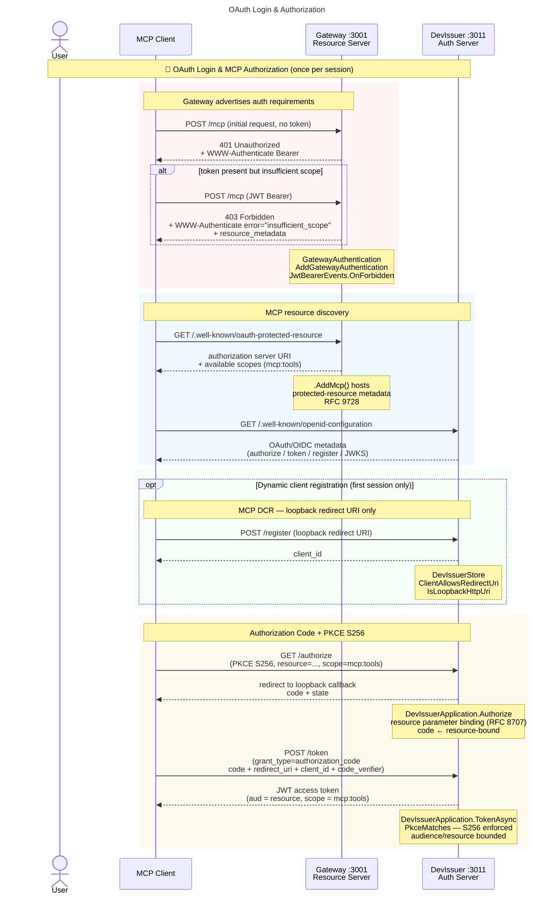
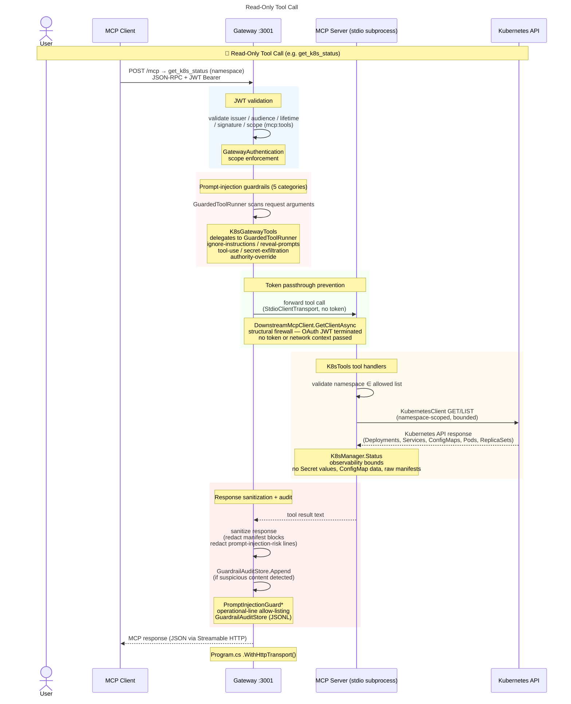
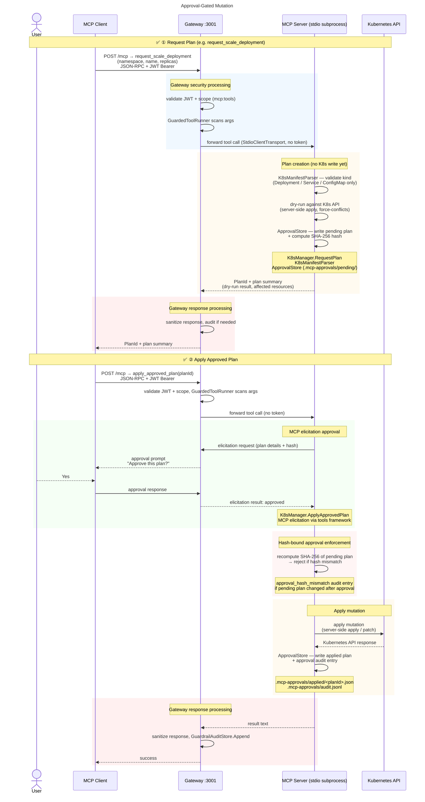

# Architecture diagram

Three comprehensive sequence diagrams covering the complete lifecycle, with code-source annotations showing which class or method drives each step. 

See [docs/MCP-compliance.md](MCP-compliance.md) for the consolidated diagram and protocol detail.

## OAuth Login & MCP Authorization

## Read-Only Tool Call

## Approval-Gated Mutation (Plan + Apply)

