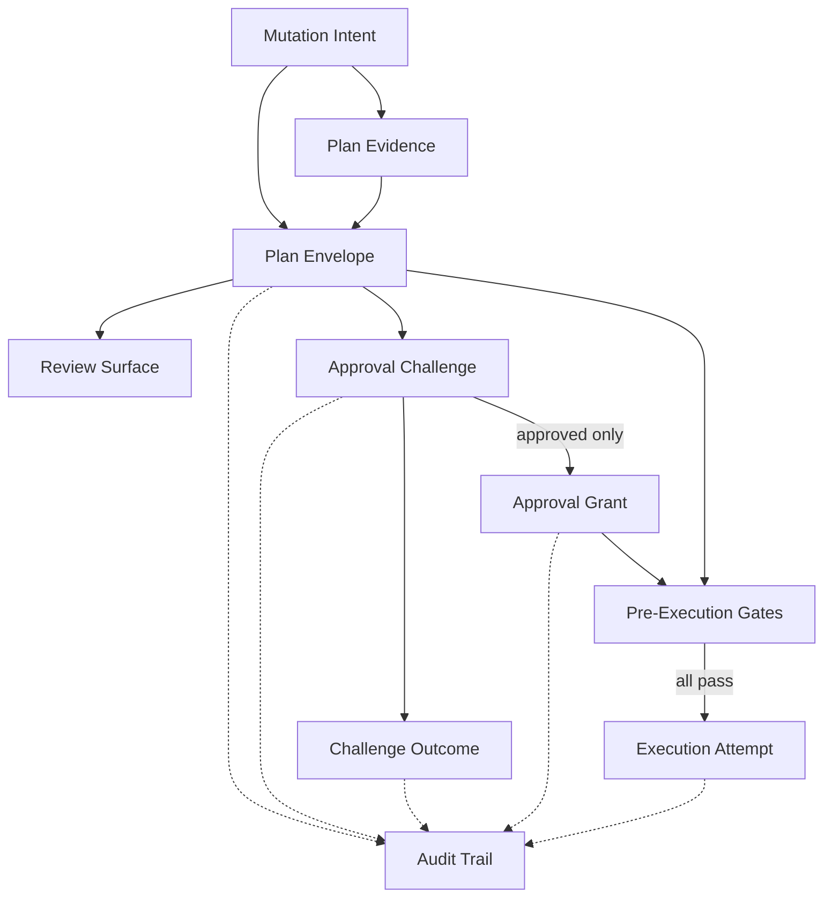
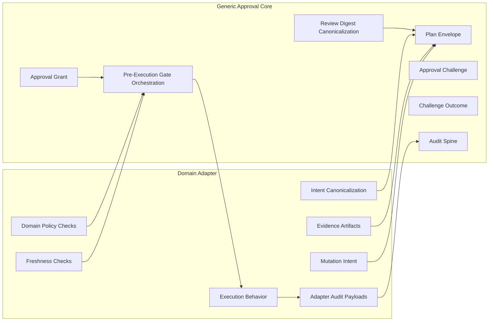
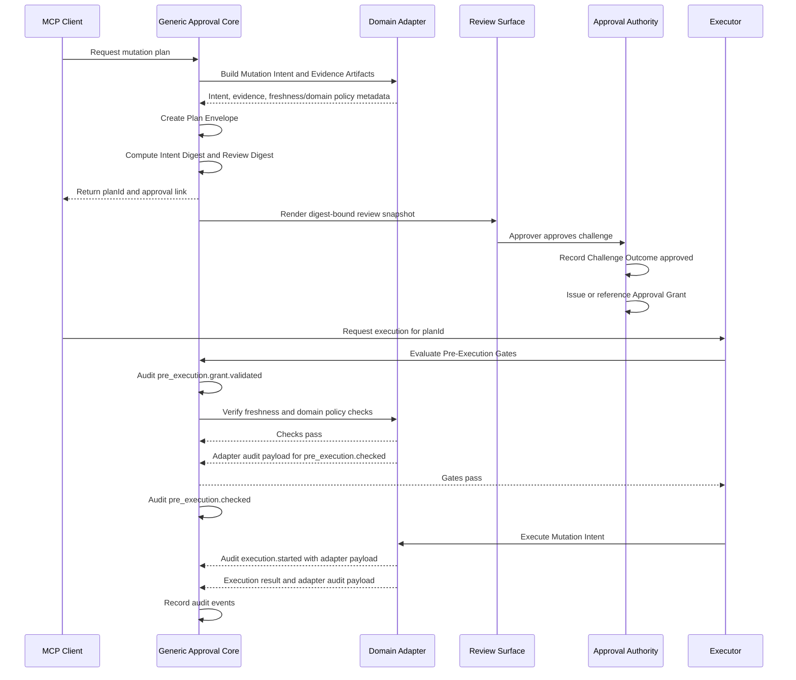
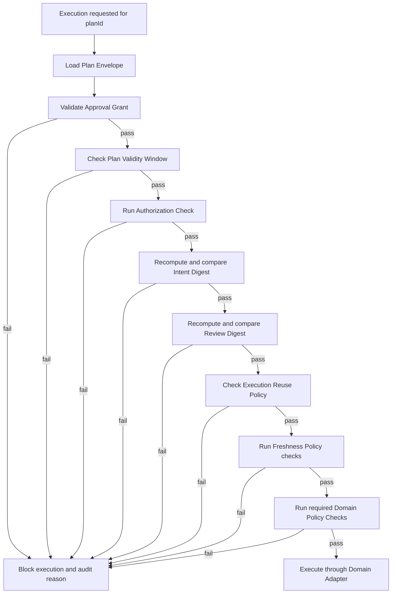

# MCP Mutation Approval Flow

This document turns the mutation-approval vocabulary into diagrams and concrete flows. It is a validation aid for the profile sketch, not a separate source of terminology.

Canonical term definitions remain in [CONTEXT.md](../CONTEXT.md). The profile narrative remains in [mutation-approval-profile.md](mutation-approval-profile.md).

## Object Flow

The important split is that **Challenge Outcome** is the terminal audit record for an approval attempt. **Approval Grant** is the durable execution authorization consumed by pre-execution gates.

## Ownership

The generic core owns lifecycle, identity, binding, and gate orchestration. The adapter owns mutation meaning, evidence, freshness, domain policy, and execution behavior.

## Relationship Table

| Source | Relationship | Target |
| --- | --- | --- |
| Plan Envelope | wraps exactly one | Mutation Intent |
| Plan Envelope | records exactly one | Requester |
| Plan Envelope | has exactly one | Plan Identifier |
| Plan Envelope | carries exactly one | Intent Digest |
| Plan Envelope | carries exactly one | Review Digest |
| Plan Envelope | declares one | Approval Policy object |
| Plan Envelope | declares one | Execution Reuse Policy object |
| Plan Envelope | declares one | Freshness Policy |
| Plan Envelope | may include or reference | Evidence Artifacts |
| Plan Envelope | may produce one or more | Approval Challenges |
| Approval Challenge | has one | Challenge TTL |
| Approval Challenge | may be pending with no | Challenge Outcome |
| terminal Approval Challenge | records exactly one | Challenge Outcome |
| approved Approval Challenge | produces or references one | Approval Grant |
| non-approved Approval Challenge | produces no | Approval Grant |
| Approval Grant | is bound to one | Plan Envelope |
| Approval Grant | is bound to | Plan Identifier, Requester, Approver, Intent Digest, Review Digest, Approval Policy, expiry, reuse constraints |
| Pre-Execution Gates | consume | Approval Grant |
| Pre-Execution Gates | verify | digests, validity, authorization, reuse, freshness, domain policy |
| passing Pre-Execution Gates | allow one | Execution Attempt |

## Approved Flow

The gate audit split is intentional: `pre_execution.grant.validated` records generic approval-grant proof, `pre_execution.checked` records the adapter-owned freshness and domain-policy check result, and `execution.started` records the adapter execution attempt without grant identifiers or approval digests.

## Non-Approved Flow

```mermaid
stateDiagram-v2
    [*] --> ChallengePending
    ChallengePending --> Approved: approver approves
    ChallengePending --> Denied: approver denies
    ChallengePending --> Rejected: policy or authority rejects
    ChallengePending --> Expired: Challenge TTL expires
    ChallengePending --> Canceled: requester/system cancels

    Approved --> GrantIssued: record Challenge Outcome and issue/reference Approval Grant
    Denied --> NoGrant: record Challenge Outcome
    Rejected --> NoGrant: record Challenge Outcome
    Expired --> NoGrant: record Challenge Outcome
    Canceled --> NoGrant: record Challenge Outcome

    GrantIssued --> ExecutionEligible
    NoGrant --> [*]
    ExecutionEligible --> [*]
```

Denied, rejected, expired, and canceled challenges are terminal for that challenge. A new challenge may be created for the same plan envelope only while the plan validity window and approval policy allow it.

## Pre-Execution Gate Flow

Execution is approval-bound only if the grant and every required gate pass immediately before mutation.

For Kubernetes today, apply-manifest policy is rechecked by the pre-execution server-side dry-run evidence path. Set-image policy is checked directly by the Kubernetes adapter before dry-run because the image tag is carried as operation parameters rather than as a full manifest.

## Scenarios To Verify

### Happy Path

1. Requester asks for a mutation plan.
2. Domain adapter builds the mutation intent and evidence artifacts.
3. Generic core creates the plan envelope and digests.
4. Approval authority creates an approval challenge.
5. Review surface renders the review snapshot bound by the review digest.
6. Approver approves the challenge.
7. Approval authority records a challenge outcome and issues or references an approval grant.
8. Executor verifies the grant, digests, validity, authorization, reuse, freshness, and domain policy gates.
9. Domain adapter executes the mutation intent.
10. Audit trail records the lifecycle and adapter payloads.

### Denied Challenge

1. Approval authority records a denied challenge outcome.
2. No approval grant is issued.
3. Execution cannot pass the approval-grant gate.
4. A later challenge may be created only if the plan validity window and approval policy still allow it.

### Expired Challenge

1. Challenge TTL expires.
2. Approval authority records an expired challenge outcome.
3. No approval grant is issued.
4. The plan envelope may still be valid; another challenge may be created if policy allows.

### Approved But Stale Before Execution

1. Approval authority records an approved challenge outcome and issues or references a grant.
2. The target system changes before execution.
3. Freshness or domain policy gates fail.
4. Execution is blocked even though approval succeeded.

### Failed Execution Attempt

1. Pre-execution gates pass.
2. Domain adapter attempts execution.
3. Execution fails or returns an unknown result.
4. Retry semantics are domain-adapter-owned.
5. Execution reuse policy constrains only successful executions.
