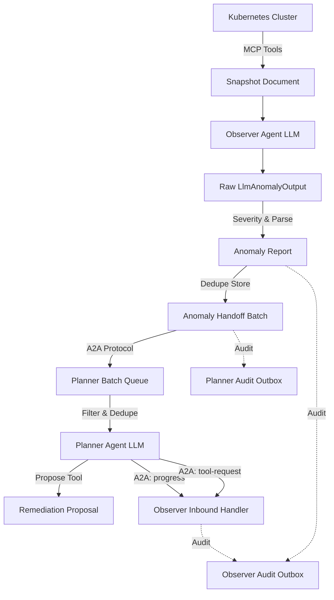
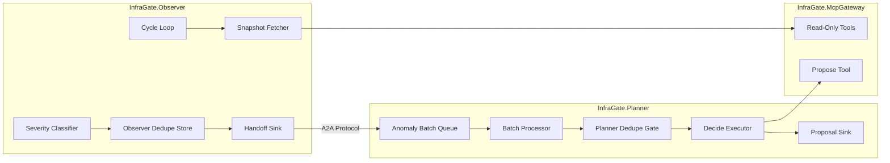
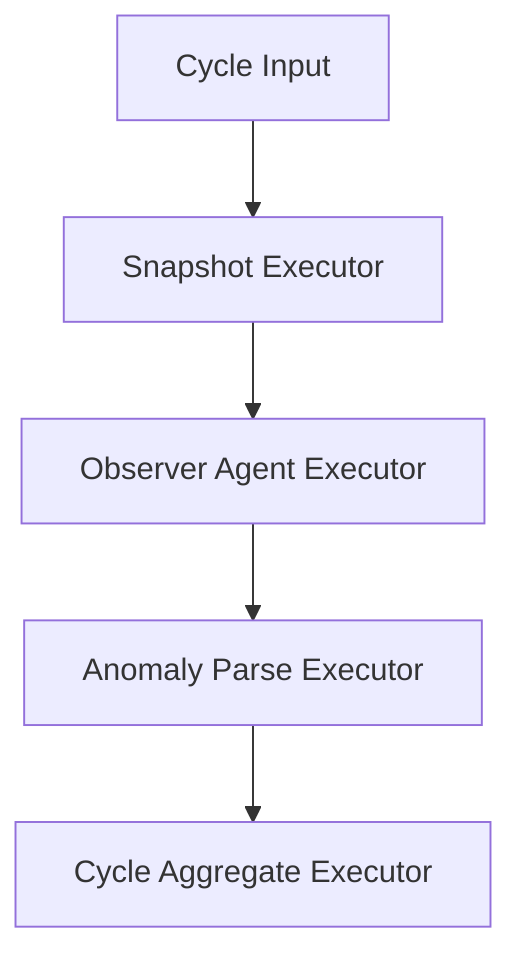
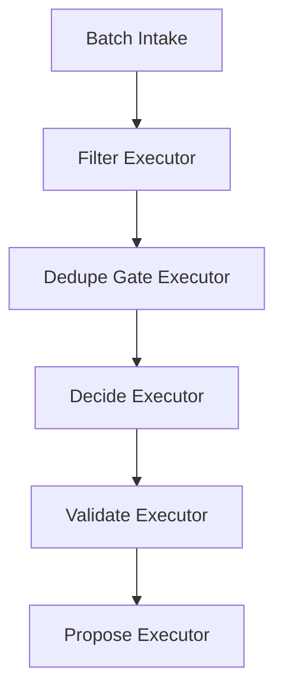
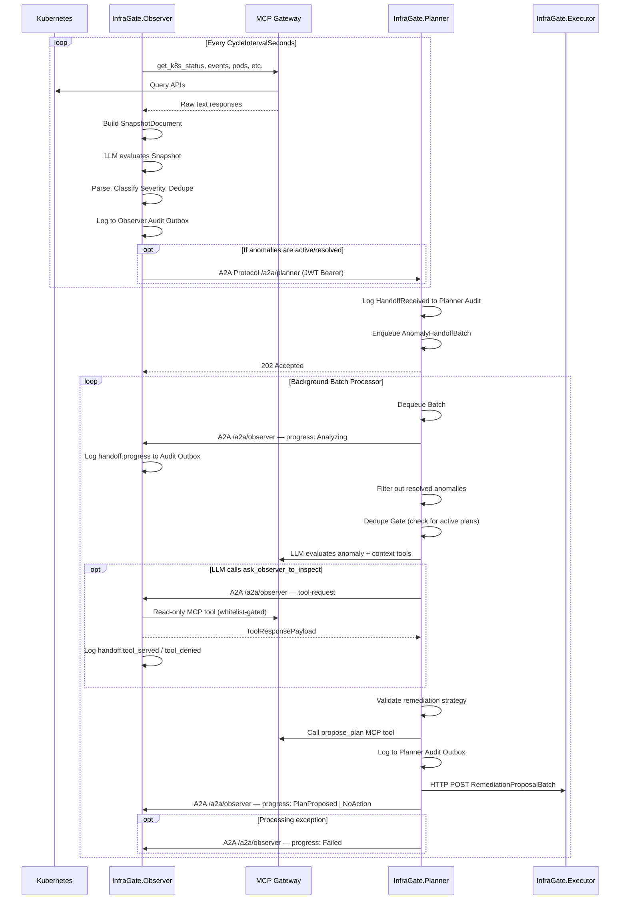

# Observer and Planner Handoff Flow

This document visualizes the detection, processing, and handoff flow between the autonomous `InfraGate.Observer` service and the analytical `InfraGate.Planner` service.

This document describes the **current** bidirectional Agent-to-Agent (A2A) channel architecture.

## Channel Overview

The Observer and Planner communicate over two A2A channels:

1. **Observer → Planner (handoff)**: the Observer POSTs an `AnomalyHandoffBatch` to the Planner's A2A endpoint (`/a2a/planner`). This is the original direction and is unchanged.
2. **Planner → Observer (progress + questions)**: the Planner calls back to the Observer's A2A endpoint (`/a2a/observer`) to deliver **Plan Progress Notifications** and to ask **Reverse Context Requests** (read-only K8s tool calls via `ask_observer_to_inspect`). The Observer is the A2A server; the Planner is the A2A client.

## Object Flow

## Ownership

The **Observer** owns temporal scheduling, raw state extraction (snapshots), initial anomaly hallucination filtering, severity classification, and cross-cycle deduplication.
The **Planner** owns queue management, remediation strategy generation, safety validation (preventing conflicting plans), and formal plan proposal to the MCP server.

## Component Workflow Graphs (Microsoft.Agents.AI.Workflows)

Both services use the `Microsoft.Agents.AI.Workflows` engine to process items as a Directed Acyclic Graph (DAG).

### Observer DAG

*(Note: The Observer fans out the Snapshot, Agent, and Parse executors per Kubernetes namespace before fanning back in at the Aggregate node).*

### Planner DAG

*(Note: The Planner fans out from Intake through Propose per anomaly in the received batch).*

## Sequence Diagram

## Scenarios To Verify

### Happy Path
1. Observer loop fires.
2. Snapshot is fetched and fed to the Observer LLM.
3. LLM identifies a failing Pod.
4. Observer parses it into an `AnomalyReport`, classifies its severity, and verifies it isn't suppressed in the `AnomalyDedupeStore`.
5. Observer POSTs the report in a batch to Planner.
6. Planner queues the batch.
7. Planner dequeues, passes the Filter and Dedupe gates.
8. Planner LLM investigates the specific Pod and devises a rollout restart strategy.
9. Planner validates the strategy and formally proposes it to the Gateway.
10. Planner forwards the `RemediationProposal` to the Executor.

### Deduped / Suppressed Anomaly
1. Observer detects a failing Pod.
2. Observer checks the `AnomalyDedupeStore`.
3. The store sees this exact anomaly was reported 1 minute ago, which is within the `DedupeSuppressionWindow`.
4. The anomaly is suppressed.
5. The suppressed report is logged to the Observer Audit Outbox.
6. No A2A handoff message is sent to the Planner.

### Resolved Anomaly
1. Observer detects zero anomalies.
2. The `AnomalyDedupeStore` notices a previously active anomaly has not been seen for longer than the `DedupeResolutionThreshold`.
3. The store produces a "Resolved" `AnomalyReport`.
4. Observer POSTs the "Resolved" batch to the Planner.
5. Planner queues and dequeues the batch.
6. Planner's `FilterExecutor` sees the "Resolved" status and terminates the workflow for that item immediately. No LLM call is made.

### Existing Plan Dedupe (Planner Side)
1. Planner receives an active anomaly.
2. Planner's `DedupeGateExecutor` checks the `PlannerDedupeStore`.
3. The store indicates there is already an active or pending remediation plan proposed for this exact anomaly target in a previous cycle.
4. The workflow for that anomaly terminates early to prevent the LLM from proposing duplicate, overlapping plans.
