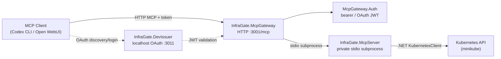

# InfraGate — Local Dev Environment Guide

## Architecture at a Glance



**Four source projects, three runtime processes:**

| Project | Role | Runs as |
|---|---|---|
| `InfraGate.McpServer` | Kubernetes MCP server (tools, plans, approvals) | stdio child process |
| `InfraGate.McpGateway` | HTTP MCP endpoint + guardrails + audit | HTTP server `:3001` |
| `InfraGate.McpGateway.Auth` | Auth library (OAuth JWT + browser approval cookie) | Linked into Gateway |
| `InfraGate.DevIssuer` | Dev-only OAuth/OIDC issuer | HTTP server `:3011` (optional) |

In source mode all three processes run separately. In the containerized OAuth mode, the gateway and server share a single container (the gateway launches the server as a stdio subprocess), so only two containers run: `mcp-gateway` and `devissuer`.

---

## Prerequisites

### 1. .NET 10 SDK

All projects target `net10.0`. Install the .NET 10 SDK:

```bash
# Check if installed
dotnet --version   # must be 10.x

# Install (Ubuntu/Debian)
# See https://learn.microsoft.com/dotnet/core/install/linux
# or use the dotnet-install script:
curl -sSL https://dot.net/v1/dotnet-install.sh | bash -s -- --channel 10.0
export PATH="$HOME/.dotnet:$PATH"
```

### 2. Minikube + kubectl

The MCP server talks to Kubernetes via the .NET `KubernetesClient` library. For local dev, use minikube:

```bash
# Install minikube (if not present)
# https://minikube.sigs.k8s.io/docs/start/

minikube start

# Verify kubectl context
kubectl cluster-info
```

### 3. Docker Compose

The containerized OAuth path uses Docker Compose:

```bash
docker compose version
```

### 4. Verify tools

```bash
dotnet --version          # → 10.x.x
minikube status           # → Running
kubectl version --client  # → any recent version
docker compose version    # → Docker Compose v2
```

---

## Step-by-Step Setup

### Step 1 — Bootstrap RBAC & Kubeconfig

This creates the `mcp-nginx-demo` namespace, a scoped ServiceAccount + Role + RoleBinding, and a short-lived (24h) kubeconfig:

```bash
cd /workspace
./scripts/create-demo-kubeconfig.sh --compose
```

**Output:** `.kube/mcp-nginx-demo.config` and `.kube/mcp-nginx-demo.compose.config`

Use `./scripts/create-demo-kubeconfig.sh` without `--compose` when you only need the source-based stdio or gateway flows.

**Verify RBAC:**

```bash
KC=".kube/mcp-nginx-demo.config"

kubectl --kubeconfig $KC auth can-i create deployments -n mcp-nginx-demo  # → yes
kubectl --kubeconfig $KC auth can-i patch configmaps   -n mcp-nginx-demo  # → yes
kubectl --kubeconfig $KC auth can-i create namespaces                     # → no
kubectl --kubeconfig $KC auth can-i create deployments -n default         # → no
```

> [!NOTE]
> The token expires after 24 hours. Re-run `./scripts/create-demo-kubeconfig.sh --compose` to refresh the containerized setup.

### Step 2 — Build the Solution

```bash
dotnet build InfraGate.slnx
```

### Step 3 — Run Unit Tests

```bash
dotnet test InfraGate.slnx --no-build
```

All tests should pass without a Kubernetes cluster. Integration tests are opt-in (see [Verification](#verification) below).

---

## Running the Solution

You have **three modes** depending on what you need. Pick whichever suits your current workflow:

---

### Mode A — Stdio MCP Server Only (Simplest)

Use this when you want to connect a local MCP client (e.g. Codex CLI) directly to the server without HTTP or auth.

**Terminal 1:**

```bash
export REPO_ROOT="$(pwd)"
export INFRA_GATE_ENVIRONMENT=Development
export KUBECONFIG="${REPO_ROOT}/.kube/mcp-nginx-demo.config"
export K8S_MCP_APPROVAL_ROOT="${REPO_ROOT}/.mcp-approvals"
export K8S_MCP_ALLOWED_NAMESPACES=mcp-nginx-demo

dotnet run --project src/InfraGate.McpServer/InfraGate.McpServer.csproj
```

**Client config** (for Codex, VS Code MCP, etc.):

```json
{
  "mcpServers": {
    "infra-gate": {
      "command": "dotnet",
      "args": [
        "run", "--project",
        "/workspace/src/InfraGate.McpServer/InfraGate.McpServer.csproj"
      ],
      "env": {
        "INFRA_GATE_ENVIRONMENT": "Development",
        "KUBECONFIG": "/workspace/.kube/mcp-nginx-demo.config",
        "K8S_MCP_APPROVAL_ROOT": "/workspace/.mcp-approvals",
        "K8S_MCP_ALLOWED_NAMESPACES": "mcp-nginx-demo"
      }
    }
  }
}
```

Or register with Codex CLI:

```bash
REPO_ROOT="$(pwd)"
codex mcp add infra-gate \
  --env INFRA_GATE_ENVIRONMENT=Development \
  --env KUBECONFIG="${REPO_ROOT}/.kube/mcp-nginx-demo.config" \
  --env K8S_MCP_APPROVAL_ROOT="${REPO_ROOT}/.mcp-approvals" \
  --env K8S_MCP_ALLOWED_NAMESPACES=mcp-nginx-demo \
  -- dotnet run --project "${REPO_ROOT}/src/InfraGate.McpServer/InfraGate.McpServer.csproj"
```

---

### Mode B — HTTP Gateway + OAuth (DevIssuer)

Use this for the full OAuth/OIDC flow (e.g., testing Codex CLI `mcp login`). The recommended local path is Docker Compose: the gateway and dev issuer run on a Docker bridge network, and the gateway launches the Kubernetes MCP server as a private stdio subprocess. For production identity providers, see the [Production OIDC Guide](production-oidc.md).

```bash
./scripts/create-demo-kubeconfig.sh --compose
docker compose -f deploy/mode-c/compose.yaml up --build
```

**Endpoints:**

- Gateway: `http://127.0.0.1:3001/mcp`
- Dev issuer: `http://127.0.0.1:3011`

**Codex CLI config** (`~/.codex/config.toml`):

```toml
[mcp_servers.infra-gate]
url = "http://127.0.0.1:3001/mcp"
oauth_resource = "http://127.0.0.1:3001/mcp"
scopes = ["mcp:tools"]
```

```bash
codex mcp login infra-gate
```

**Claude Code config** (`.mcp.json` in repo root):

```json
{
  "mcpServers": {
    "infra-gate": {
      "type": "http",
      "url": "http://127.0.0.1:3001/mcp",
      "oauth": {
        "scopes": ["mcp:tools"]
      }
    }
  }
}
```

Then run `/mcp` inside Claude Code to trigger the OAuth login flow.

The Compose path is OAuth-only. It uses `INFRA_GATE_OAUTH_METADATA_ADDRESS` internally so the gateway container can discover DevIssuer through `http://devissuer:3011` while clients still use the public issuer `http://127.0.0.1:3011`. Browser approval links point at `http://127.0.0.1:3001/approvals/...` and use the pre-registered DevIssuer approval UI client.

Tradeoff: keeping `InfraGate.McpServer` as a private stdio subprocess makes setup simpler and keeps the HTTP attack surface small. The downside is that the gateway image bundles the server binary, the gateway and server share a container boundary, and the server cannot be scaled or restarted independently.

> [!IMPORTANT]
> Set `INFRA_GATE_OAUTH_REQUIRE_HTTPS_METADATA=false` only for local development HTTP issuers, such as this DevIssuer path or the Keycloak demo. Never in production.

#### Mode B — Run from published images

This is the fastest path to evaluate the gateway. It pulls released images from GHCR (Docker Hub equivalents are listed below). Use this when you do not need to modify source.

**Prerequisites:**

- Minikube running (see [Prerequisites](#prerequisites) above).
- Docker Compose v2 (`docker compose version`).
- A checkout of the repository (for the kubeconfig helper and volume mounts).

**Run:**

```bash
./scripts/create-demo-kubeconfig.sh --compose
TAG=vX.Y.Z docker compose -f deploy/mode-c/compose.release.yaml up
```

Replace `vX.Y.Z` with the release tag from <https://github.com/mirusser/Kubernetes-MCP-Guard/releases>. Omitting `TAG=` falls back to `latest`, which moves over time and is fine for a quick try but is not stable for repeatable runs.

**Endpoints:** same as the build-from-source path above — gateway at `http://127.0.0.1:3001/mcp`, dev issuer at `http://127.0.0.1:3011`.

**Codex CLI config:** same as the Mode B from-source config above.

**Docker Hub alternates** (substitute into `compose.release.yaml` if preferred):

```text
ghcr.io/mirusser/kubernetes-mcp-guard-devissuer:${TAG} → mirusser/kubernetes-mcp-guard-devissuer:${TAG}
ghcr.io/mirusser/kubernetes-mcp-guard-gateway:${TAG}   → mirusser/kubernetes-mcp-guard-gateway:${TAG}
```

After release, the published-image path is verified by `scripts/smoke-test-release.sh` (see [Verification](#verification)).

The same tradeoffs as the build-from-source Compose path apply: the gateway image bundles the server binary, and the server cannot be scaled or restarted independently.

#### Source Mode B

Use this alternate flow when you want to run the same OAuth path from source instead of containers.

> [!IMPORTANT]
> Start the **Gateway first**, then the DevIssuer. The MCP client discovers the DevIssuer URL by querying the gateway's `/.well-known/oauth-protected-resource` endpoint, so the gateway must be answering before you trigger authentication in the client.

**Terminal 1 — Gateway with OAuth:**

```bash
export REPO_ROOT="$(pwd)"
export INFRA_GATE_ENVIRONMENT=Development
export INFRA_GATE_OAUTH_AUTHORITY="http://127.0.0.1:3011"
export INFRA_GATE_OAUTH_RESOURCE="http://127.0.0.1:3001/mcp"
export INFRA_GATE_OAUTH_SCOPE="mcp:tools"
export INFRA_GATE_OAUTH_REQUIRE_HTTPS_METADATA=false
export INFRA_GATE_APPROVAL_OAUTH_CLIENT_ID="infra-gate-approval-ui"
export INFRA_GATE_APPROVAL_OAUTH_AUTHORIZATION_ENDPOINT="http://127.0.0.1:3011/authorize"
export INFRA_GATE_APPROVAL_OAUTH_TOKEN_ENDPOINT="http://127.0.0.1:3011/token"
export INFRA_GATE_APPROVAL_BASE_URL="http://127.0.0.1:3001"
export INFRA_GATE_DOWNSTREAM_PROJECT="${REPO_ROOT}/src/InfraGate.McpServer/InfraGate.McpServer.csproj"
export KUBECONFIG="${REPO_ROOT}/.kube/mcp-nginx-demo.config"
export K8S_MCP_APPROVAL_ROOT="${REPO_ROOT}/.mcp-approvals"
export K8S_MCP_ALLOWED_NAMESPACES=mcp-nginx-demo

dotnet run --project src/InfraGate.McpGateway/InfraGate.McpGateway.csproj
```

**Terminal 2 — Dev Issuer:**

```bash
export INFRA_GATE_ENVIRONMENT=Development
dotnet run --project src/InfraGate.DevIssuer/InfraGate.DevIssuer.csproj
```

Listens on `http://127.0.0.1:3011`. Provides OAuth discovery, PKCE authorization-code flow, JWKS, dynamic client registration, and a pre-registered approval UI client — all in-memory, ephemeral.

---

## Available MCP Tools

Once running, the server exposes these tools:

| Tool | Purpose |
|---|---|
| `get_k8s_status(namespace, labelSelector?)` | Read deployments, services, pods status |
| `get_k8s_events(namespace, labelSelector?, fieldSelector?, limit?)` | Read bounded Kubernetes events |
| `get_pod_logs(namespace, podName, container?, tailLines?, previous?)` | Read bounded pod logs |
| `get_k8s_resource(namespace, kind, name)` | Read a focused resource summary |
| `get_deployment_diagnostics(namespace, name, limit?)` | Read bounded Deployment troubleshooting context |
| `get_pod_diagnostics(namespace, podName, limit?)` | Read bounded Pod troubleshooting context |
| `get_service_diagnostics(namespace, name, limit?)` | Read bounded Service troubleshooting context |
| `request_apply_manifest(namespace, manifest)` | Create a plan to apply a YAML/JSON manifest |
| `request_delete_manifest(namespace, manifest)` | Create a plan to delete a resource |
| `request_scale_deployment(namespace, name, replicas)` | Create a plan to scale a deployment |
| `request_restart_deployment(namespace, name)` | Create a plan to restart a deployment |
| `request_set_deployment_image(namespace, name, container, image)` | Create a plan to update a Deployment container image |
| `apply_approved_plan(planId)` | Apply a previously approved plan |

Logs and Events are untrusted Kubernetes workload/cluster output. Prefer the HTTP gateway for model-visible diagnostics because it sanitizes suspicious output before returning it; direct stdio use bypasses that gateway guardrail layer.

**Approval flow:** `request_*` → Kubernetes `dryRun=All` succeeds → returns `planId` → `apply_approved_plan(planId)` → Gateway returns approval URL → browser OAuth approval → call `apply_approved_plan(planId)` again → repeat dry-run → applied.

Allowed manifest kinds: `apps/v1 Deployment`, `v1 Service`, `v1 ConfigMap`.

---

## Verification

```bash
# Build
dotnet build InfraGate.slnx

# Unit tests (no cluster needed)
dotnet test InfraGate.slnx --no-build

# Integration tests (requires minikube + RBAC from Step 1)
INFRA_GATE_RUN_INTEGRATION=1 dotnet test InfraGate.slnx --no-build

# HTTP gateway integration tests (requires minikube + RBAC from Step 1)
INFRA_GATE_RUN_GATEWAY_INTEGRATION=1 dotnet test tests/InfraGate.McpGateway.Tests/InfraGate.McpGateway.Tests.csproj --no-build

# Compose config validation
docker compose -f deploy/mode-c/compose.yaml config

# Check cluster state after integration tests
kubectl --kubeconfig .kube/mcp-nginx-demo.config \
  -n mcp-nginx-demo get deployment,service,configmap,pods,replicasets -o wide
```

The stdio integration flag verifies the direct MCP server path. The gateway integration flag verifies the HTTP MCP endpoint, downstream stdio bridge, gateway guardrails, approval plans, and Kubernetes path through the same demo namespace.

---

## Settings Reference

The canonical environment variable, CI/CD, and release configuration reference is [docs/configuration.md](configuration.md). Keep the command snippets in this guide as runnable examples, and update the reference when defaults or production guidance change.

---

## File Layout Quick Reference

```
/workspace
├── InfraGate.slnx                        # Solution file
├── src/
│   ├── InfraGate.Approvals/              # Shared approval storage/challenge contracts
│   ├── InfraGate.RuntimeSafety/          # Runtime mode and production safety checks
│   ├── InfraGate.McpServer/              # Stdio MCP server (Kubernetes tools)
│   ├── InfraGate.McpGateway/             # HTTP gateway (guardrails, downstream client)
│   ├── InfraGate.McpGateway.Auth/        # Auth library (OAuth JWT + browser approval cookie)
│   └── InfraGate.DevIssuer/             # Dev-only OAuth issuer
├── tests/
│   ├── InfraGate.McpServer.Tests/
│   ├── InfraGate.McpGateway.Tests/
│   └── InfraGate.DevIssuer.Tests/
├── deploy/
│   ├── compose/                          # Remote Docker host deployments
│   ├── docker/                           # Runtime Dockerfiles
│   ├── minikube/rbac.yaml                # Namespace + ServiceAccount + Role + RoleBinding
│   └── mode-c/compose.yaml               # Containerized OAuth setup
├── scripts/
│   ├── create-demo-kubeconfig.sh         # Bootstrap RBAC & generate kubeconfig
│   └── approve-plan.sh                   # Manual dev-only hash approval helper
├── .kube/                                # Generated kubeconfigs (gitignored)
├── .mcp-approvals/                       # Plan files: pending/, approved/, applied/ (gitignored)
└── .mcp-guardrails/                      # Gateway audit log output (gitignored)
```

---

## Troubleshooting

| Symptom | Cause | Fix |
|---|---|---|
| `dotnet: command not found` | .NET 10 SDK not installed | Install SDK, ensure `~/.dotnet` is on `$PATH` |
| `error NETSDK1045: target framework 'net10.0' not installed` | Wrong SDK version | Install .NET 10 preview/RC SDK |
| RBAC `can-i` returns `no` for allowed operations | Token expired or RBAC not applied | Re-run `./scripts/create-demo-kubeconfig.sh --compose` |
| Gateway returns `401 Unauthorized` | No `Authorization` header, invalid JWT, or no auth env vars set | Set OAuth vars and re-run MCP login |
| `INFRA_GATE_OAUTH_REQUIRE_HTTPS_METADATA` error | Trying to reach HTTP issuer with HTTPS check | Set to `false` only for local development issuers such as DevIssuer or the Keycloak demo |
| `apply_approved_plan` refuses with hash mismatch | Plan changed after approval | Re-request the plan and re-approve |
| DevIssuer registrations lost on restart | By design — all state is in-memory | Re-register the client (Codex does this automatically) |
