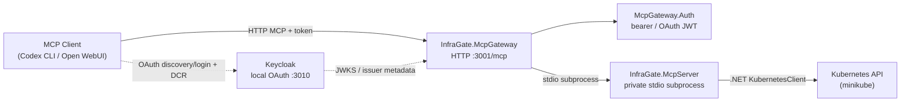

# InfraGate — Local Dev Environment Guide

## Architecture at a Glance



**Source projects and runtime processes:**

| Project | Role | Runs as |
|---|---|---|
| `InfraGate.McpServer` | Kubernetes MCP server (tools, plans, approvals) | stdio child process |
| `InfraGate.McpGateway` | HTTP MCP endpoint + guardrails + audit | HTTP server `:3001` |
| `InfraGate.McpGateway.Auth` | Auth library (OAuth JWT + browser approval cookie) | Linked into Gateway |
| Keycloak realm | Local OAuth/OIDC issuer | Container `:3010` |

In the supported containerized OAuth path, Keycloak and the gateway run as separate containers. The gateway launches the server as a private stdio subprocess, so there is no separate network-facing MCP server process.

---

## Prerequisites

### 1. .NET 10 SDK

All projects target `net10.0`. Install the .NET 10 SDK:

```bash
# Check if installed
dotnet --version   # must be 10.x

# Install (Ubuntu/Debian)
# See https://learn.microsoft.com/dotnet/core/install/linux
# or use the dotnet-install script:
curl -sSL https://dot.net/v1/dotnet-install.sh | bash -s -- --channel 10.0
export PATH="$HOME/.dotnet:$PATH"
```

### 2. Minikube + kubectl

The MCP server talks to Kubernetes via the .NET `KubernetesClient` library. For local dev, use minikube:

```bash
# Install minikube (if not present)
# https://minikube.sigs.k8s.io/docs/start/

minikube start

# Verify kubectl context
kubectl cluster-info
```

### 3. Docker Compose

The containerized OAuth path uses Docker Compose:

```bash
docker compose version
```

### 4. Verify tools

```bash
dotnet --version          # → 10.x.x
minikube status           # → Running
kubectl version --client  # → any recent version
docker compose version    # → Docker Compose v2
```

---

## Step-by-Step Setup

### Step 1 — Bootstrap RBAC & Kubeconfig

This creates the `mcp-nginx-demo` namespace, a scoped ServiceAccount + Role + RoleBinding, and a short-lived (24h) kubeconfig:

```bash
cd /workspace
./scripts/create-demo-kubeconfig.sh --compose
```

**Output:** `.kube/mcp-nginx-demo.config` and `.kube/mcp-nginx-demo.compose.config`

Use `./scripts/create-demo-kubeconfig.sh` without `--compose` when you only need the source-based stdio or gateway flows. 

Both source integration test suites use `.kube/mcp-nginx-demo.config`, so refresh it before live test runs if the previous token may be stale.

**Verify RBAC:**

```bash
KC=".kube/mcp-nginx-demo.config"

kubectl --kubeconfig $KC auth can-i create deployments -n mcp-nginx-demo  # → yes
kubectl --kubeconfig $KC auth can-i patch configmaps   -n mcp-nginx-demo  # → yes
kubectl --kubeconfig $KC auth can-i create namespaces                     # → no
kubectl --kubeconfig $KC auth can-i create deployments -n default         # → no
```

> [!NOTE]
> The token expires after 24 hours. Re-run `./scripts/create-demo-kubeconfig.sh --compose` to refresh the containerized setup.

### Step 2 — Build the Solution

```bash
dotnet build InfraGate.slnx
```

### Step 3 — Run Unit Tests

```bash
dotnet test InfraGate.slnx --no-build --filter "Category!=Keycloak"
```

The default fast suite should pass without Docker or a Kubernetes cluster. Integration tests are opt-in (see [Verification](#verification) below).

---

## Running the Solution

There are two common local paths: direct stdio for no-auth MCP work, and Keycloak local OAuth for the HTTP gateway path.

---

### Stdio MCP Server Only

Use this when you want to connect a local MCP client (e.g. Codex CLI) directly to the server without HTTP or auth.

**Terminal 1:**

```bash
export REPO_ROOT="$(pwd)"
export INFRA_GATE_ENVIRONMENT=Development
export KUBECONFIG="${REPO_ROOT}/.kube/mcp-nginx-demo.config"
export K8S_MCP_APPROVAL_ROOT="${REPO_ROOT}/.mcp-approvals"
export K8S_MCP_ALLOWED_NAMESPACES=mcp-nginx-demo

dotnet run --project src/InfraGate.McpServer/InfraGate.McpServer.csproj
```

**Client config** (for Codex, VS Code MCP, etc.):

```json
{
  "mcpServers": {
    "infra-gate": {
      "command": "dotnet",
      "args": [
        "run", "--project",
        "/workspace/src/InfraGate.McpServer/InfraGate.McpServer.csproj"
      ],
      "env": {
        "INFRA_GATE_ENVIRONMENT": "Development",
        "KUBECONFIG": "/workspace/.kube/mcp-nginx-demo.config",
        "K8S_MCP_APPROVAL_ROOT": "/workspace/.mcp-approvals",
        "K8S_MCP_ALLOWED_NAMESPACES": "mcp-nginx-demo"
      }
    }
  }
}
```

Or register with Codex CLI:

```bash
REPO_ROOT="$(pwd)"
codex mcp add infra-gate \
  --env INFRA_GATE_ENVIRONMENT=Development \
  --env KUBECONFIG="${REPO_ROOT}/.kube/mcp-nginx-demo.config" \
  --env K8S_MCP_APPROVAL_ROOT="${REPO_ROOT}/.mcp-approvals" \
  --env K8S_MCP_ALLOWED_NAMESPACES=mcp-nginx-demo \
  -- dotnet run --project "${REPO_ROOT}/src/InfraGate.McpServer/InfraGate.McpServer.csproj"
```

---

### Keycloak Local OAuth

Use this when you want the supported local OAuth setup with persistent user accounts and a real PKCE login flow. The realm is auto-imported from `deploy/keycloak/infra-gate-realm.json` on first start.

```bash
./scripts/create-demo-kubeconfig.sh --compose
./scripts/generate-env.sh local-compose
docker compose --env-file deploy/generated/local-compose.env \
  -f deploy/local-oauth/compose.yaml up --build
```

`generate-env.sh` writes `deploy/generated/local-compose.env` from `deploy/run-profiles.yaml` (profile `local-compose`) and supplies absolute host paths via `--set`. Docker Compose resolves volume bind-mount paths relative to the Compose file directory, not the working directory, so absolute paths are required. The generated file is gitignored; `deploy/local-oauth/release.env.example` is the committed reference for the released profile.

Keycloak starts first and takes ~30s to pass its health check before the gateway comes up. No manual step is needed — the `depends_on: condition: service_healthy` gate handles the ordering.

#### Network topology

The Keycloak local OAuth path intentionally keeps Keycloak and minikube on **separate Docker networks** to better simulate a production environment where the identity provider and the Kubernetes API server are in distinct network segments:

```
┌──────────────────────────────────────────────┐   ┌──────────────────────┐
│  compose-internal (local-oauth_default)      │   │  minikube (external) │
│                                              │   │                      │
│  keycloak ──────────────────────────────────►│   │                      │
│                                  mcp-gateway ├───►  K8s API :8443       │
└──────────────────────────────────────────────┘   └──────────────────────┘
```

- **`keycloak`** is attached to the compose-internal network only — it has no route to the cluster.
- **`mcp-gateway`** bridges both networks: it reaches Keycloak via Docker service-name DNS (`http://keycloak:8080`) and the Kubernetes API via the `minikube` bridge (`https://192.168.49.2:8443`).

The `minikube` Docker network is created automatically by `minikube start --driver=docker`. Verify it exists before starting the stack:

```bash
docker network ls | grep minikube
# minikube   bridge   local
```

If the network is missing (e.g. minikube was started with a different driver), all MCP tool calls that hit the K8s API will time out inside the container. See the [Troubleshooting](#troubleshooting) table for the fix.

**Endpoints:**

- Gateway: `http://127.0.0.1:3001/mcp`
- Keycloak: `http://127.0.0.1:3010` (admin UI at `/admin`, realm at `/realms/infra-gate`)

**Pre-seeded demo accounts** (from the imported realm):

| Username | Password |
|---|---|
| `demo` | `demo` |
| `demo2` | `demo2` |

**Pre-configured clients and scopes**:

| Client/scope | Purpose |
|---|---|
| `mcp-client` | Public authorization-code client for MCP clients; PKCE S256 configured; direct password grant disabled |
| `mcp-smoke-client` | Local/test direct-grant client for non-browser token acquisition and smoke checks |
| `mcp-client-limited` | Valid-audience client without `mcp:tools`, used to verify 403 insufficient-scope behavior |
| `infra-gate-approval-ui` | Public PKCE client for browser approval sessions |
| `mcp:tools` | Client scope with the audience mapper for `http://127.0.0.1:3001/mcp` |

Anonymous OIDC Dynamic Client Registration is enabled for this local/demo realm and constrained to trusted loopback hosts (`localhost`, `127.0.0.1`, and `host.docker.internal`) plus the local scopes above. Do not copy anonymous DCR into production without replacing it with controlled registration or admin-managed clients.

**Codex CLI config** (`~/.codex/config.toml`):

```toml
[mcp_servers.infra-gate]
url = "http://127.0.0.1:3001/mcp"
oauth_resource = "http://127.0.0.1:3001/mcp"
scopes = ["mcp:tools"]
```

```bash
codex mcp login infra-gate
```

**Claude Code config** (`.mcp.json` in repo root):

```json
{
  "mcpServers": {
    "infra-gate": {
      "type": "http",
      "url": "http://127.0.0.1:3001/mcp",
      "oauth": {
        "scopes": ["mcp:tools"]
      }
    }
  }
}
```

Then run `/mcp` inside Claude Code to trigger the OAuth login flow against Keycloak.

#### Run from published images

```bash
./scripts/create-demo-kubeconfig.sh --compose
./scripts/generate-env.sh smoke-release
TAG=vX.Y.Z docker compose --env-file deploy/generated/smoke-release.env \
  -f deploy/local-oauth/compose.release.yaml up
```

Keycloak is pulled from `quay.io/keycloak/keycloak:26.6.1`; the gateway image is pulled from GHCR. Replace `vX.Y.Z` with the release tag from <https://github.com/mirusser/Kubernetes-MCP-Guard/releases>. Pass additional `--set` flags after the profile name to override individual fields (e.g. `./scripts/generate-env.sh smoke-release --set host.kubeconfigHostPath=/custom/path`).

After release, the published-image path is verified by `scripts/smoke-test-release.sh` (see [Verification](#verification)).

**Docker Hub alternate for the gateway image** (substitute into `compose.release.yaml` if preferred):

```text
ghcr.io/mirusser/kubernetes-mcp-guard-gateway:${TAG} → mirusser/kubernetes-mcp-guard-gateway:${TAG}
```

> [!IMPORTANT]
> The Keycloak realm bakes the gateway audience (`http://127.0.0.1:3001/mcp`) at import time. If you change `GATEWAY_PORT`, you must also update `deploy/keycloak/infra-gate-realm.json` and re-import the realm.

> [!IMPORTANT]
> Set `INFRA_GATE_OAUTH_REQUIRE_HTTPS_METADATA=false` only for local development HTTP issuers such as this Keycloak demo. Never in production.

---

## Available MCP Tools

Once running, the server exposes these tools:

| Tool | Purpose |
|---|---|
| `get_k8s_status(namespace, labelSelector?)` | Read deployments, services, pods status |
| `get_k8s_events(namespace, labelSelector?, fieldSelector?, limit?)` | Read bounded Kubernetes events |
| `get_pod_logs(namespace, podName, container?, tailLines?, previous?)` | Read bounded pod logs |
| `get_k8s_resource(namespace, kind, name)` | Read a focused resource summary |
| `get_deployment_diagnostics(namespace, name, limit?)` | Read bounded Deployment troubleshooting context |
| `get_pod_diagnostics(namespace, podName, limit?)` | Read bounded Pod troubleshooting context |
| `get_service_diagnostics(namespace, name, limit?)` | Read bounded Service troubleshooting context |
| `request_apply_manifest(namespace, manifest)` | Create a plan to apply a YAML/JSON manifest |
| `request_delete_manifest(namespace, manifest)` | Create a plan to delete a resource |
| `request_scale_deployment(namespace, name, replicas)` | Create a plan to scale a deployment |
| `request_restart_deployment(namespace, name)` | Create a plan to restart a deployment |
| `request_set_deployment_image(namespace, name, container, image)` | Create a plan to update a Deployment container image |
| `execute_approved_plan(planId)` | Apply a previously approved plan |

Logs and Events are untrusted Kubernetes workload/cluster output. Prefer the HTTP gateway for model-visible diagnostics because it sanitizes suspicious output before returning it; direct stdio use bypasses that gateway guardrail layer.

**Approval flow:** `request_*` → Kubernetes `dryRun=All` succeeds → returns `planId` → `execute_approved_plan(planId)` → Gateway returns approval URL → browser OAuth approval → call `execute_approved_plan(planId)` again → repeat dry-run → applied.

Allowed manifest kinds: `apps/v1 Deployment`, `v1 Service`, `v1 ConfigMap`.

---

## Verification

```bash
# Build
dotnet build InfraGate.slnx

# Unit tests (no cluster needed)
dotnet test InfraGate.slnx --no-build --filter "Category!=Keycloak"

# Refresh demo RBAC and the 24h source kubeconfig before live integration tests
./scripts/create-demo-kubeconfig.sh

# Integration tests (requires minikube + RBAC from Step 1)
INFRA_GATE_RUN_INTEGRATION=1 dotnet test InfraGate.slnx --no-build --filter "Category!=Keycloak"

# HTTP gateway integration tests (requires minikube + RBAC from Step 1)
INFRA_GATE_RUN_GATEWAY_INTEGRATION=1 dotnet test tests/InfraGate.McpGateway.Tests/InfraGate.McpGateway.Tests.csproj --no-build

# Keycloak integration tests (requires Docker)
dotnet test tests/InfraGate.McpGateway.KeycloakTests/InfraGate.McpGateway.KeycloakTests.csproj --no-build --filter "Category=Keycloak"

# Safety E2E tests (requires Docker + minikube + RBAC from Step 1)
INFRA_GATE_RUN_SAFETY_E2E=1 dotnet test tests/InfraGate.Safety.E2E.Tests/InfraGate.Safety.E2E.Tests.csproj --no-build

# Compose config validation
docker compose -f deploy/local-oauth/compose.yaml config

# Check cluster state after integration tests
kubectl --kubeconfig .kube/mcp-nginx-demo.config \
  -n mcp-nginx-demo get deployment,service,configmap,pods,replicasets -o wide
```

The stdio integration flag verifies the direct MCP server path. The gateway integration flag verifies the HTTP MCP endpoint, downstream stdio bridge, gateway guardrails, approval plans, and Kubernetes path through the same demo namespace.

---

## Settings Reference

The canonical environment variable, CI/CD, and release configuration reference is [docs/configuration.md](configuration.md). Keep the command snippets in this guide as runnable examples, and update the reference when defaults or production guidance change.

---

## File Layout Quick Reference

```
/workspace
├── InfraGate.slnx                        # Solution file
├── src/
│   ├── InfraGate.Approvals/              # Shared approval storage/challenge contracts
│   ├── InfraGate.KubernetesAdapter/      # Kubernetes approval payload/evidence adapter
│   ├── InfraGate.RuntimeSafety/          # Runtime mode and production safety checks
│   ├── InfraGate.McpServer/              # Stdio MCP server (Kubernetes tools)
│   ├── InfraGate.McpGateway/             # HTTP gateway (guardrails, downstream client)
│   └── InfraGate.McpGateway.Auth/        # Auth library (OAuth JWT + browser approval cookie)
├── tests/
│   ├── InfraGate.McpServer.Tests/
│   ├── InfraGate.McpGateway.Tests/
│   ├── InfraGate.McpGateway.KeycloakTests/
│   ├── InfraGate.Safety.E2E.Tests/
│   └── InfraGate.RuntimeSafety.Tests/
├── deploy/
│   ├── compose/                          # Docker Compose deployments and Keycloak demo
│   ├── docker/                           # Runtime Dockerfiles
│   ├── keycloak/                         # Keycloak realm config (infra-gate-realm.json)
│   ├── minikube/rbac.yaml                # Namespace + ServiceAccount + Role + RoleBinding
│   ├── local-oauth/compose.yaml          # Keycloak + Gateway (local build)
│   └── local-oauth/compose.release.yaml  # Keycloak + Gateway (published images)
├── scripts/
│   ├── create-demo-kubeconfig.sh         # Bootstrap RBAC & generate kubeconfig
│   ├── generate-env.sh                   # Generate a run profile env file for local Compose use
│   └── smoke-test-release.sh             # Published-image smoke
├── .kube/                                # Generated kubeconfigs (gitignored)
├── .mcp-approvals/                       # Approval files: pending/, grants/, applied/, challenges/ (gitignored)
└── .mcp-guardrails/                      # Gateway audit log output (gitignored)
```

---

## Troubleshooting

| Symptom | Cause | Fix |
|---|---|---|
| `dotnet: command not found` | .NET 10 SDK not installed | Install SDK, ensure `~/.dotnet` is on `$PATH` |
| `error NETSDK1045: target framework 'net10.0' not installed` | Wrong SDK version | Install .NET 10 preview/RC SDK |
| RBAC `can-i` returns `no` for allowed operations | Token expired or RBAC not applied | Re-run `./scripts/create-demo-kubeconfig.sh --compose` |
| Kubernetes API returns `Unauthorized` during integration tests | Stale or expired demo kubeconfig token | Re-run `./scripts/create-demo-kubeconfig.sh` for source tests, or `./scripts/create-demo-kubeconfig.sh --compose` for Compose flows |
| Gateway returns `401 Unauthorized` | No `Authorization` header, invalid JWT, or no auth env vars set | Set OAuth vars and re-run MCP login |
| `INFRA_GATE_OAUTH_REQUIRE_HTTPS_METADATA` error | Trying to reach HTTP issuer with HTTPS check | Set to `false` only for local development issuers such as the Keycloak demo |
| `execute_approved_plan` refuses with hash mismatch | Plan changed after approval | Re-request the plan and re-approve |
| Every MCP tool call returns `An error occurred invoking '<toolName>'` while gateway logs show `IsError = False` | The downstream MCP server failed during DI — usually because the gateway container (chiseled, UID 1654) cannot read the host-owned kubeconfig or write to `.mcp-approvals/` / `.mcp-guardrails/` | Re-run `./scripts/create-demo-kubeconfig.sh --compose`. The script grants the container UID an ACL on the kubeconfig file and on the persistence dirs (falling back to chmod 0644 only when `setfacl` is unavailable) |
| `chmod: changing permissions of '.mcp-approvals/applied': Operation not permitted` on second run, and gateway logs show `UnauthorizedAccessException: Access to the path '/data/dataprotection-keys' is denied` | On first run the container (UID 1654) creates approval subdirectories with ownership 1654:1654 mode 770; on re-run `chmod -R` fails on those dirs before `setfacl` can execute, so the data-protection volume loses its ACL | Re-run `./scripts/create-demo-kubeconfig.sh --compose` after pulling the latest script — the fixed version pre-creates the approval subdirectories host-owned and uses `find -user` instead of `chmod -R` so container-created files are skipped |
| `create-demo-kubeconfig.sh: line N: GATEWAY_APP_UID: unbound variable` | The script ran against an older copy that referenced `GATEWAY_APP_UID` without defining it locally | Pull the latest script — both constants are now declared at the top alongside the other configuration variables |
| Keycloak exits at startup with `ExecutionExceptionHandler` and `At least one of hosts verification or client URIs validation must be enabled` | Both `host-sending-registration-request-must-match` and `client-uris-must-match` set to `false` in the realm's trusted-hosts policy | Keep `client-uris-must-match: ["true"]` so DCR redirect URIs are restricted to trusted hosts |
| Keycloak login fails with `Invalid scopes: openid profile email mcp:tools offline_access` | `--import-realm` only creates client scopes listed in the JSON's `clientScopes` array — built-in scopes like `profile`/`email`/`roles` are not auto-added | The realm JSON now defines the standard built-in scopes explicitly; if you've customised it, ensure every scope referenced by a client or by `defaultDefaultClientScopes` is also defined in `clientScopes` |
| Keycloak login fails with `Offline tokens not allowed for the user or client` | The user has no `offline_access` realm role, but Claude / Codex request `offline_access` to receive refresh tokens | Realm JSON now defines `offline_access`, the `default-roles-infra-gate` composite, and assigns it to demo users — re-import the realm if you removed those |
| Every MCP tool call that touches the K8s API times out (~100 s) with `TaskCanceledException` in gateway logs | The `mcp-gateway` container cannot route to the `minikube` Docker bridge network — either minikube was started with a non-Docker driver, or the `minikube` Docker network does not exist | Run `docker network ls \| grep minikube`. If missing, restart minikube with `minikube start --driver=docker`, then re-run `./scripts/create-demo-kubeconfig.sh --compose` and restart the stack. If the network exists but connectivity is lost (e.g. after a host reboot), restarting the stack is sufficient because Compose re-attaches `mcp-gateway` to both networks on start. |
